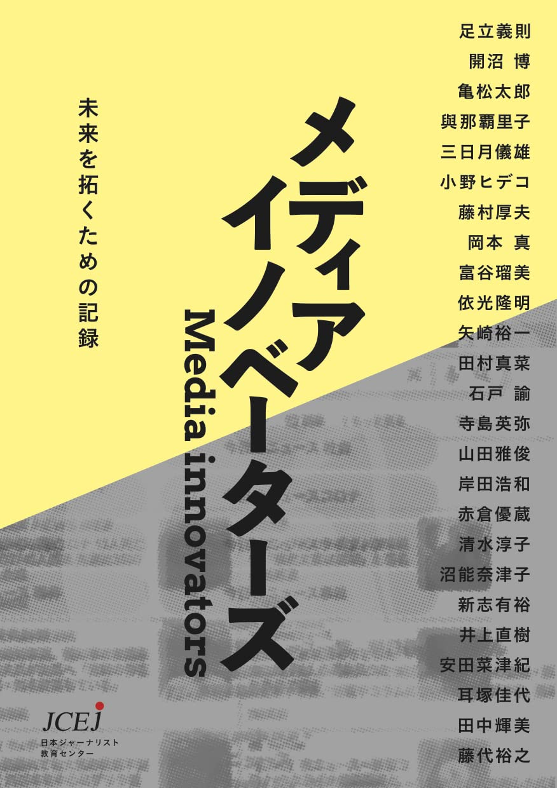

+++
author = "Yuichi Yazaki"
title = "Media Innovators: A Record for Opening the Future"
slug = "book-media-innovators"
date = "2022-11-21"
categories = ["journalism"]
tags = ["Writing"]
description = "Announcement of Media Innovators, a book commemorating JCEJ's tenth anniversary. Yuichi Yazaki appears in two chapters, as both interviewer and interviewee, among 25 practitioners who helped shape a decade of upheaval in media."
image = "images/book.jpg"
+++

To commemorate the tenth anniversary of the Japan Center of Education for Journalists (JCEJ), *Media Innovators: A Record for Opening the Future* was published. I was selected as one of 25 practitioners who helped shape a decade of upheaval in media and appear in two chapters as both interviewer and interviewee.

<!--more-->

## Official Announcement

JCEJ published *Media Innovators: A Record for Opening the Future* to mark its tenth anniversary. The book re-edits the month-long relay-talk series “Let’s Create an Illustrated Guide to Journalists,” held in May 2021, and records testimony from 25 practitioners who helped navigate a turbulent decade in media.

- [Media Innovators: A Record for Opening the Future](https://amzn.to/3LUz2uV)

In a continually changing environment, 25 leading practitioners interview one another and speak freely about how to approach their work, how to thrive in media, what the future of media may hold, and what it means to be a journalist.

The chapters and contributors are as follows:

- **Be a “Professional Amateur”** (Yoshinori Adachi)
- **Be Surprised in Order to Surprise** (Hiroshi Kainuma)
- **The Shift from Organizations to Individuals Will Not Stop** (Taro Kamematsu)
- **Work That Makes Someone Happy** (Satoko Yonaha)
- **Moving Between Distribution and Production** (Norio Mikazuki)
- **Consider the Medium Itself** (Hideko Ono)
- **Technology Is the Driving Force** (Atsuo Fujimura)
- **The Internet Tells You Eighty Percent** (Makoto Okamoto)
- **Publish from a Place You Love** (Rumi Tomiya)
- **Facts Before Arguments** (Takaaki Yorimitsu)
- **Toward a Society That Discusses with Data** (Yuichi Yazaki)
- **Those Directly Involved Became the Power** (Mana Tamura)
- **Answering Curiosity with Facts** (Satoshi Ishido)
- **Everyone Encounters a Mission** (Hideya Terashima)
- **I Want to Build a Sustainable System** (Masatoshi Yamada)
- **Filming While Running Alongside** (Hirokazu Kishida)
- **An Engineer Working with Reporters** (Yuzo Akakura)
- **Drawing Gaps to Elicit Honest Feelings** (Junko Shimizu)
- **After Ten Years, I Could Finally Put It into Words** (Natsuko Numano)
- **Is It Reaching the People You Want to Reach?** (Arihiro Shinshi)
- **Updating Reporting Methods** (Naoki Inoue)
- **Sometimes a Stethoscope, Then a Megaphone** (Natsuki Yasuda)
- **Learning Outside the Company Matters** (Kayo Mimizuka)
- **Go Beyond “I Want People to Know”** (Terumi Tanaka)
- **Work for the Future** (Hiroyuki Fujishiro)

## Related Links

- [Media Innovators: A Record for Opening the Future](https://amzn.to/3LUz2uV)
- [“Media Innovators” completed; Kindle edition in preparation — JCEJ Activity Diary](https://jcej.hatenablog.com/entry/2022/11/13/222507)
- [JCEJ announcement on Facebook](https://www.facebook.com/JCEJinfo/posts/pfbid031Lw1BroMz5Wre5EhLK6kdMDkX8GXRgQPsra4fWRb7qjZzLx5qLySeGdaZqSYPno2l)
