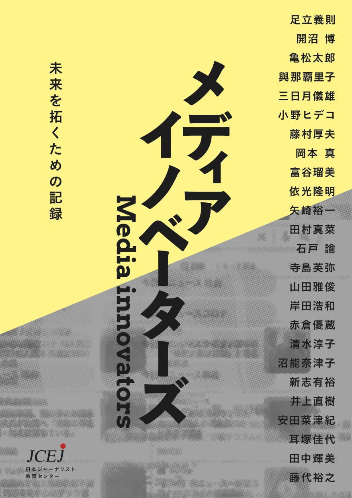

+++
author = "Yuichi Yazaki"
title = "メディアイノベーターズ 未来を拓くための記録"
slug = "book-media-innovators"
date = "2022-11-21"
categories = [
    "journalism"
]
tags = [
]
description = "JCEJ活動10周年記念書籍「メディアイノベーターズ」の発刊告知。メディア激動の10年を切り拓いた25人の実践者による証言集に、矢崎裕一がインタビューおよびインタビューイとして参加しています。"
image = "images/book.jpg"
+++

日本ジャーナリスト教育センター（JCEJ）の活動10周年を記念し発刊された「メディアイノベーターズ 未来を拓くための記録」において、メディア激動の10年を実践者として切り拓いてきた25人のうちの1人に選ばれ、インタビューおよびインタビューイとして2章に矢崎が登場しています。

<!--more-->

## 公式告知

日本ジャーナリスト教育センター（JCEJ）の活動10周年を記念し、「メディアイノベーターズ 未来を拓くための記録」を発刊しました。2021年の5月から1ヶ月間にわたり開催したリレートークイベント『ジャーナリスト図鑑をつくろう！』を再編集し、メディア激動の10年を実践者として切り拓いてきた25人による「時代の証言」を記録しました。

- [メディアイノベーターズ: 未来を拓くための記録](https://amzn.to/3LUz2uV)

変化を続ける環境の中で、「仕事にどう向き合えばいいのか」「メディアの世界で活躍するにはどうすればいいのか」「メディアの未来はどうなるか」「ジャーナリストとはなにか」を、一線で活躍する25人が互いにインタビュアーとしての役割も担う形で、縦横無尽に語り合っています。

「メディアイノベーターズ: 未来を拓くための記録」の目次と証言者は以下の通りです。

- **「プロの素人」たれ**（足立義則）
- **驚かせるために、驚く**（開沼博）
- **「組織から個人」は止まらない**（亀松太郎）
- **誰かを幸せにする仕事**（與那覇里子）
- **流通と制作を行き来する**（三日月儀雄）
- **媒体のことまで考えてみる**（小野ヒデコ）
- **原動力はテクノロジー**（藤村厚夫）
- **ネットで分かるのは8割**（岡本真）
- **好きな場所から発信する**（富谷瑠美）
- **論より、ファクト**（依光隆明）
- **データで議論する社会に**（矢崎裕一）
- **当事者が、権力になった**（田村真菜）
- **事実で人の好奇心に応える**（石戸諭）
- **誰もが使命と出会う**（寺島英弥）
- **続く仕組みをつくりたい**（山田雅俊）
- **併走しながら撮っていく**（岸田浩和）
- **記者と働くエンジニア**（赤倉優蔵）
- **ズレを描き、本音を誘発する**（清水淳子）
- **10年たって言葉にできた**（沼能奈津子）
- **届けたい人に届いているか**（新志有裕）
- **取材方法をアップデート**（井上直樹）
- **時に聴診器、次に拡声器**（安田菜津紀）
- **会社の外で学べるって大事**（耳塚佳代）
- **「知ってほしい」を越えてゆけ**（田中輝美）
- **未来に対して仕事する**（藤代裕之）

## 関連リンク

- [メディアイノベーターズ: 未来を拓くための記録](https://amzn.to/3LUz2uV)
- [「メディアイノベーターズ 未来を拓くための記録」完成。Kindle版も準備中です - #JCEJ 活動日記](https://jcej.hatenablog.com/entry/2022/11/13/222507)
- [日本ジャーナリスト教育センター（J... - JCEJ（Japan Center of Education for Journalists） | Facebook](https://www.facebook.com/JCEJinfo/posts/pfbid031Lw1BroMz5Wre5EhLK6kdMDkX8GXRgQPsra4fWRb7qjZzLx5qLySeGdaZqSYPno2l)

