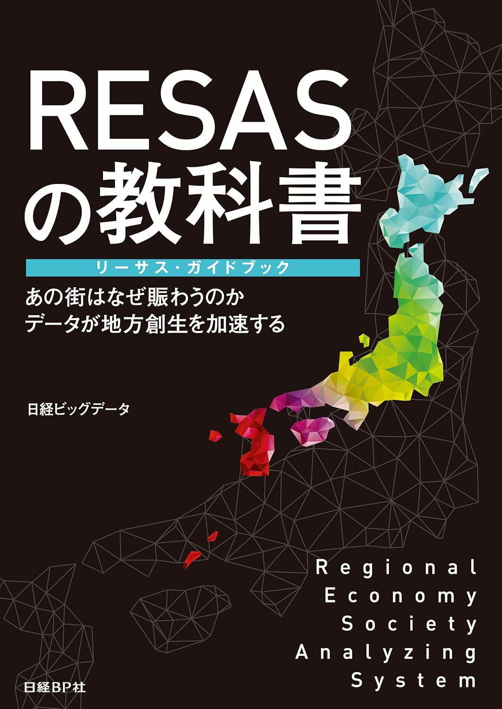

+++
author = "Yuichi Yazaki"
title = "Co-Authoring a Practical Guide to Japan's Regional Economy and Society Analyzing System (RESAS)"
slug = "book-resas"
date = "2016-09-05"
categories = ["codefor"]
tags = ["Writing"]
image = "images/cover_resas.jpg"
+++

I co-authored *The RESAS Textbook: RESAS Guidebook*, published by Nikkei BP in September 2016.

<!--more-->

Subtitled *Why Does That Town Thrive? Data Accelerates Regional Revitalization*, the book explains how to use the Japanese government's Regional Economy and Society Analyzing System (RESAS) and presents practical applications.

As data-informed policymaking and business development became increasingly important to regional revitalization, the book served as a practical guide for local-government staff and regional business professionals across Japan seeking to make full use of RESAS.

Through the book, I helped share methods for discovering and solving regional challenges with data.

- **Title**: *The RESAS Textbook: RESAS Guidebook*
- **Publisher**: Nikkei BP
- **Publication date**: September 2016
- **Co-authors**: Nikkei Big Data Editorial Department, Yuichiro Kotani, Mami Enomoto, Yoshiaki Matsuura, and Yuichi Yazaki

## Related Links

- [The RESAS Textbook: RESAS Guidebook | Nikkei BOOK Plus](https://bookplus.nikkei.com/atcl/catalog/16/254300/)
- [The RESAS Textbook: RESAS Guidebook | Amazon Kindle](https://amzn.to/4ckhuD0)
