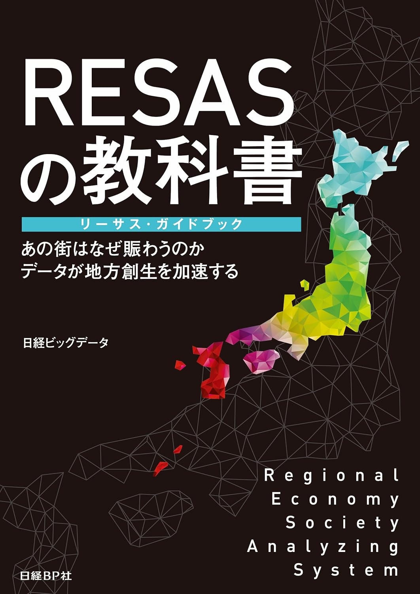

+++
author = "Yuichi Yazaki"
title = "地域経済分析システム（RESAS）の活用を解説した書籍を共同執筆"
slug = "book-resas"
date = "2016-09-05"
categories = [
    "codefor"
]
tags = [
    "執筆"
]
image = "images/cover_resas.jpg"
+++

2016年9月、日経BP社より刊行された書籍『**ＲＥＳＡＳの教科書 リーサス・ガイドブック**』を共同執筆いたしました。

<!--more-->

この書籍は、「**あの街はなぜ賑わうのか データが地方創生を加速する**」を副題に、政府が提供する地域経済分析システム（RESAS：リーサス）の具体的な使い方や活用事例を解説したものです。

地方創生、地域活性化の取り組みにおいて、データに基づいた政策立案やビジネス展開が求められる中、RESASを最大限に活用するための実践的な手引書として、全国の自治体職員や地域ビジネス関係者にご活用いただきました。

執筆を通じて、データに基づく課題発見と解決に向けた知見を広く共有することに貢献しています。

- **書籍名**: ＲＥＳＡＳの教科書 リーサス・ガイドブック
- **発行元**: 日経BP社
- **発行年**: 2016年9月
- **共同著者**: 日経ビッグデータ編集部、小谷祐一朗 氏、榎本真美 氏、松浦義昭 氏、矢崎裕一（Yuichi 

## 関連リンク

- [ＲＥＳＡＳの教科書　リーサス・ガイドブック | 日経BOOKプラス](https://bookplus.nikkei.com/atcl/catalog/16/254300/)
- [ＲＥＳＡＳの教科書　リーサス・ガイドブック | Amazon Kindle](https://amzn.to/4ckhuD0)