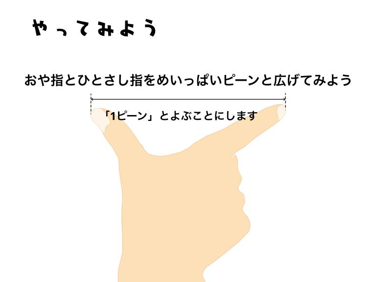
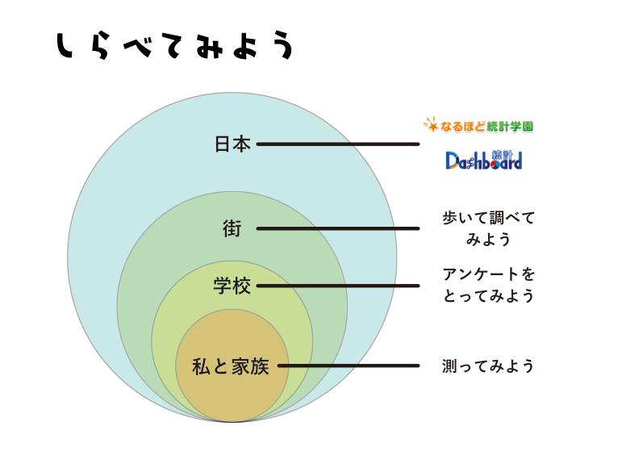
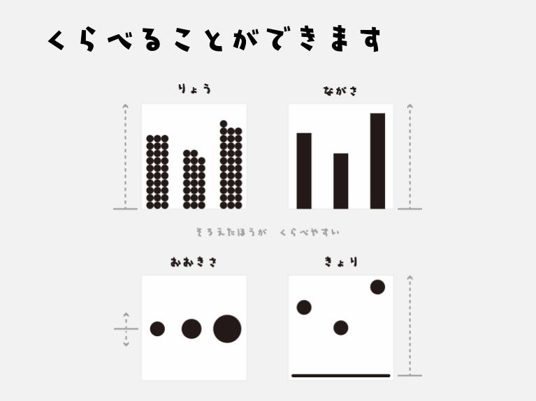
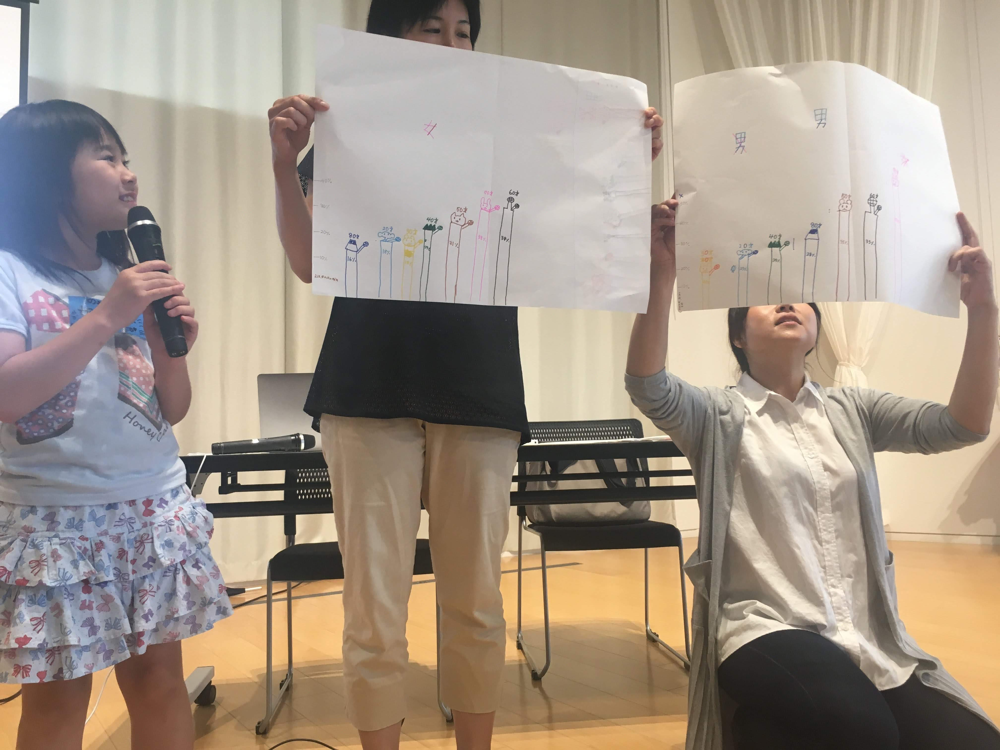
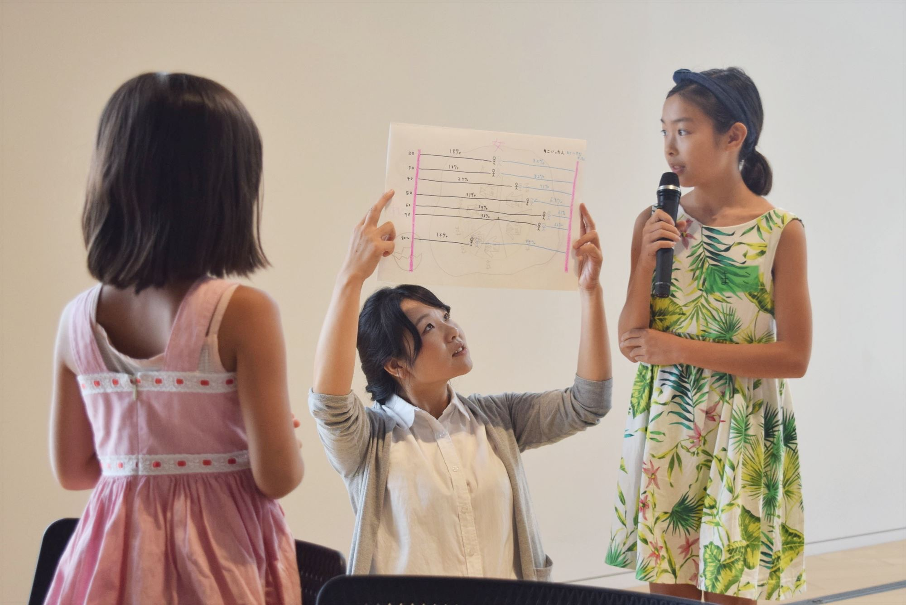
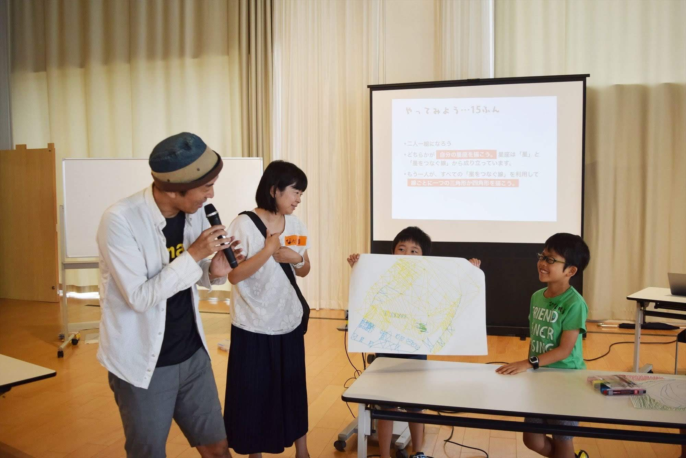
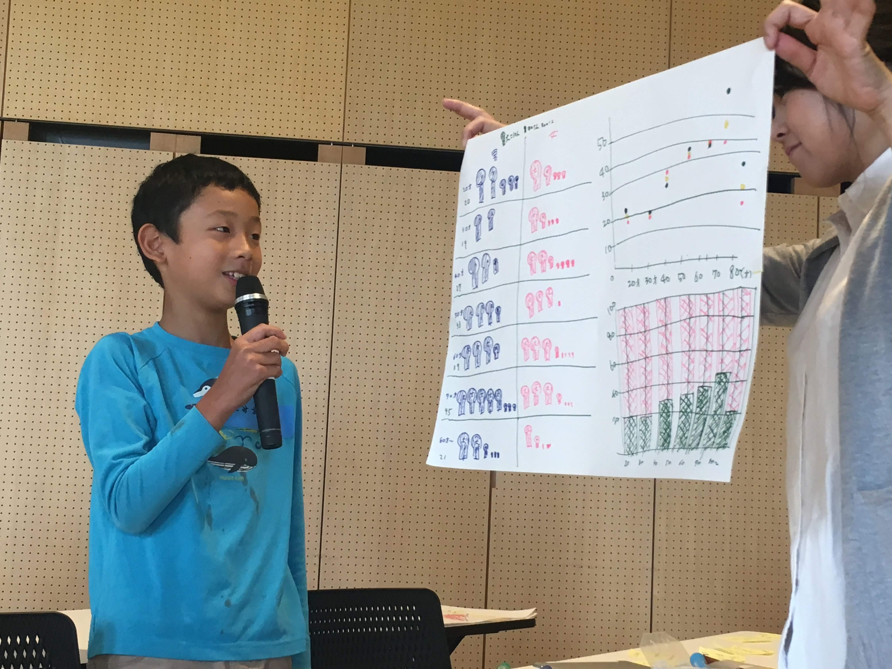
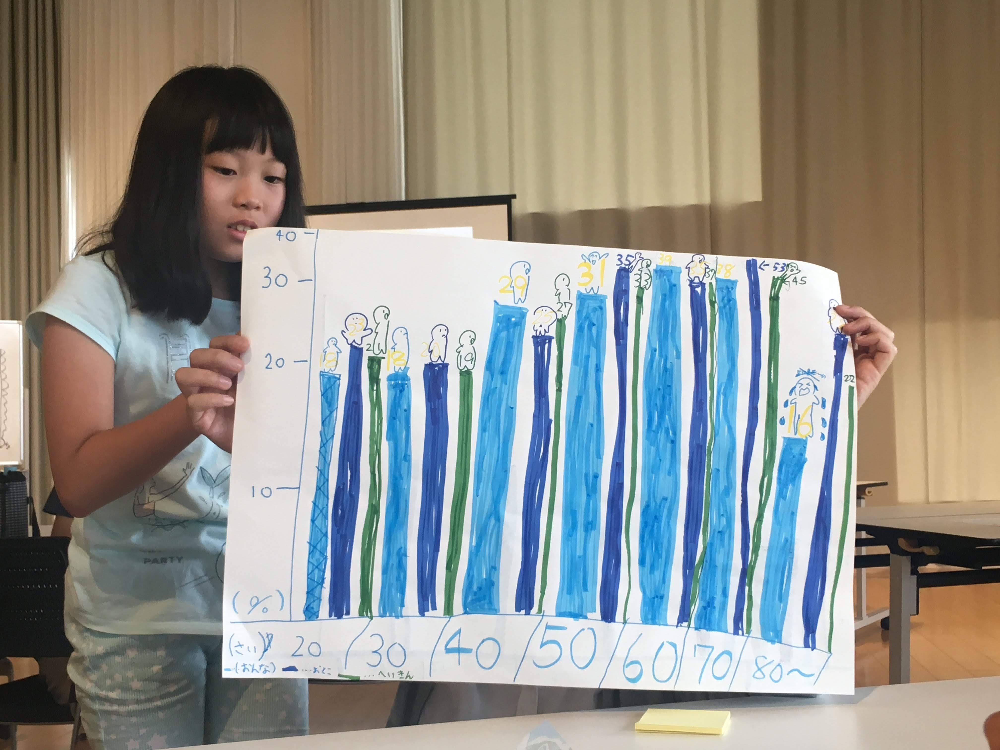

+++
author = "Yuichi Yazaki"
title = "Nagareyama, Chiba: Code for NAGAREYAMA Statistical-Chart Workshop for Elementary School Students"
slug = "code-for-nagareyama-drawing"
date = "2017-07-29"
categories = ["codefor"]
tags = ["Workshop"]
image = "images/presentation/IMG_5135.jpg"
+++

I participated as a facilitator in a workshop organized by Code for NAGAREYAMA in Nagareyama, Chiba Prefecture.

<!--more-->

## Event Overview

### Announcement

Data visualization has attracted a great deal of attention, but it can feel difficult to begin. This workshop introduced data visualization methods that even children could use. Children could apply them to summer projects, while adults could develop useful business skills. The instructor was Yuichi Yazaki, founder of Data Visualization Japan.

After seven years as a designer and art director at Business Architects Inc., Yazaki became independent in 2008. He has since worked extensively in the practice and promotion of data visualization and is a co-author of *The RESAS Textbook*.

### Slides

### Student Presentations

## Related Links

- [Draw Pictures with Data! Data Visualization — Parents and Children Welcome | Facebook](https://www.facebook.com/events/1595367000497933)
- [Code for NAGAREYAMA workshop post | Facebook](https://www.facebook.com/codefornagareyama/posts/pfbid0wfwcrwukeWrfHXxaWbs8GGry4eNdnGdGSJjiUjzLVQowwYwur23uKDheRQNPEdaxl)
