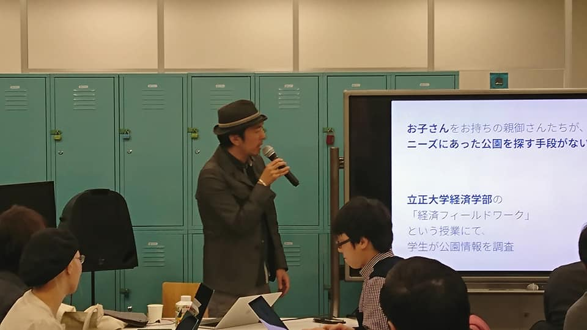
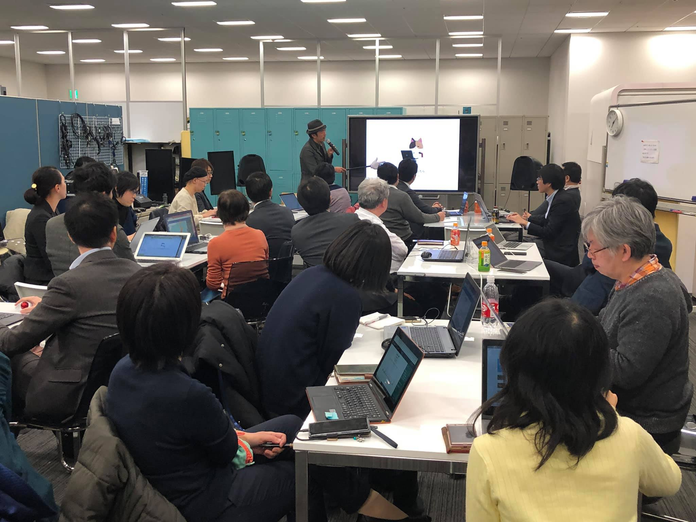
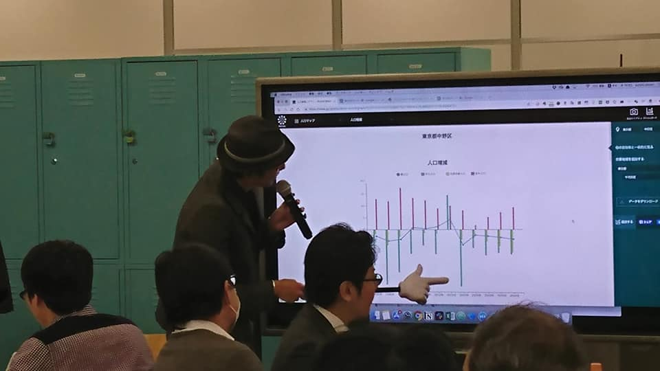
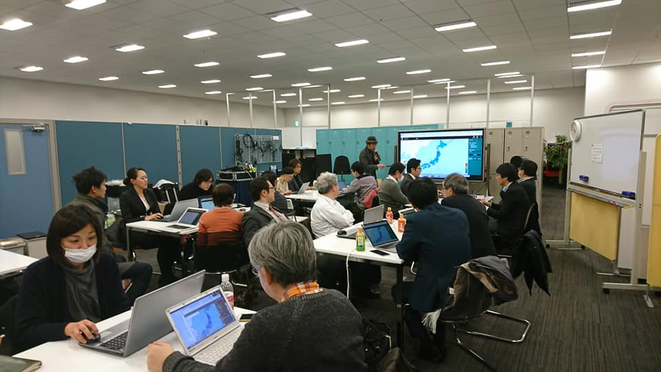

+++
author = "Yuichi Yazaki"
title = "Nakano, Tokyo: Presenting Visualization Methods at an Open-Data Study Session"
slug = "code-for-nakano-nas"
date = "2019-01-24"
categories = ["codefor"]
tags = []
image = "images/cover_nakano-nas.jpeg"
+++

On January 24, 2019, I taught the third session of “Using Open Data for Residents and Government,” a study series co-hosted by Nakano City Office (NAS) and the local Code for Nakano community.

<!--more-->

The session, titled “Visualizing Open Data and the Means to Do It,” explained effective ways to use open data to discover and address local issues.

### Main Topics

The presentation focused on concrete methods for making open data valuable to both residents and government.

- **Practicing data visualization**: I shared ways to visualize open data so that local conditions and issues could be communicated accurately and compellingly.
- **Introducing practical methods**: I presented specific tools and approaches that participants could use even without technical expertise, helping them take their first step toward working with data.

The session brought local government and the civic-tech community together to share knowledge for resident-led digital development.

- **Event**: Using Open Data for Residents and Government, Session 3: Visualizing Open Data and the Means to Do It
- **Date**: January 24, 2019
- **Co-hosts**: Nakano City Office (NAS) and Code for Nakano

## Related Links

- [Using Open Data for Residents and Government, Session 3 | Peatix](https://nas-code4nakano-3.peatix.com/)
- [Code for Nakano event report | Facebook](https://www.facebook.com/code4nakano/posts/pfbid0XhHzjHNQSBXoKSmZATVAo7MaRUTgcw7uYfDbBizfaxNrfYn8UpfxxnckzQjG8qc6l)
