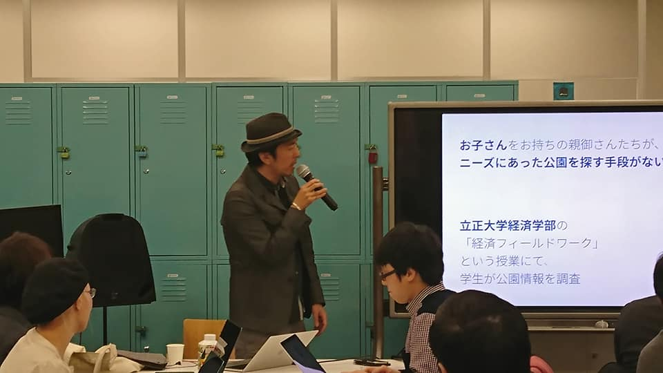
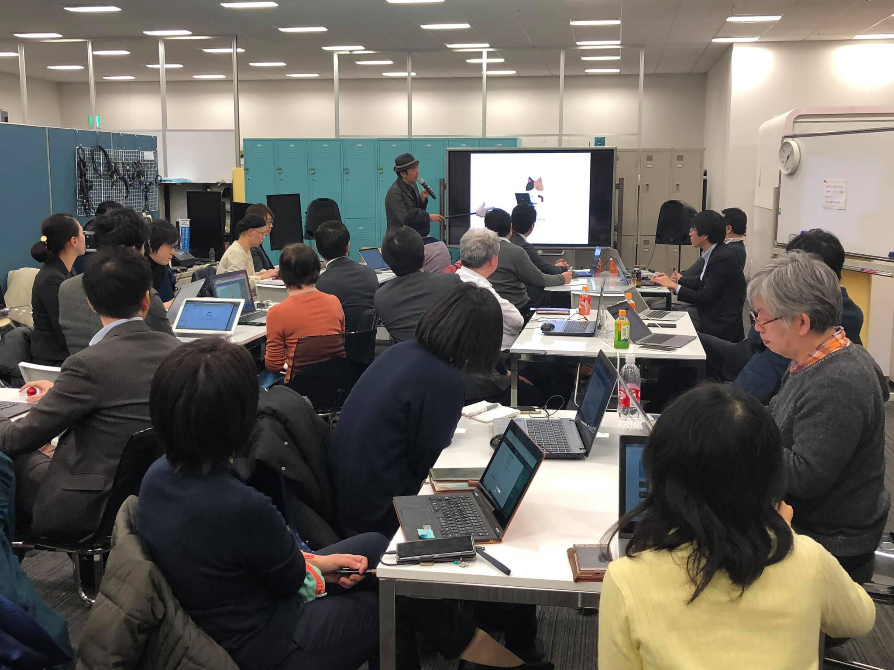
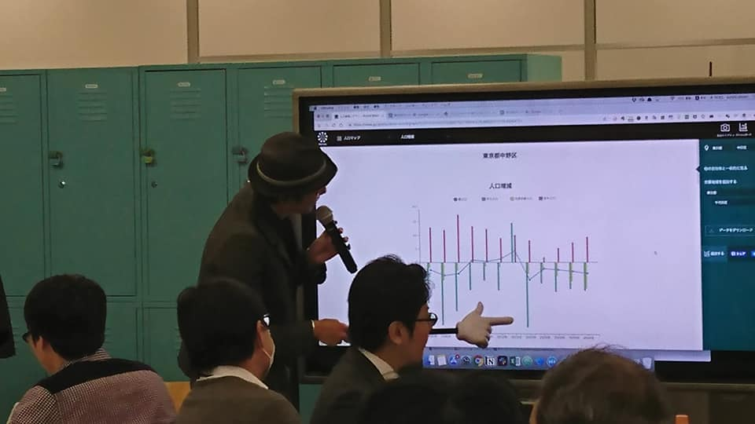
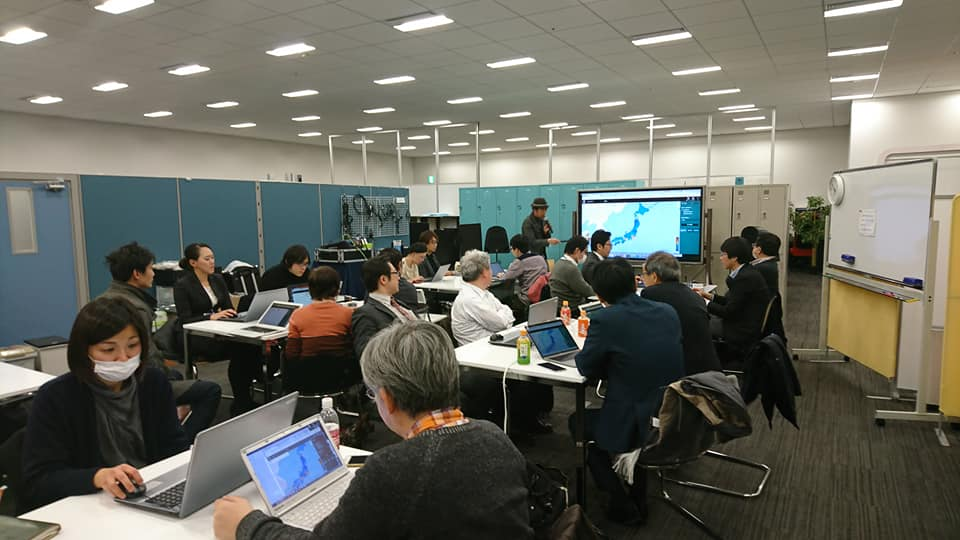

+++
author = "Yuichi Yazaki"
title = "【東京都中野区】中野区でのオープンデータ活用勉強会に登壇：可視化とその実践手段を解説"
slug = "code-for-nakano-nas"
date = "2019-01-24"
categories = [
    "codefor"
]
tags = [
]
image = "images/cover_nakano-nas.jpeg"
+++

2019年1月24日、中野区役所（NAS）と地域コミュニティ「Code for 中野」が共催する勉強会「**区民と行政のためのオープンデータ活用**」の第3回に講師として登壇いたしました。

<!--more-->

この回のテーマは、「**オープンデータの可視化とその手段**」とし、地域課題の発見・解決に向けたオープンデータの効果的な活用方法について解説しました。

**主な講演内容**

講演では、オープンデータを区民と行政の双方にとって価値あるものにするための具体的な手法に焦点を当てました。

- **データビジュアライゼーションの実践**: オープンデータをどのように「見える化」すれば、地域特有の課題や現状を正確かつ魅力的に伝えられるかという、データビジュアライゼーションのノウハウを共有しました。
- **手段の紹介**: データを扱うための具体的なツールや、技術的な知識がない参加者でも実践可能な方法を紹介し、参加者のデータ活用への第一歩を支援しました。

本登壇は、行政とシビックテックコミュニティが連携し、市民が主体となって地域のデジタル化を推進するための知見を共有する場となりました。

- **イベント名**: 区民と行政のためのオープンデータ活用 第3回 オープンデータの可視化とその手段
- **開催日**: 2019年1月24日
- **共催**: 中野区役所（NAS）、Code for 中野

 

## 関連リンク

- [区民と行政のためのオープンデータ活用 第3回 オープンデータの可視化とその手段 | Peatix](https://nas-code4nakano-3.peatix.com/)
- [Code for 中野 - Code for... | Facebook](https://www.facebook.com/code4nakano/posts/pfbid0XhHzjHNQSBXoKSmZATVAo7MaRUTgcw7uYfDbBizfaxNrfYn8UpfxxnckzQjG8qc6l)