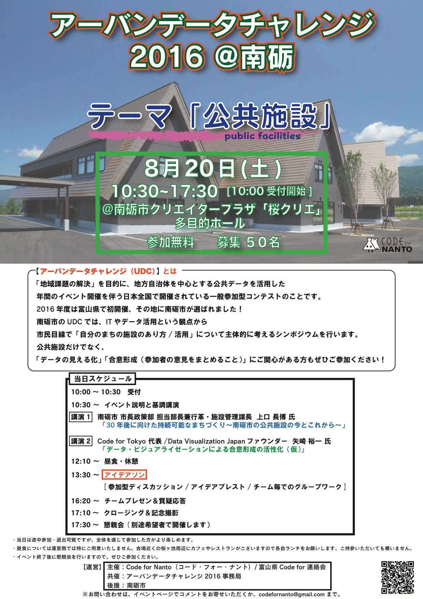
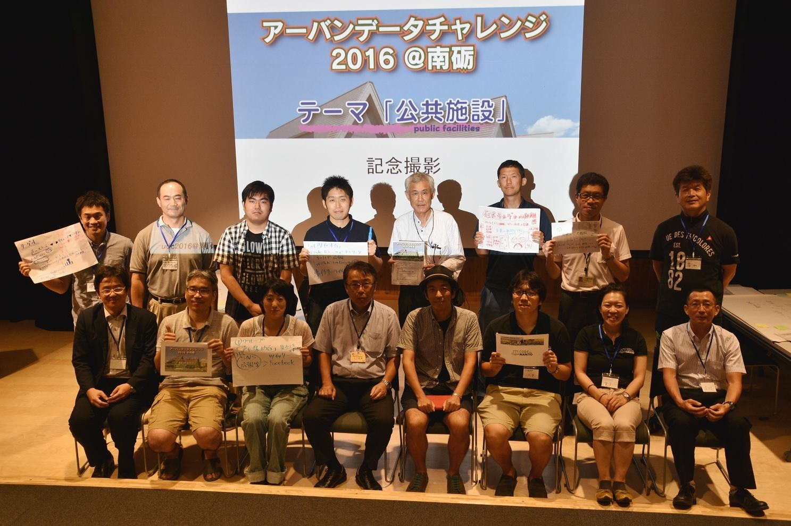
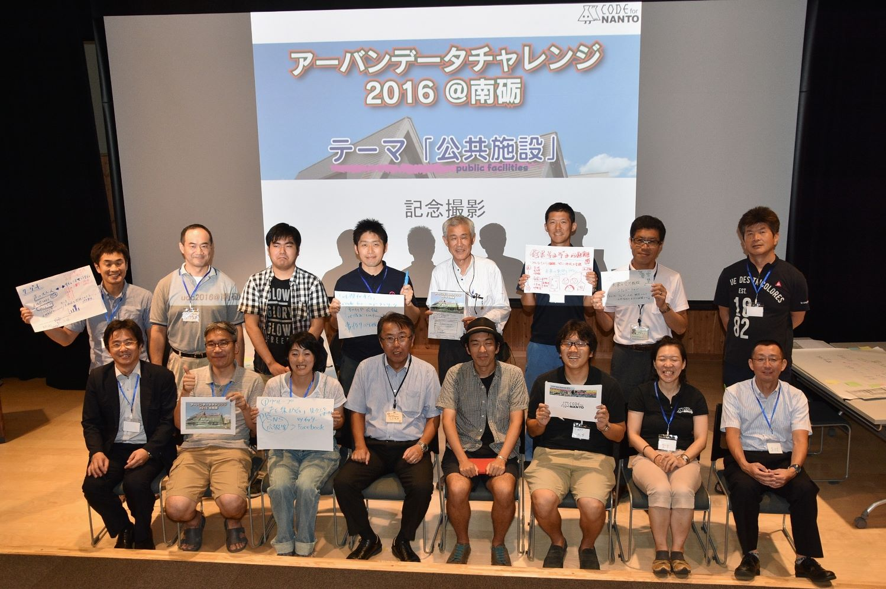

+++
author = "Yuichi Yazaki"
title = "Nanto, Toyama: Talk at the Urban Data Challenge 2016 Public-Facilities Ideathon"
slug = "code-for-nanto-urbandata"
date = "2016-08-20"
categories = ["codefor"]
tags = []
image = "images/cover_nanto-urbandata.jpg"
+++

I spoke at the “Urban Data Challenge 2016 in Nanto: Public-Facilities Ideathon” in Nanto, Toyama Prefecture, on using public data and building consensus.

The event addressed Nanto's urgent need to reduce its stock of public facilities by approximately fifty percent. By visualizing and using public data, it aimed to help residents understand the situation, treat it as their own concern, and develop solutions.

<!--more-->

## Presentation

**Speaker:** Yuichi Yazaki (representative of Code for Tokyo / founder of Data Visualization Japan)  
**Title:** “Energizing Consensus Building through Data Visualization”

I discussed the importance of data visualization as a way to raise public interest and encourage constructive dialogue around the complex and consequential issue of reorganizing public facilities. Presenting data clearly helps each participant understand the structure of the problem quickly, exchange views from multiple perspectives, and work toward more effective consensus.

## Event Information

- **Event**: Nanto City and Code for Nanto: Reconsidering Nanto's Public Facilities through Public Data and Data Visualization (Urban Data Challenge 2016 in Nanto Public-Facilities Ideathon)
- **Date**: Saturday, August 20, 2016
- **Venue**: Nanto Creator Plaza

## Related Links

- [Urban Data Challenge 2016 in Nanto: Public-Facilities Ideathon](https://www.facebook.com/events/650399448456534/?post_id=655188431310969&view=permalink)
