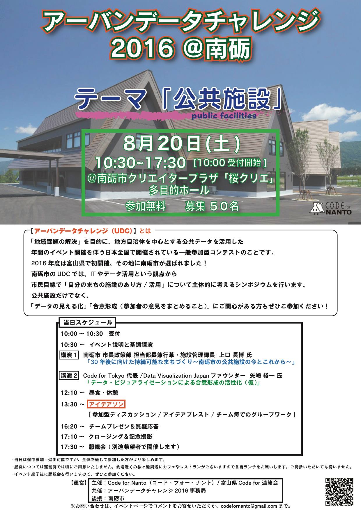
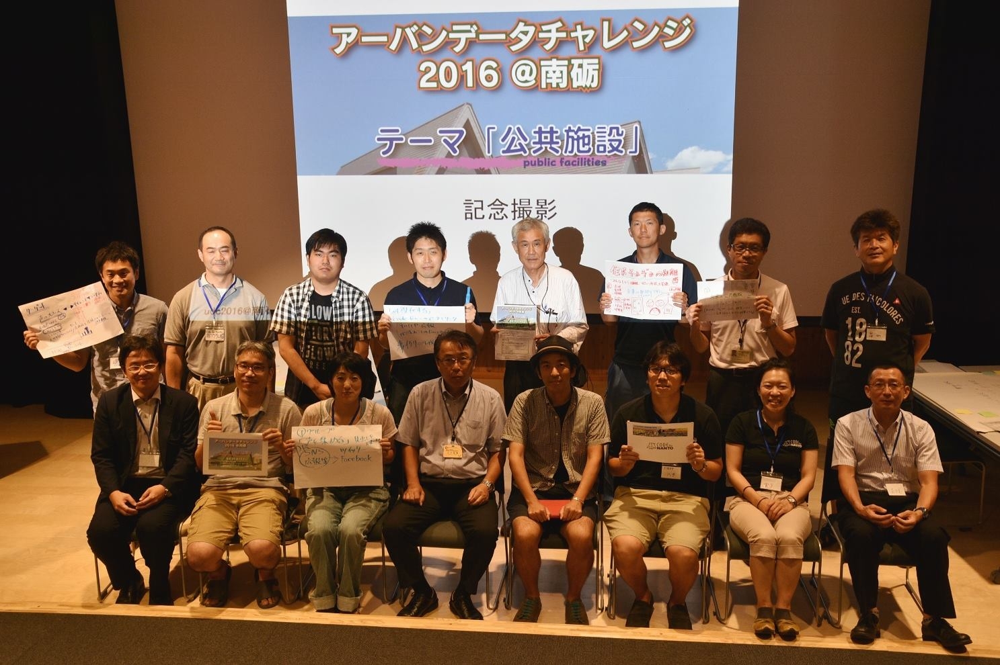
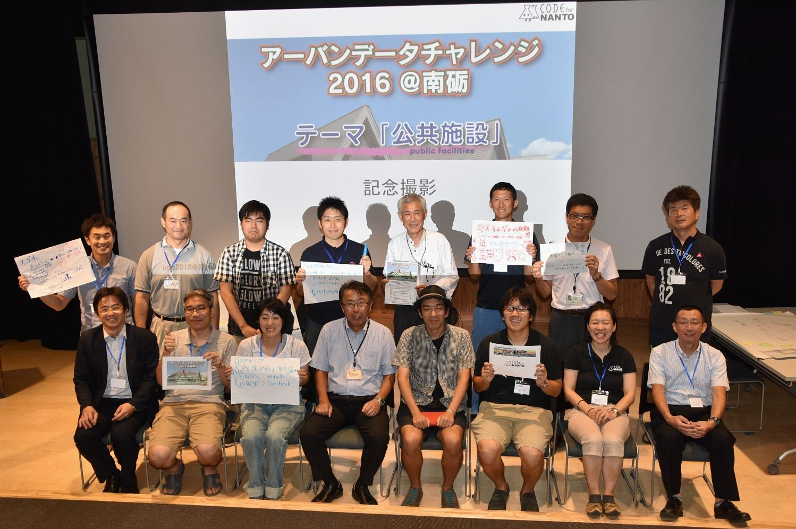

+++
author = "Yuichi Yazaki"
title = "【富山県南砺市】「アーバンデータチャレンジ2016＠南砺 公共施設アイデアソン」にて講演"
slug = "code-for-nanto-urbandata"
date = "2016-08-20"
categories = [
    "codefor"
]
tags = [
]
image = "images/cover_nanto-urbandata.jpg"
+++

矢崎 裕一は、富山県南砺市で開催された「アーバンデータチャレンジ2016＠南砺 公共施設アイデアソン」に登壇し、公共データの活用と合意形成をテーマに講演を行いました。

本イベントは、南砺市が抱える公共施設の約50％縮減という喫緊の課題に対し、「データの見える化」と「公共データの活用」を通じて市民が現状を理解し、“ジブンゴト”として解決策を考えることを目的として開催されました。

<!--more-->

## 講演内容

**登壇者：** 矢崎 裕一（Code for Tokyo 代表 / Data Visualization Japanファウンダー）
**講演タイトル：**「データビジュアライゼーションによる合意形成の活性化」

矢崎は、公共施設の再編という複雑で重要な施策において、市民の関心を高め、建設的な議論を促す手法として「データビジュアライゼーション（データの視覚化）」の重要性を解説しました。データをわかりやすく提示することで、参加者一人ひとりが課題の構造を迅速に把握し、多角的な意見交換を経て、より実効性の高い合意形成へと繋げるためのアプローチを提案しました。

## 開催情報

  * **イベント名：** 富山県南砺市・Code For Nanto／｢公共データの活用｣と｢データの見える化｣で考える南砺市の公共施設再編（アーバンデータチャレンジ2016＠南砺 公共施設アイデアソン）
  * **日時：** 平成28年8月20日(土)
  * **場所：** 南砺クリエータープラザ

## 関連リンク

- [アーバンデータチャレンジ2016＠南砺「公共施設アイデアソン」](https://www.facebook.com/events/650399448456534/?post_id=655188431310969&view=permalink)