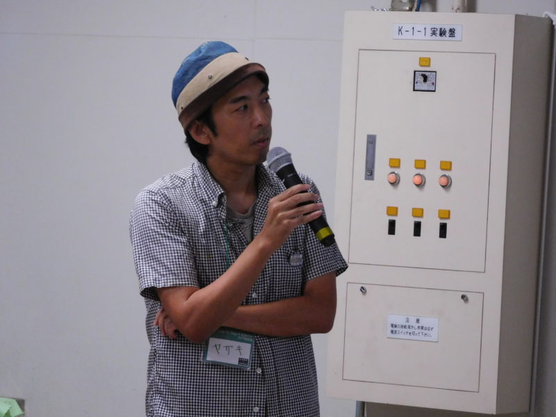
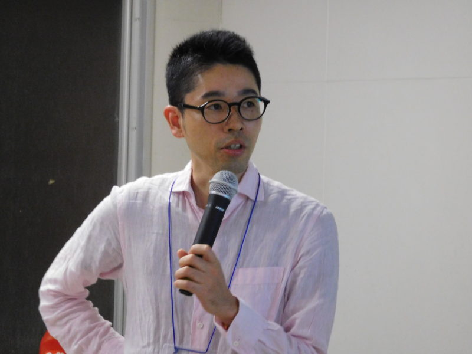
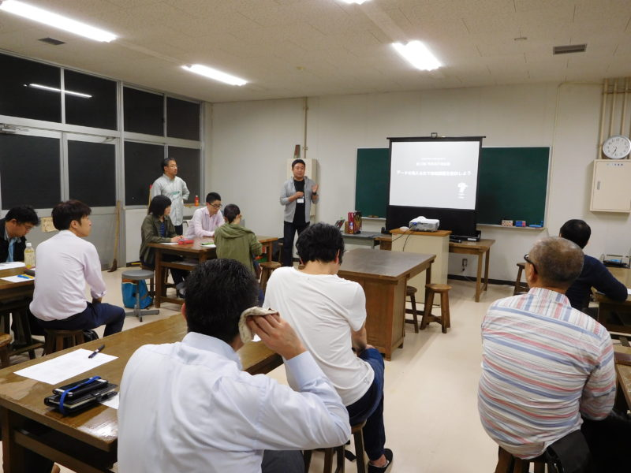
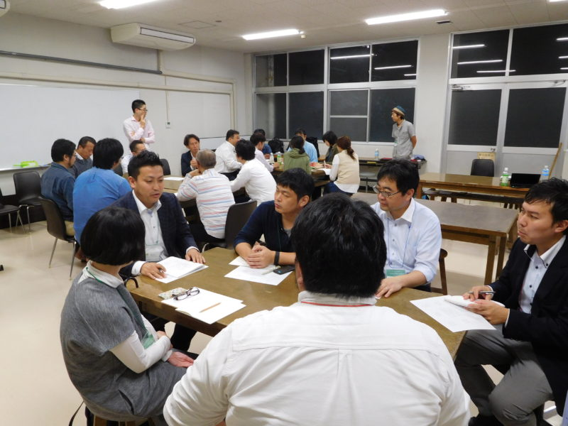
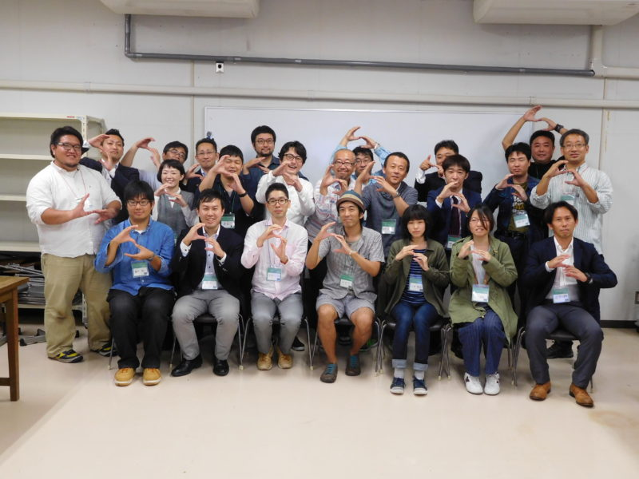

+++
author = "Yuichi Yazaki"
title = "Saga: Code for Saga × Saga University Workshop on Solving Local Issues through Data Visualization"
slug = "code-for-saga-university"
date = "2016-10-28"
categories = ["codefor"]
tags = []
image = "images/DSCN0268-800x600.jpg"
+++

I gave a presentation at the first “Workshop on Solving Local Issues through Data Visualization,” the inaugural collaboration between Code for Saga and Saga University.

<!--more-->

### Scenes from the Workshop

## Related Links

- [Workshop on Solving Local Issues through Data Visualization, Session 1 — Code for Saga](https://code4saga.org/archives/373)
