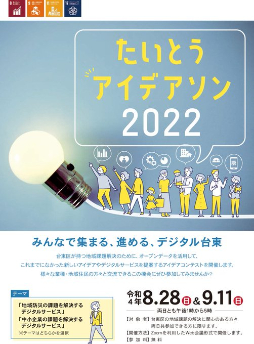
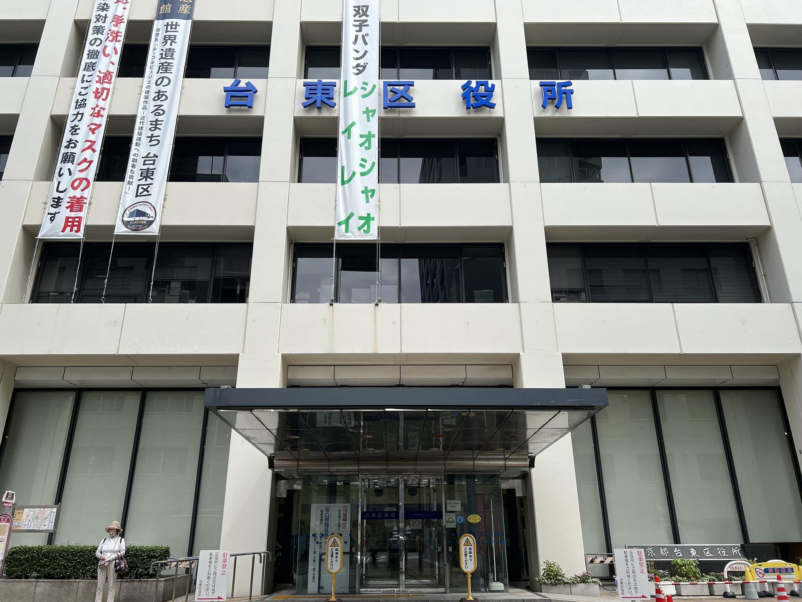
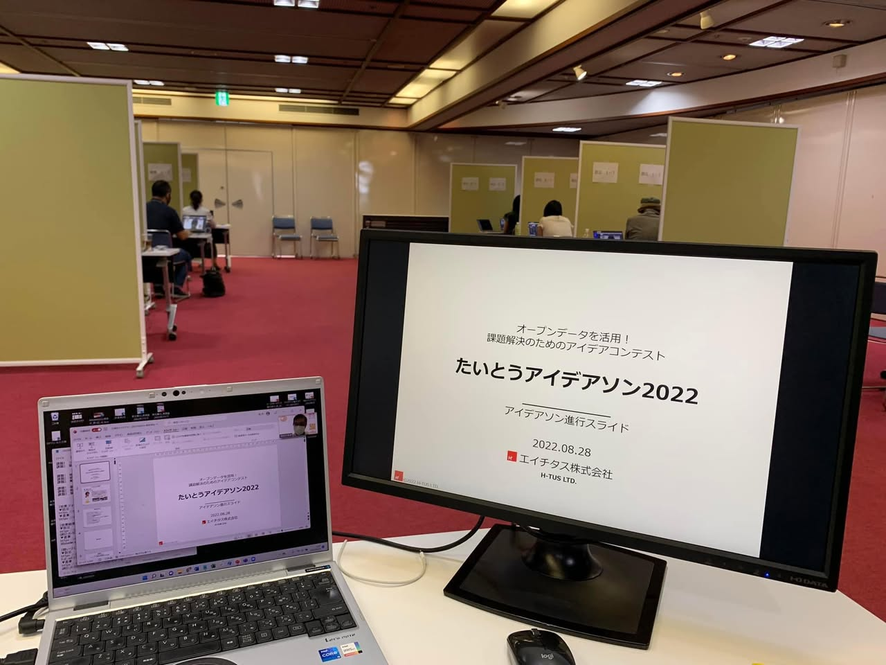
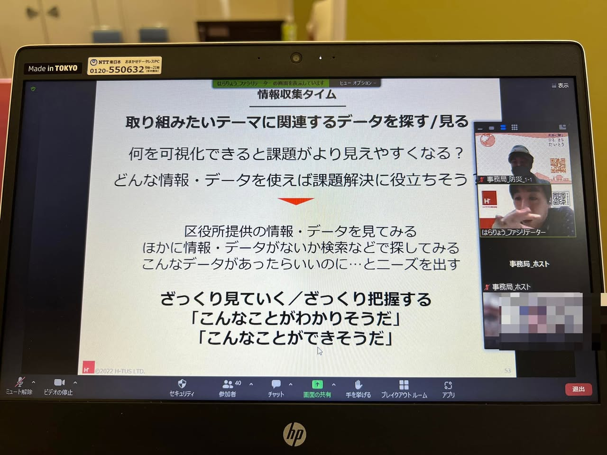
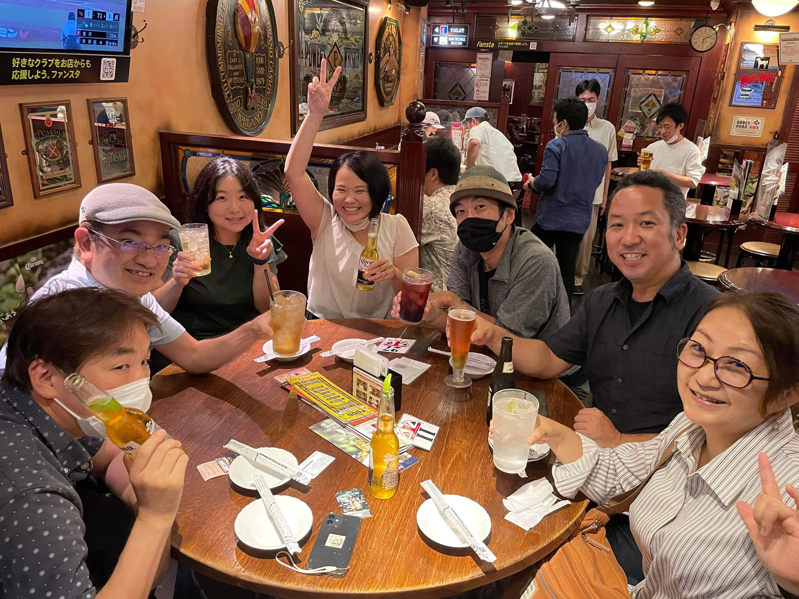

+++
author = "Yuichi Yazaki"
title = "Taito, Tokyo: Operational Support for the Open-Data Ideathon Taito Ideathon 2022"
slug = "code-for-taito-ideathon"
date = "2022-08-28"
categories = ["codefor"]
tags = []
image = "images/cover_taito-ideathon.jpeg"
+++

Code for Tokyo supported the planning and delivery of “Taito Ideathon 2022: An Open-Data Idea Contest for Solving Problems,” organized by Taito City in 2022, as the contracted operational-support provider.

<!--more-->

The event focused on regional disaster preparedness and digital services for challenges faced by small and medium-sized businesses. It was held via Zoom on August 28 and September 11, 2022, from 1:00 to 5:00 p.m. each day.

We supported residents and businesses throughout the process of developing data-informed ideas to address challenges in Taito's disaster-prevention and industrial sectors.

### Main Contributions

- **Ideathon design and operational support**: We proposed and coordinated the timetable, Zoom operations, group-work format, and other technical and content details to ensure smooth delivery.
- **Facilitator recruitment and coordination**: We assembled a facilitation team and used rehearsals to establish roles and a shared understanding of the event flow.
- **A participant-friendly environment**: We advised the city on positive, unambiguous language for participation terms and website provisions concerning copyright and portrait rights. Revisions clarified the benefits for participants and helped create an environment conducive to high-quality ideas.

This project demonstrates how expertise in planning and operating municipal open-data events can promote co-creation between residents and government and lead to meaningful outcomes.

## Related Links

- [Taito Ideathon 2022 announcement | Taito City](https://www.city.taito.lg.jp/kusei/sanka/release/2022/press0407/press040701_02.html)
- [Taito Ideathon 2022 results | Taito City](https://www.city.taito.lg.jp/kusei/online/opendata/seikatu/Taitoideathon2022.html)
