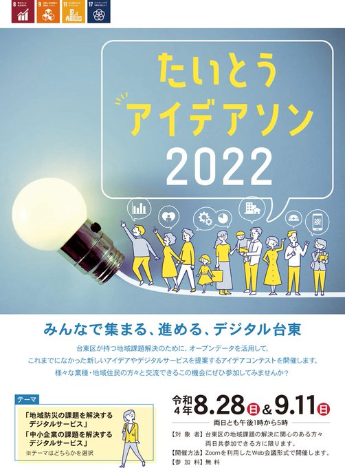
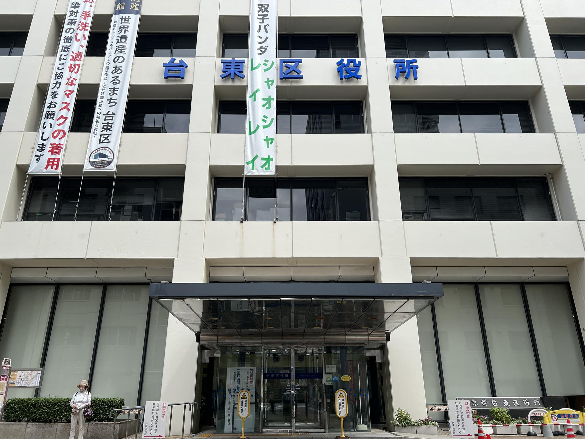
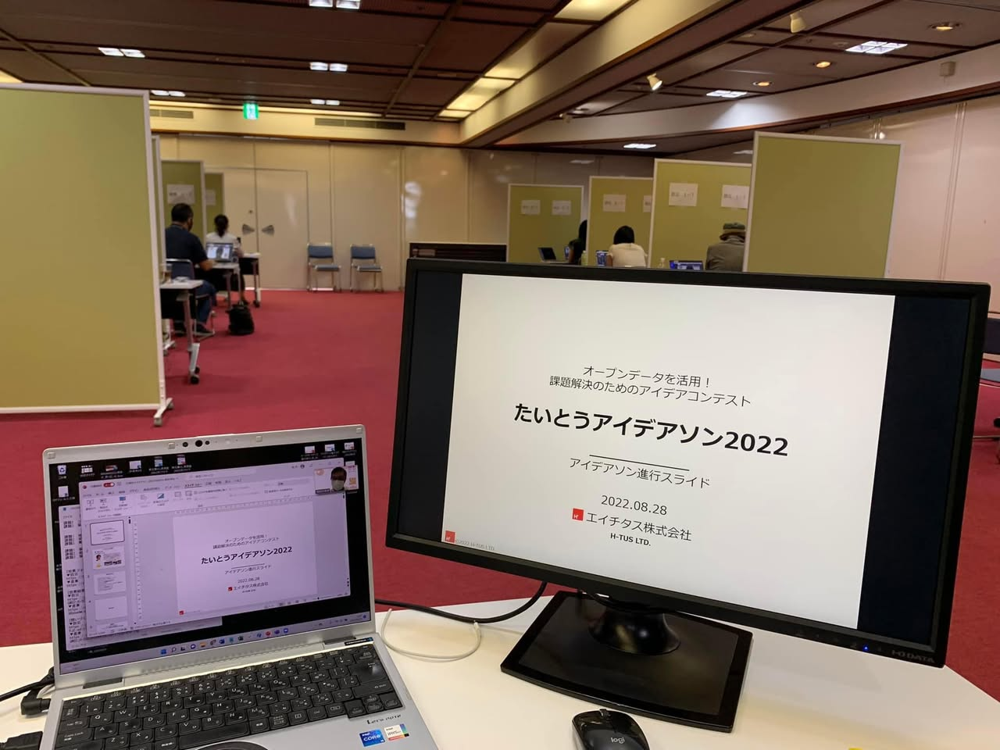
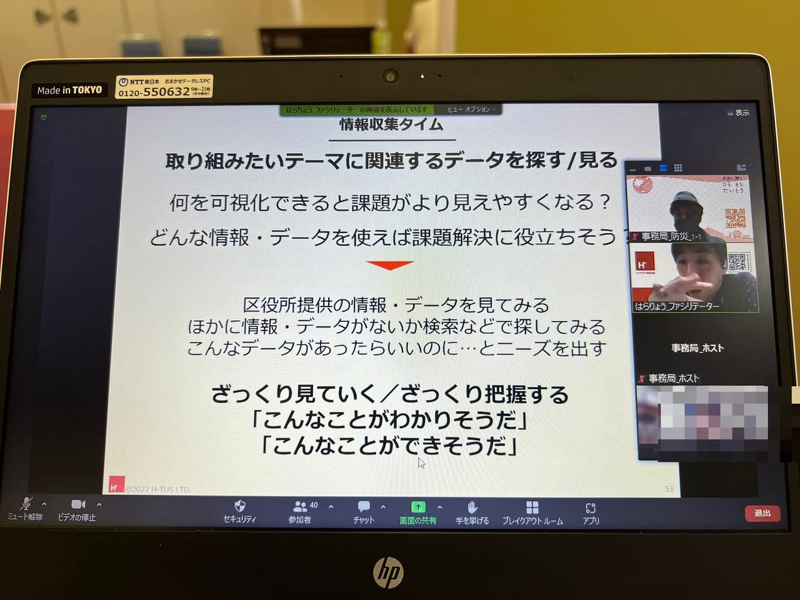
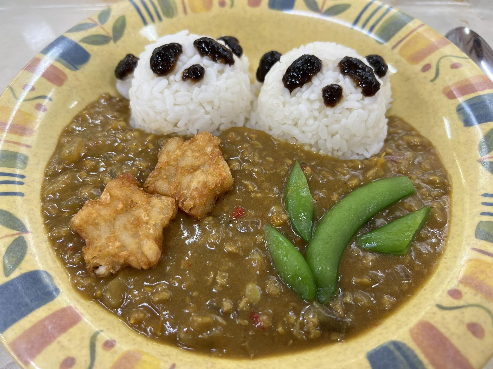
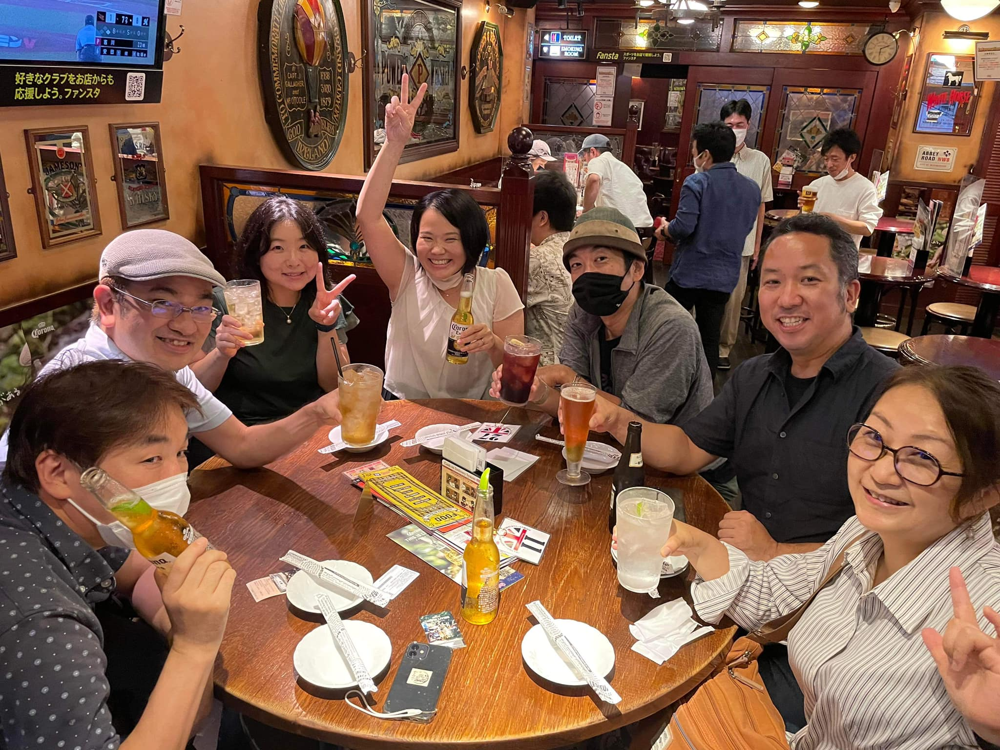

+++
author = "Yuichi Yazaki"
title = "【東京都台東区】オープンデータを活用したアイデアソン「たいとうアイデアソン2022」の運営支援"
slug = "code-for-taito-ideathon"
date = "2022-08-28"
categories = [
    "codefor"
]
tags = [
]
image = "images/cover_taito-ideathon.jpeg"
+++

2022年に東京都台東区が開催した「**オープンデータを活用！課題解決のためのアイデアコンテスト「たいとうアイデアソン2022」**」において、Code for Tokyoが**運営支援委託事業者**として、企画・実施をサポートいたしました。

<!--more-->

「たいとうアイデアソン2022」は、**地域防災**および**中小企業の課題を解決するデジタルサービス**をテーマに掲げ、2022年8月28日と9月11日の両日（各日13時から17時）に**Zoomを利用したWeb会議形式**で開催されました。

台東区の防災分野および産業分野の課題解決に向け、区民や事業者がデータに基づくアイデアを創出するプロセスを全面的に支援しました。

**主な貢献内容**

* **アイデアソン設計・運営支援**  
イベント当日の円滑な進行を目指し、タイムテーブルの設計やZoom会議の運営方法、グループワークの進め方など、技術的側面・コンテンツ側面の双方から具体的な提案と調整を実施しました。
* **ファシリテーターの確保と調整**  
グループワークを円滑に進めるため、ファシリテーターチームの編成・調整を行い、リハーサルを通じて役割分担や進行イメージの共有を行いました。
* **参加者フレンドリーな環境整備**  
参加者が安心してアイデアを創出できるよう、イベントの参加規約やウェブサイトにおける著作権・肖像権に関する文言について、より前向きで誤解のない表現となるよう区に提言。参加者にとってのメリットが伝わる表現への修正を実現し、質の高いアイデア出しを促進する環境づくりに貢献しました。

本実績は、自治体におけるオープンデータ利活用イベントの企画・運営において、市民と行政の「共創」を促進し、実効性のある成果を生み出すためのノウハウを提供した事例となります。

## 関連リンク

- [オープンデータを活用！課題解決のためのアイデアコンテスト「たいとうアイデアソン2022」開催！　台東区ホームページ](https://www.city.taito.lg.jp/kusei/sanka/release/2022/press0407/press040701_02.html)
- [たいとうアイデアソン2022実施結果　台東区ホームページ](https://www.city.taito.lg.jp/kusei/online/opendata/seikatu/Taitoideathon2022.html)