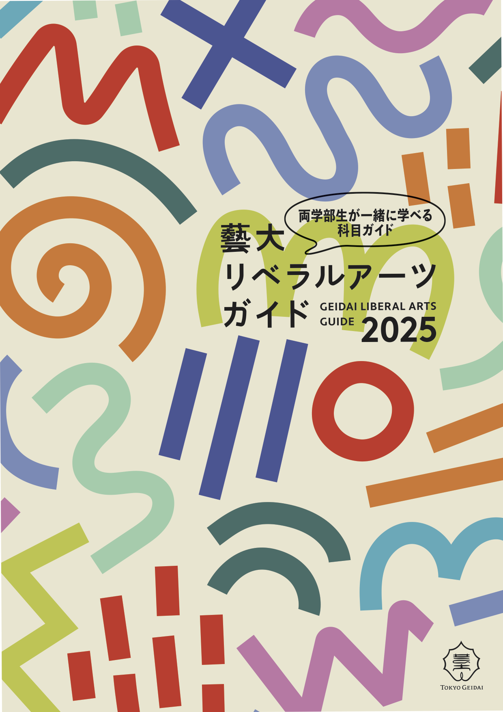
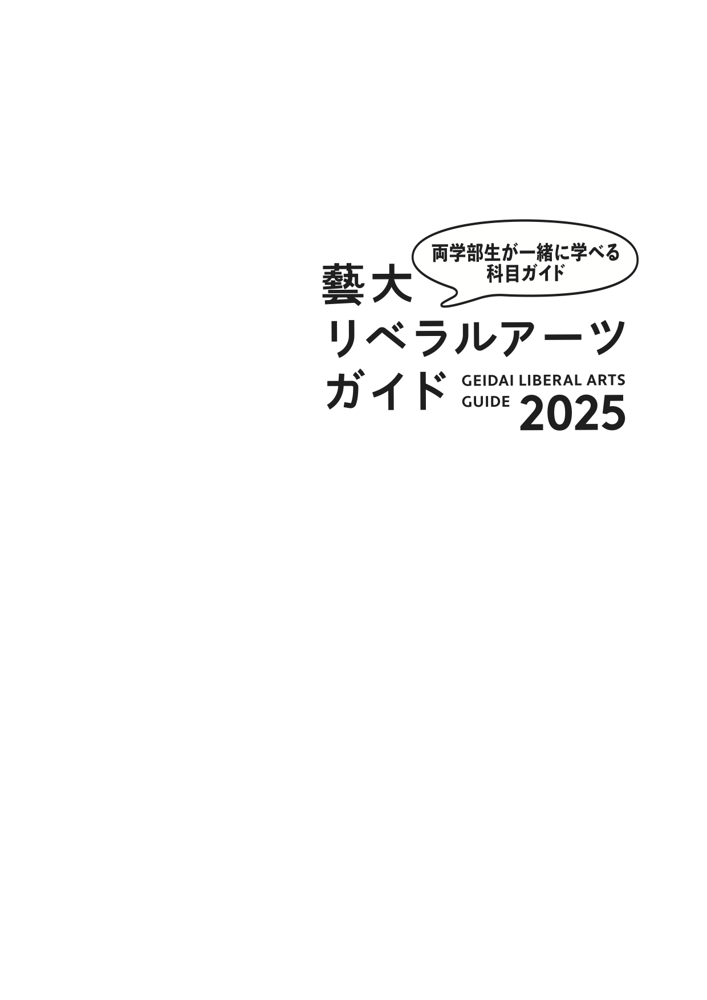
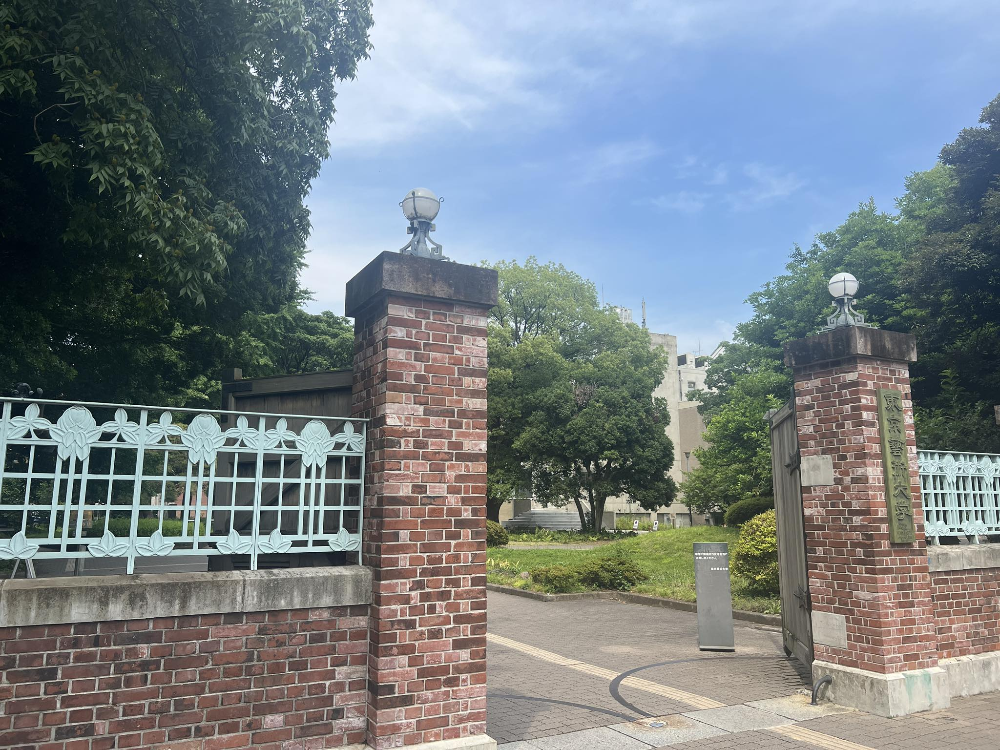
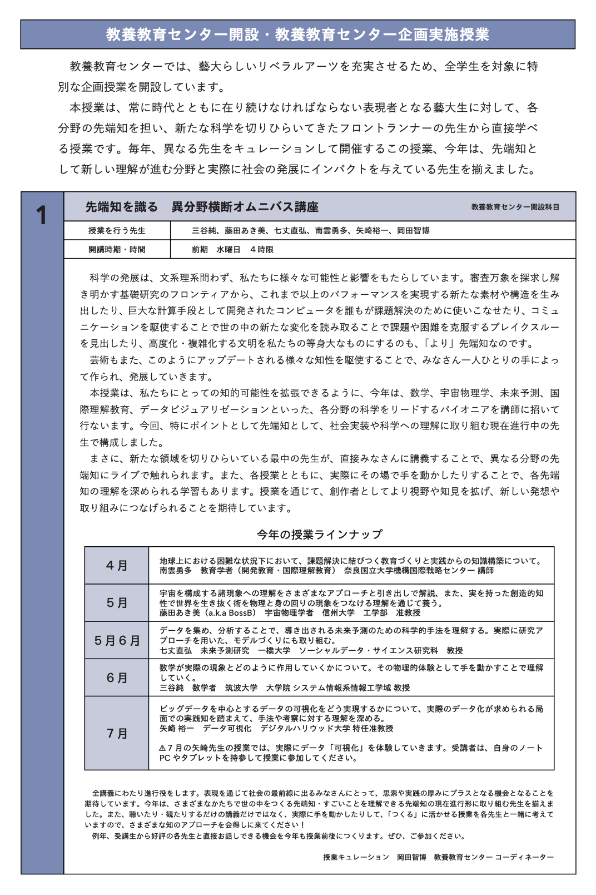

+++
author = "Yuichi Yazaki"
title = "Tokyo University of the Arts Interdisciplinary Omnibus Course on Advanced Knowledge"
slug = "geidai-liberal-arts"
date = "2025-07-01"
categories = ["education"]
tags = []
image = "images/cover.png"
+++

I taught all four July 2025 sessions of the Tokyo University of the Arts interdisciplinary omnibus course “Encountering Advanced Knowledge.”

<!--more-->

## Related Links

- [Geidai Liberal Arts Guide 2025](https://www.geidai.ac.jp/wp-content/uploads/2025/04/Geidai_Liberal_Arts_Guide_2025_Web.pdf)
