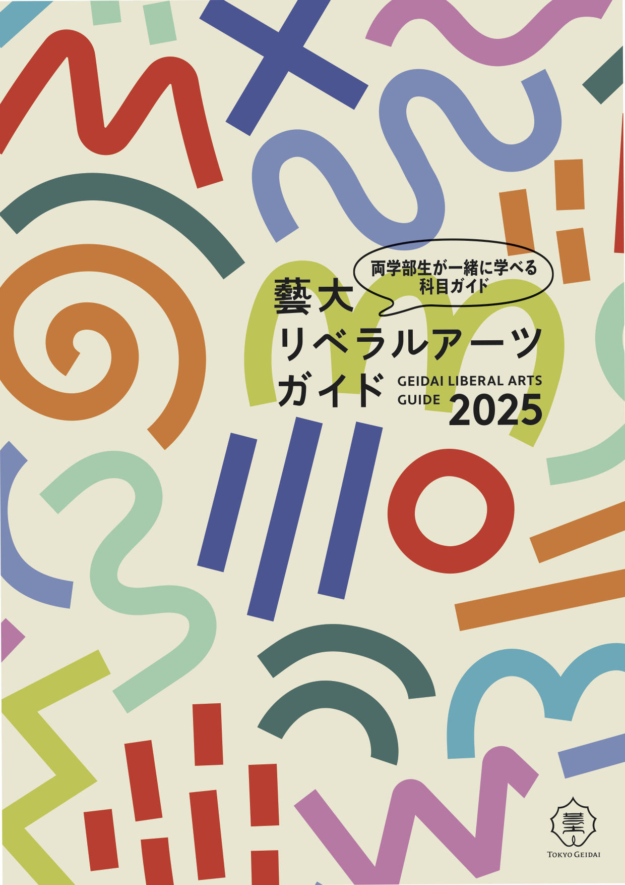
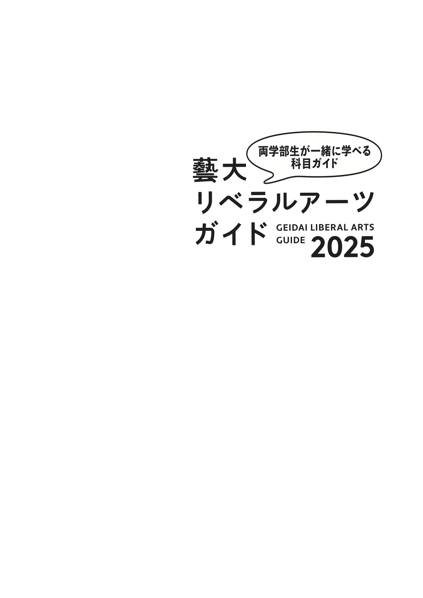
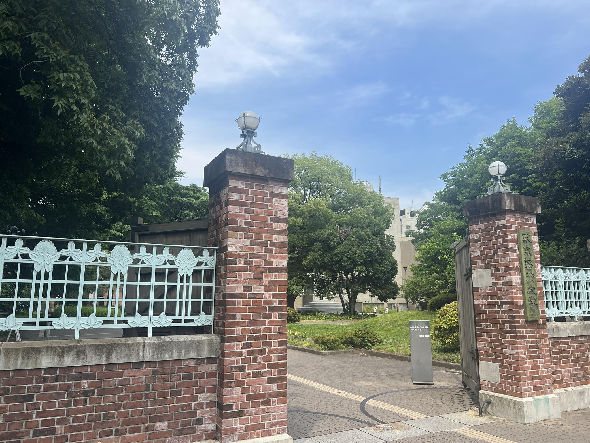
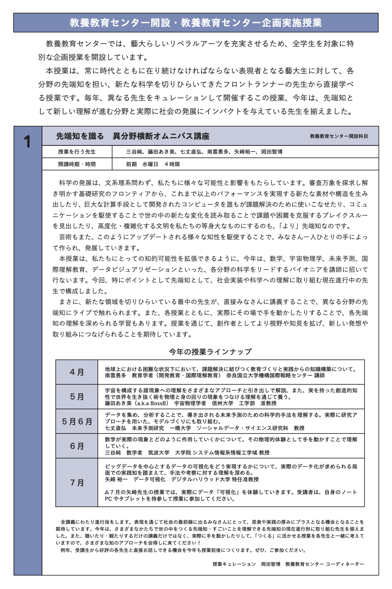

+++
author = "Yuichi Yazaki"
title = "東京藝術大学「先端知を識る　異分野横断オムニバス講座」"
slug = "geidai-liberal-arts"
date = "2025-07-01"
categories = [
    "education"
]
tags = [
]
image = "images/cover.png"
+++

東京藝術大学「先端知を識る　異分野横断オムニバス講座」2025年7月の全4回講義を担当しました。

<!--more-->

## 関連リンク

- [藝大リベラルアーツガイド2025](https://www.geidai.ac.jp/wp-content/uploads/2025/04/Geidai_Liberal_Arts_Guide_2025_Web.pdf)