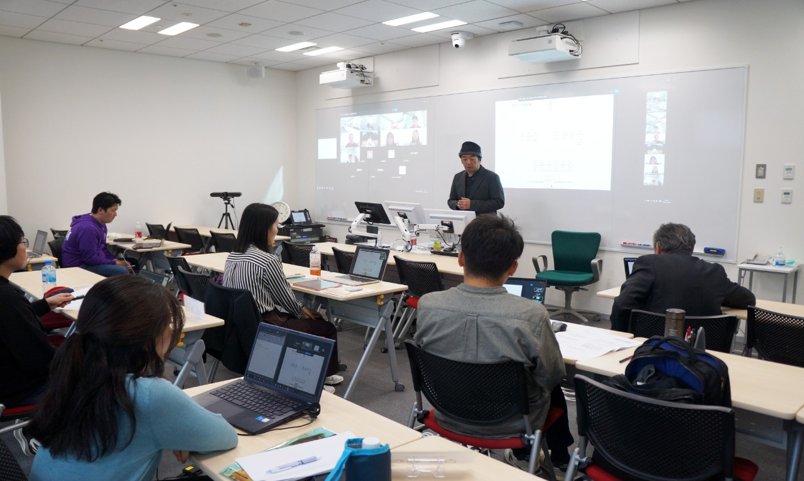

+++
author = "Yuichi Yazaki"
title = "立命館大学ビジネススクール（大学院経営管理研究科）で講義"
slug = "guest-ritsumei"
date = "2025-11-03"
categories = [
    "education"
]
tags = [
]
image = "images/cover.jpg"
+++

立命館大学ビジネススクール（大学院経営管理研究科）にて「データビジュアライゼーションの世界」と題したゲスト講義を3回実施させていただきました。

<!--more-->

- 2024.11.03
- 2025.11.02
- 2025.11.03

## 関連リンク

- [【2024.11.03】データビジュアライゼーションの世界 | 立命館大学ビジネススクール（大学院経営管理研究科） | 立命館大学](https://www.ritsumei.ac.jp/mba/curriculum/speaker/detail/?id=124)
- [【2025.11.02】データビジュアライゼーションの世界 | 立命館大学ビジネススクール（大学院経営管理研究科） | 立命館大学](https://www.ritsumei.ac.jp/mba/curriculum/speaker/detail/?id=203)
- [【2025.11.03】データビジュアライゼーションの世界 | 立命館大学ビジネススクール（大学院経営管理研究科） | 立命館大学](https://www.ritsumei.ac.jp/mba/curriculum/speaker/detail/?id=204)