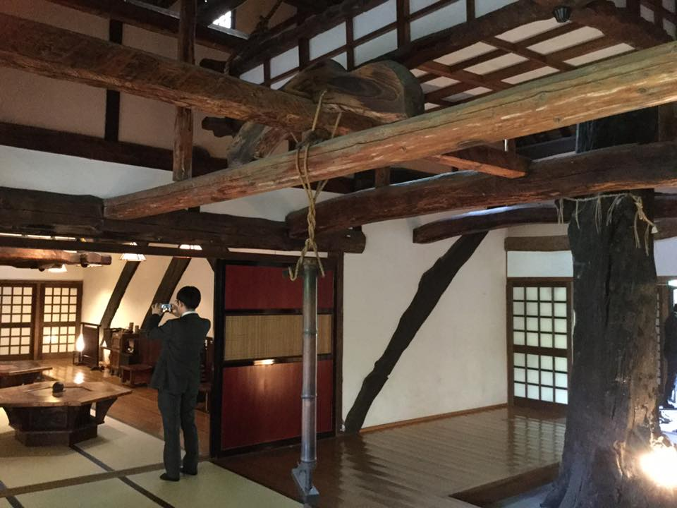
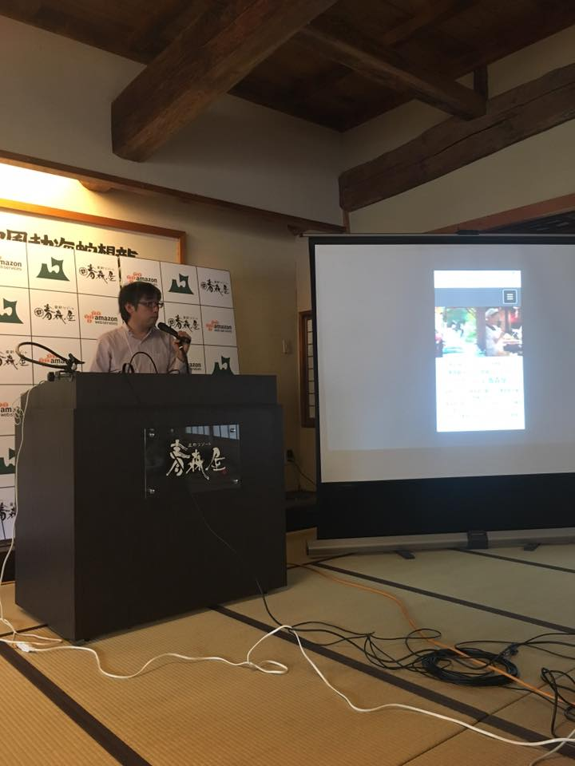
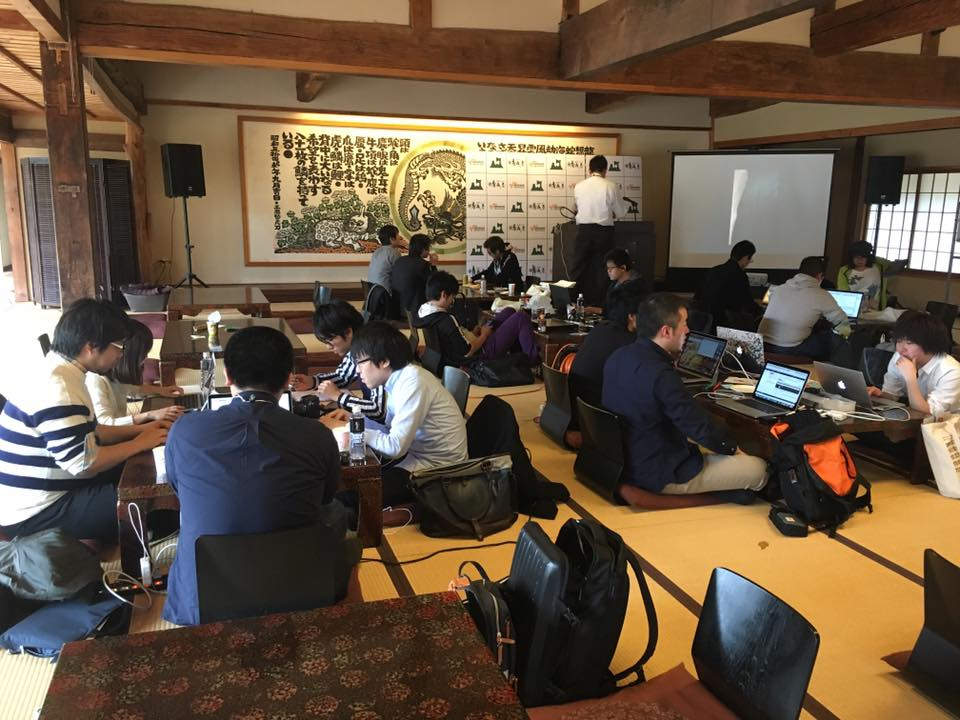
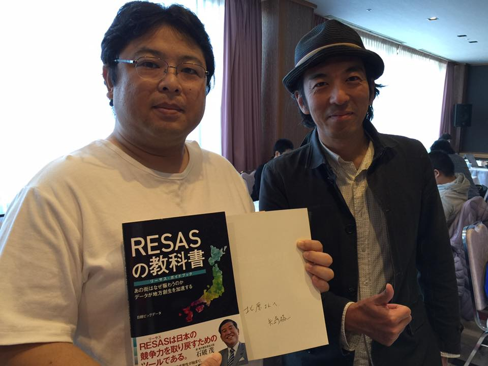
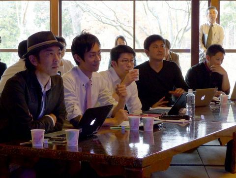
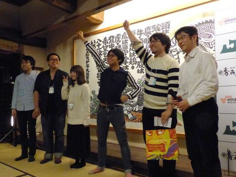
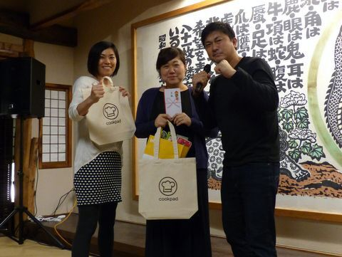
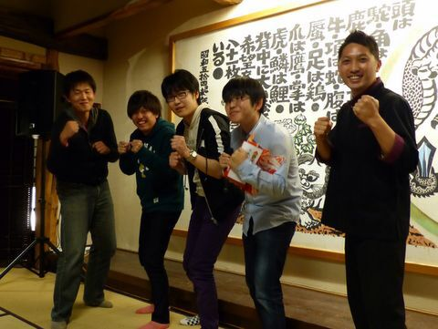
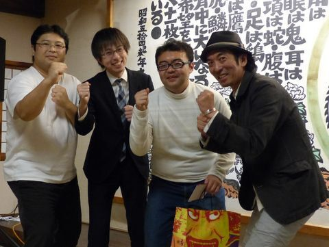

+++
author = "Yuichi Yazaki"
title = "Aomori: Judge for the Aomori Tourism App Development Contest"
slug = "judge-aomori-tourism-app-dev-contest"
date = "2016-10-04"
categories = ["civictech"]
tags = ["Hackathon", "Judge"]
image = "images/event/468451158_10160661943153201_810002551114112023_n.jpg"
+++

Aomori Prefecture held a residential hackathon at Hoshino Resorts Aomoriya. Over three days and two nights, participants developed apps that communicated the appeal of Aomori through the theme of tourism. I spoke at the preliminary event and served as a hackathon judge.

<!--more-->

## Event Overview

- October 4, 2016: Preliminary event
- November 18–20, 2016: Hackathon development
- November 19, 2016: Presentations and award announcements

### Scenes from the Event

### Slides

- [Tourism Data Analysis with RESAS | Speaker Deck](https://speakerdeck.com/n1n9/resasdehazimeruguan-guang-detafen-xi)

### Judges

### Award-Winning Teams

## Related Links

### Event Operator

- [Aomori Tourism App Development Contest — H-tus](https://htus.jp/works/%E9%9D%92%E6%A3%AE%E8%A6%B3%E5%85%89%E3%82%A2%E3%83%97%E3%83%AA%E9%96%8B%E7%99%BA%E3%82%B3%E3%83%B3%E3%83%86%E3%82%B9%E3%83%88/)

### Participant Reports

- [ASCII.jp report on the Aomori Tourism App Development Contest](https://ascii.jp/elem/000/001/422/1422480/)
- [Participating in the Aomori Tourism App Development Contest — Cookpad Developer Blog](https://techlife.cookpad.com/entry/2016/12/05/183442)
