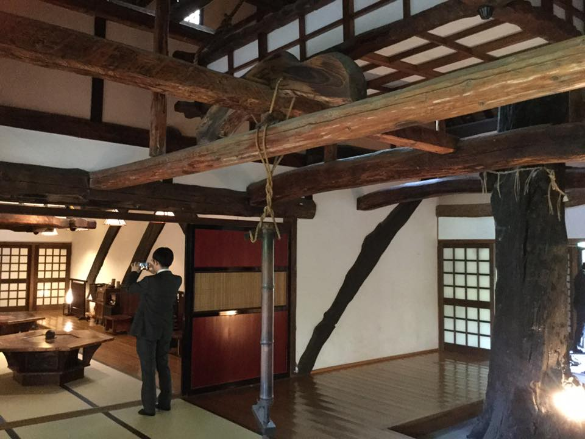
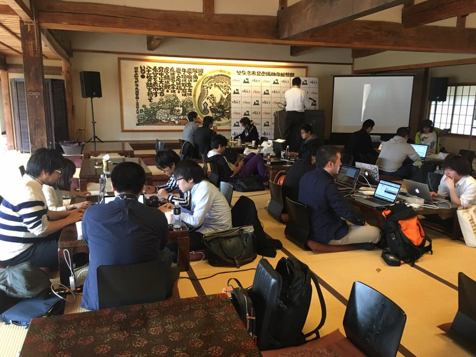
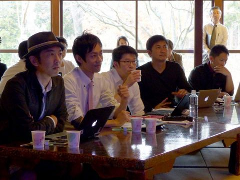
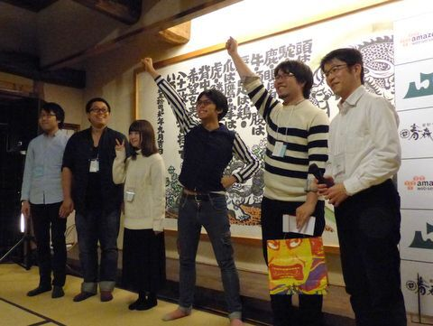

+++
author = "Yuichi Yazaki"
title = "【青森県】「青森観光アプリ開発コンテスト」審査員"
slug = "judge-aomori-tourism-app-dev-contest"
date = "2016-10-04"
categories = [
    "civictech"
]
tags = [
    "ハッカソン","審査員"
]
image = "images/event/468451158_10160661943153201_810002551114112023_n.jpg"
+++

青森屋by星野リゾートを舞台に、青森県主催のハッカソンが開催されました。
「観光」をテーマに、青森の良さを伝えるアプリの開発に2泊3日の泊りがけで挑戦します。
プレイベントでの講演と、ハッカソンの審査員を務めました。

<!--more-->

## イベント概要

- 2016-10-04 プレイベント
- 2016-11-18 〜 20 ハッカソン開発
- 2016-11-19 ハッカソンのプレゼンと受賞チーム発表

### 開催中の様子

### スライド

- RESASではじめる観光データ分析 - Speaker Deck https://speakerdeck.com/n1n9/resasdehazimeruguan-guang-detafen-xi

### 審査員

### 受賞チーム

 

## 関連リンク

### 運営会社

- 青森観光アプリ開発コンテスト - エイチタス株式会社 https://htus.jp/works/%E9%9D%92%E6%A3%AE%E8%A6%B3%E5%85%89%E3%82%A2%E3%83%97%E3%83%AA%E9%96%8B%E7%99%BA%E3%82%B3%E3%83%B3%E3%83%86%E3%82%B9%E3%83%88/

### 参加レポート

- ASCII.jp：青森観光アプリ開発コンテスト、緊迫の選定結果をこの目で見た (1/3) https://ascii.jp/elem/000/001/422/1422480/
- 青森観光アプリ開発コンテストに参加してきました - クックパッド開発者ブログ https://techlife.cookpad.com/entry/2016/12/05/183442
