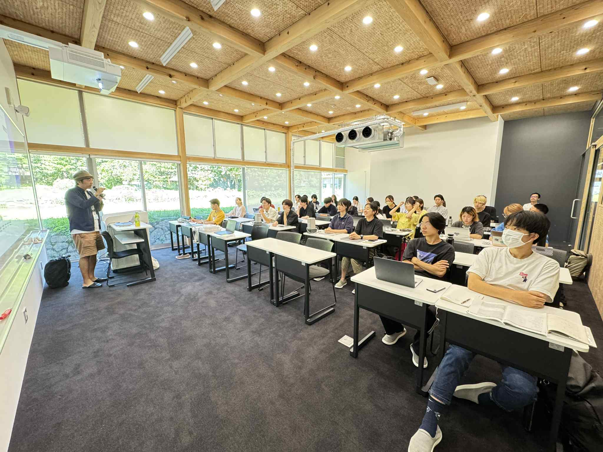
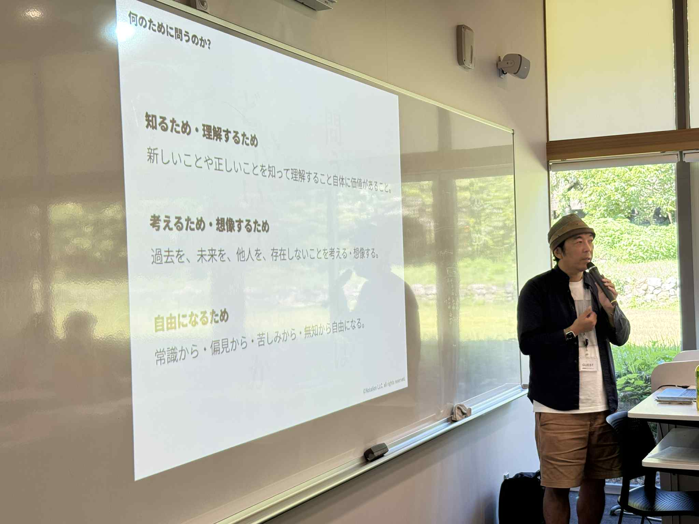
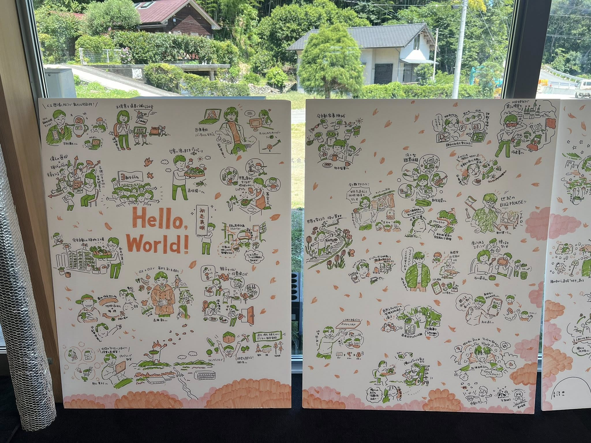
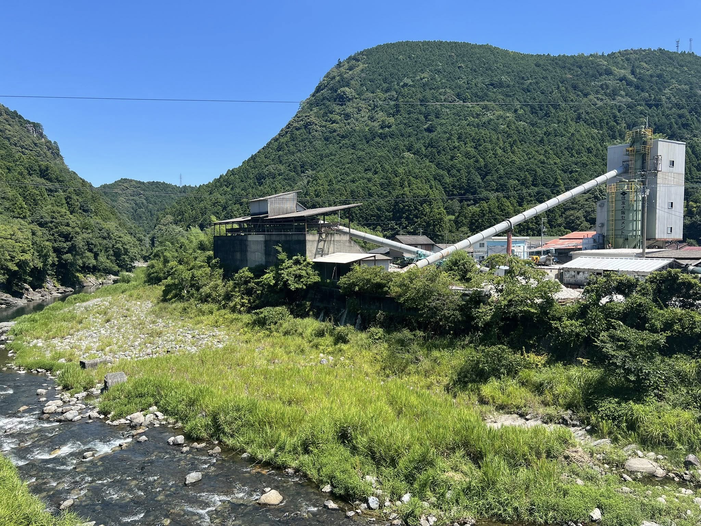

+++
author = "Yuichi Yazaki"
title = "神山まるごと高専で講義"
slug = "lecture-kamiyama-marugoto"
date = "2025-07-29"
categories = [
    "education"
]
tags = [
]
image = "images/525079157_10161608592578201_4098629231935871328_n.jpg"
+++

徳島にある神山まるごと高専にて、ゲスト講義として「データ可視化」について授業を行いました。

<!--more-->

## 関連リンク

- [神山まるごと高専 | テクノロジー×デザインで人間の未来を変える学校](https://kamiyama.ac.jp/)