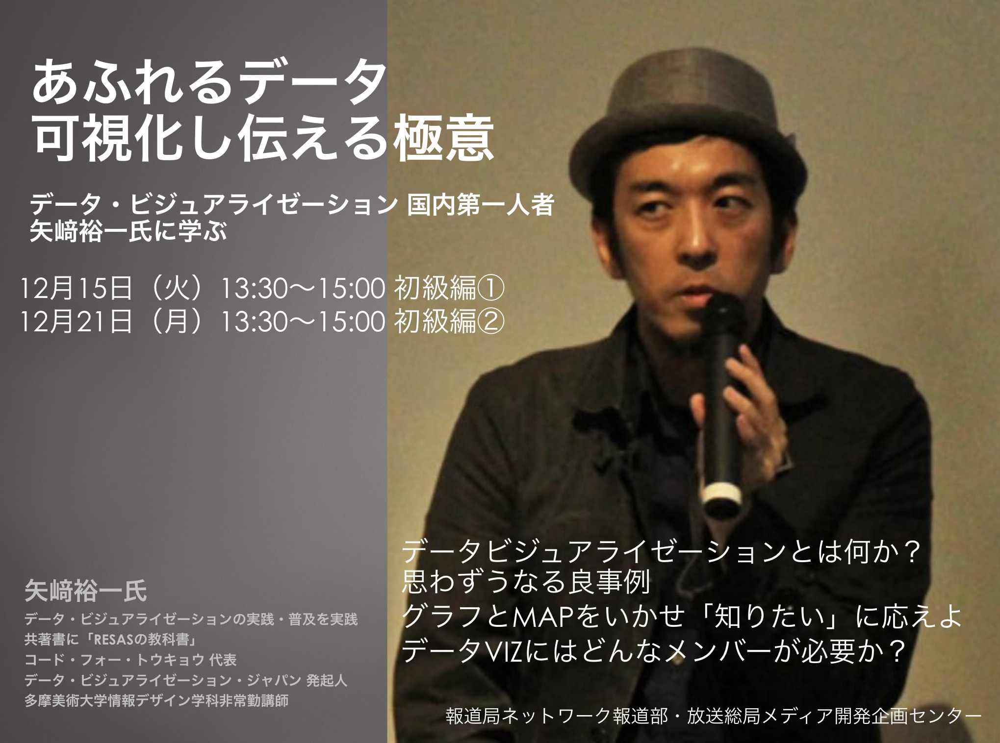

+++
author = "Yuichi Yazaki"
title = "Data Journalism Study Sessions for 500 NHK Staff across Japan"
slug = "lecture-nhk"
date = "2020-12-21"
categories = ["journalism"]
tags = []
image = "images/lecture-nhk.jpg"
+++

I delivered internal study sessions for 500 NHK staff members from across Japan.

- December 15, 2020
- December 21, 2020

<!--more-->

The sessions covered a wide range of topics spanning television, the web, smartphones, and short-form video, and required substantial preparation.

