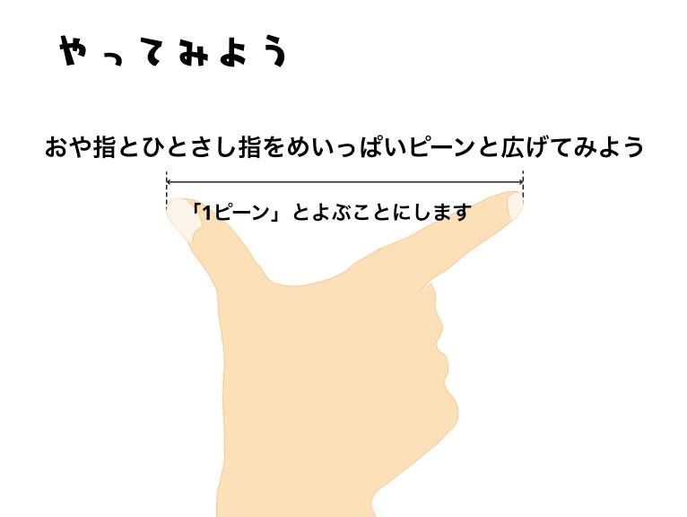
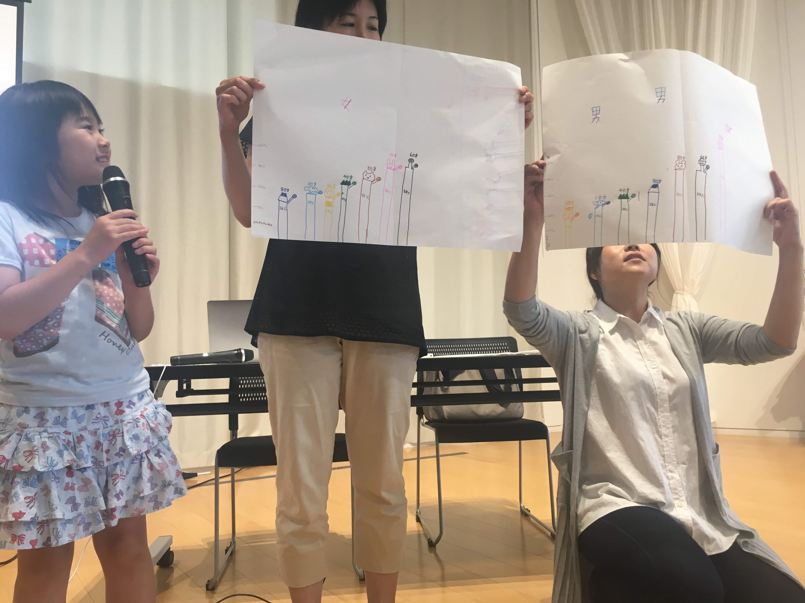
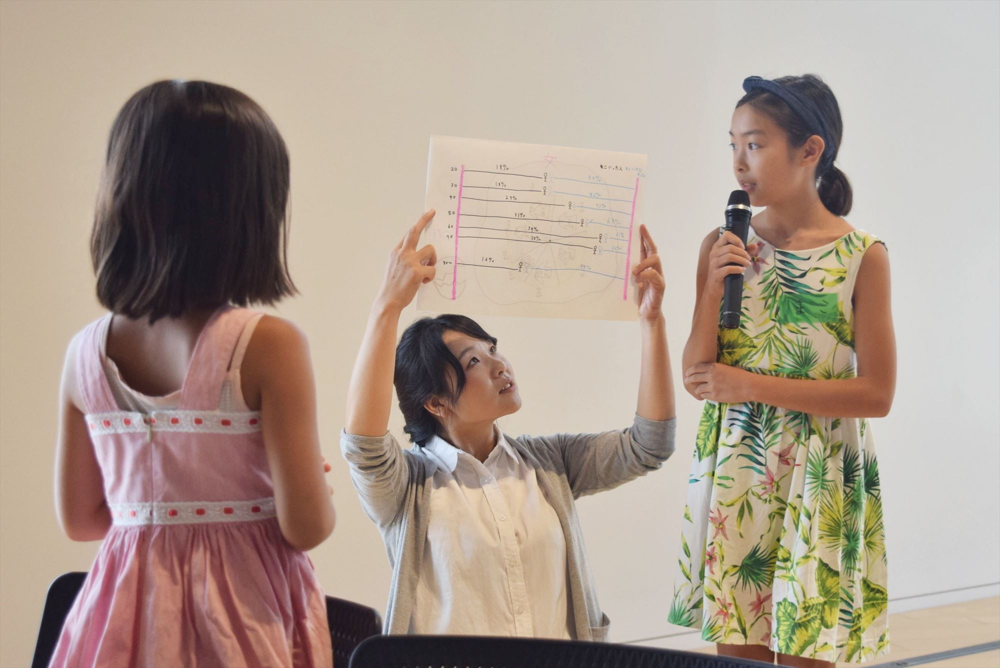
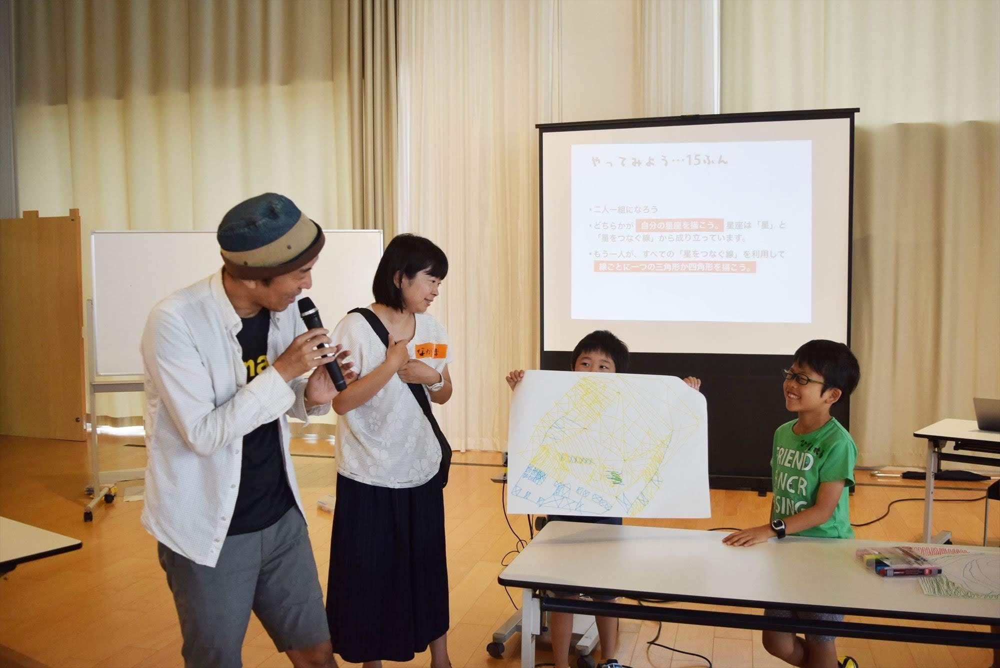

+++
author = "Yuichi Yazaki"
title = "千葉県流山市・Code for NAGAREYAMA「小学生向け 統計グラフを描くワークショップ」"
slug = "nagareyama-drawing"
date = "2017-07-29"
categories = [
    "codefor"
]
tags = [
    "ワークショップ"
]
image = "images/presentation/IMG_5135.jpg"
+++

千葉県流山市にて、コード・フォー・流山主催のワークショップに、ファシリテーターとして参加しました。

<!--more-->

## イベント概要

### 告知文

今話題の、データビジュアライゼーション
やってみたいけど、ハードルが高い！！
そこで今回、子どもでもできるデータビジュアライゼーションの講座を開きます。
子どもは夏休みの課題に
大人はビジネススキルに
色々なことに使える技術です！！
講師は、データビジュアライズといえばこの方という、データ・ビジュアライゼーション・ジャパン 発起人でもある矢崎裕一さんです。

※矢崎裕一氏(株式会社ビジネス・アーキテクツにてデザイナー及びアートディレクターを7年間経験後、2008年に独立。近年では、データ・ビジュアライゼーションの実践と普及に関する様々な活動をおこなっている。共著書に「RESASの教科書」がある。)

### スライド

### 子どもたちの発表

## 関連リンク

- データで絵を描く！！データビジュアライゼーション【親子参加歓迎】 | Facebook https://www.facebook.com/events/1595367000497933
- オープンデータを使った親子ワークショップ開催中(^-^) 楽しいです！ - Code for NAGAREYAMA | Facebook https://www.facebook.com/codefornagareyama/posts/pfbid0wfwcrwukeWrfHXxaWbs8GGry4eNdnGdGSJjiUjzLVQowwYwur23uKDheRQNPEdaxl