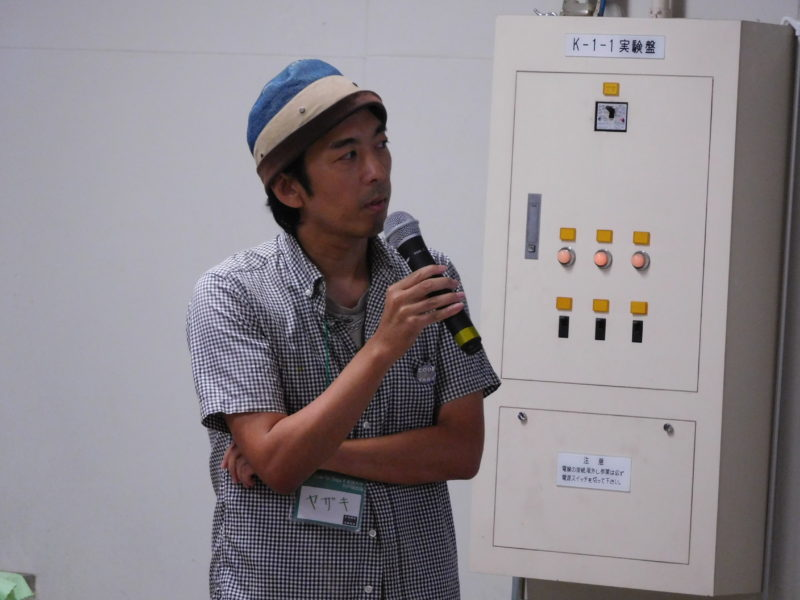
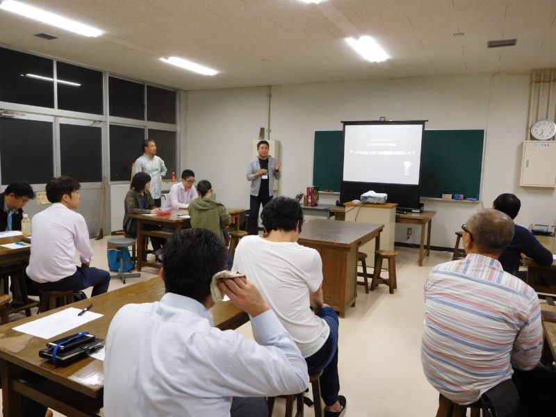
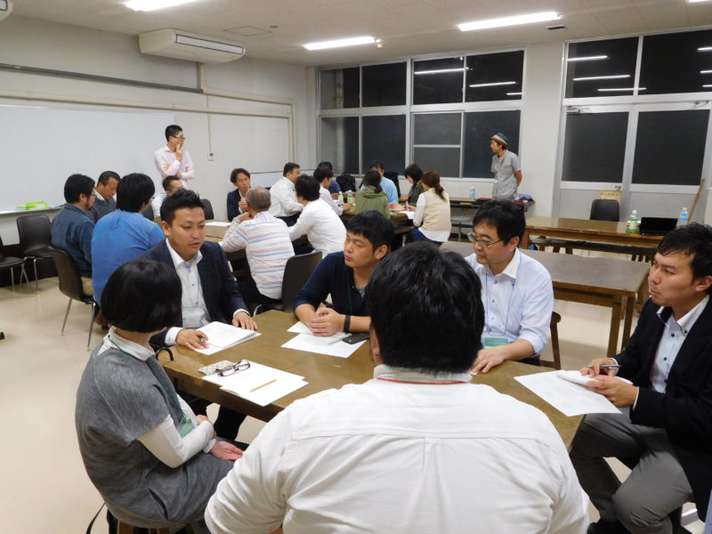

+++
author = "Yuichi Yazaki"
title = "Code for Saga×佐賀大学「データの見える化による地域課題解決ワークショップ」"
slug = "saga-code-for-university"
date = "2016-10-28"
categories = [
    "codefor"
]
tags = [
]
image = "images/DSCN0268-800x600.jpg"
+++

Code for Saga×佐賀大学の初企画「データの見える化による地域課題解決ワークショップ」第1回目にて、講演を行いました。

<!--more-->

### 開催中の様子

## 関連リンク

- データの見える化による地域課題解決ワークショップ第1回目 – CODE FOR SAGA https://code4saga.org/archives/373