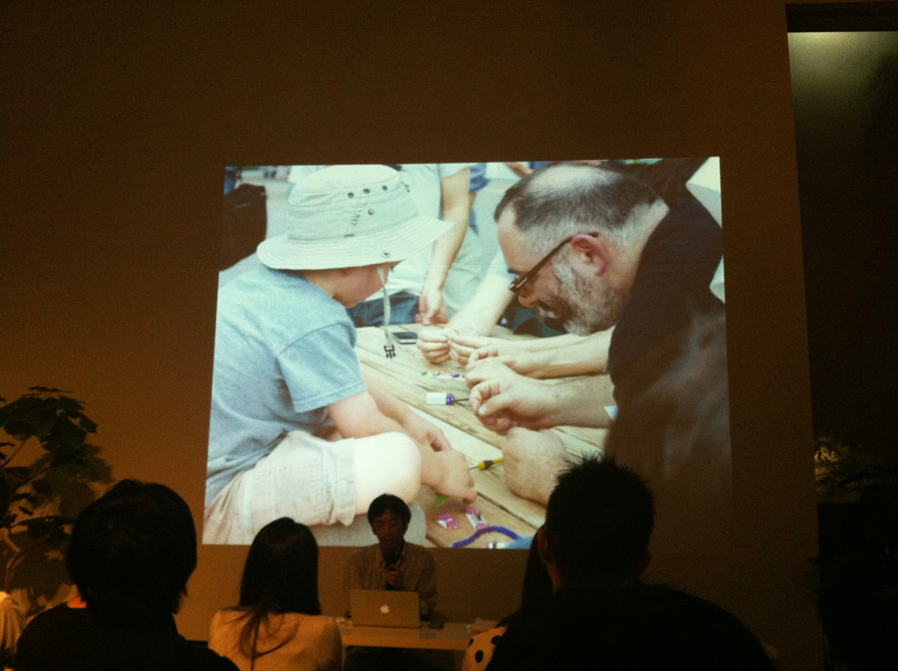

+++
author = "Yuichi Yazaki"
title = "Speaking at the Visualization: Possible or Impossible? Event Celebrating Visual Complexity"
slug = "talk-amu-visual-complexity"
date = "2012-06-27"
categories = ["talk"]
tags = []
image = "images/cover_amu-visual-complexity.jpg"
+++

Yuichi Yazaki of Notation LLC spoke at “Visualization: Possible or Impossible?”, a talk event celebrating the publication and reprinting of *Visual Complexity: Mapping Patterns of Information*.

<!--more-->

- **Event:** Visualization: Possible or Impossible?
- **Date:** June 2012
- **Venue:** amu, Aoyama, Tokyo
- **Overview:** A discussion of the possibilities and limitations of visualization centered on *Visual Complexity*, a collection of international examples in information design and data visualization

## Related Links

- [Visualization: Possible or Impossible? | amu archive](https://web.archive.org/web/20130615100027/http://www.a-m-u.jp/event/2012/06/bnn-amu.html)
- [CBCNET event report](https://www.cbc-net.com/topic/2012/07/amu-visual-complexity-report/)
