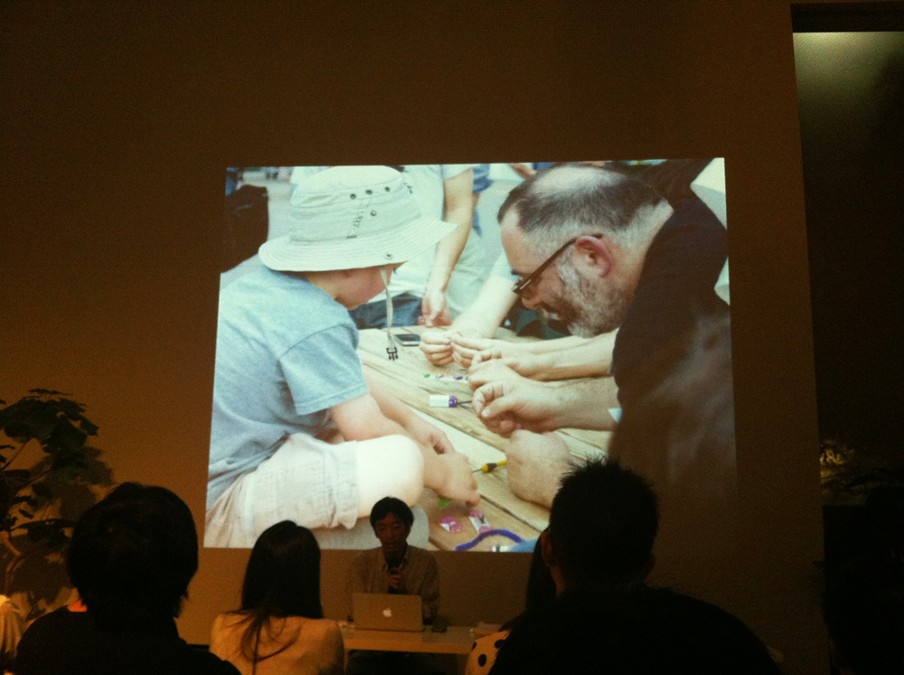

+++
author = "Yuichi Yazaki"
title = "【登壇実績】書籍「ビジュアル・コンプレキシティ」刊行・重版記念イベント「可視化可不可」への登壇"
slug = "talk-amu-visual-complexity"
date = "2012-06-27"
categories = [
    "talk"
]
tags = [
]
image = "images/cover_amu-visual-complexity.jpg"
+++

当社の矢崎裕一が、書籍『ビジュアル・コンプレキシティ ―情報パターンのマッピング』の刊行および重版を記念して開催されたトークイベント「可視化可不可」に登壇いたしました。

<!--more-->

- **イベント名:** 可視化可不可
- **開催時期:** 2012年6月
- **場所:** amu（青山）
- **概要:** 情報デザインやデータビジュアライゼーションの国際的な事例を集めた書籍『ビジュアル・コンプレキシティ』をテーマに、可視化が持つ可能性と限界について議論を行いました。

## 関連リンク

- [Contents：可視化可不可 | amu](https://web.archive.org/web/20130615100027/http://www.a-m-u.jp/event/2012/06/bnn-amu.html)
- [CBCNET | Topic » 書籍「ビジュアル・コンプレキシティ ―情報パターンのマッピング」刊行と重版を記念したイベント「可視化可不可」を振り返る](https://www.cbc-net.com/topic/2012/07/amu-visual-complexity-report/)
