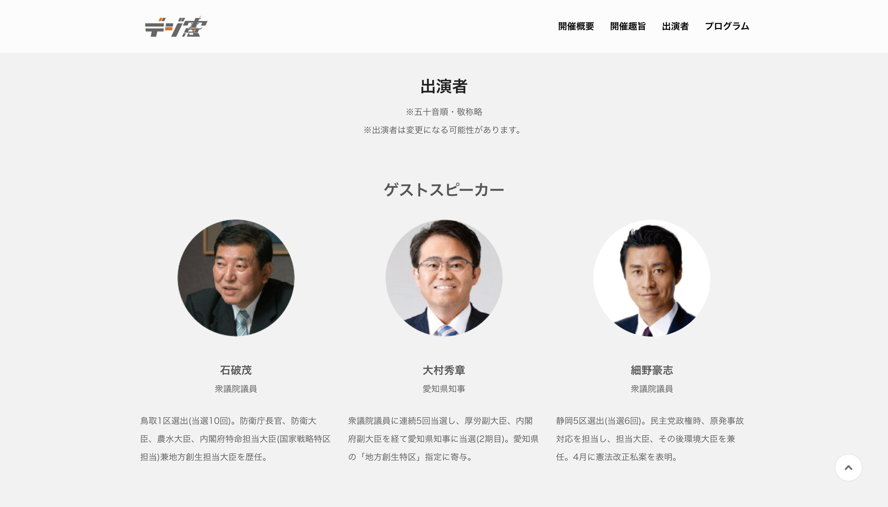
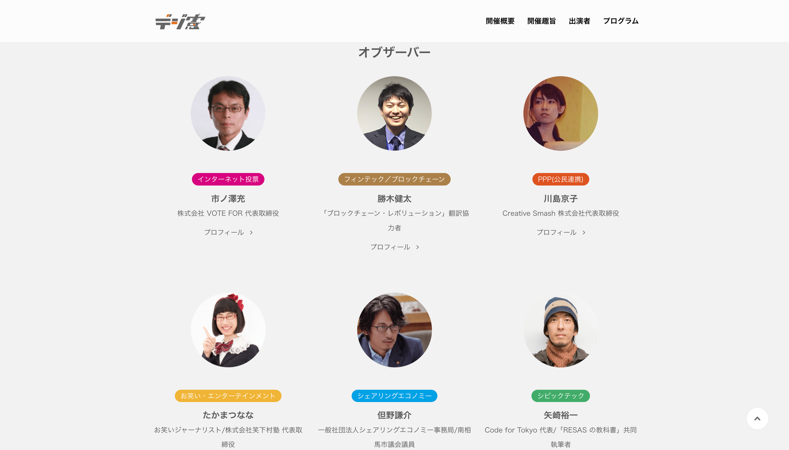
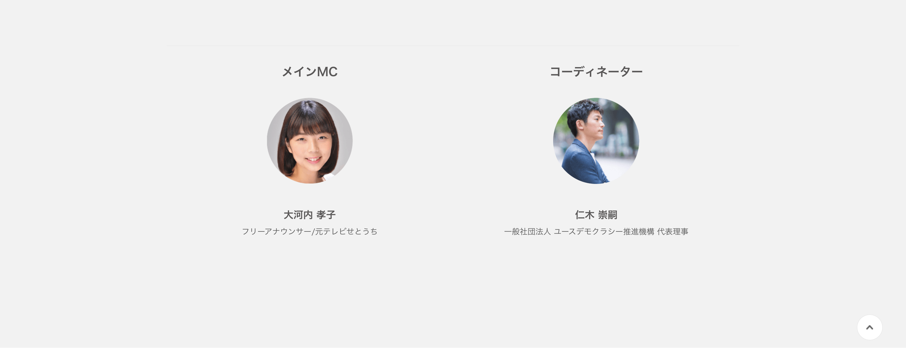

+++
author = "Yuichi Yazaki"
title = "Speaking at the Digital Constitution Forum Observer Talk Session"
slug = "talk-digi-ken"
date = "2016-07-21"
categories = ["talk", "civictech"]
tags = []
image = "images/cover_digi-ken.png"
+++

Yuichi Yazaki of Notation LLC spoke at the Digital Constitution Forum, organized by the Youth Democracy Promotion Organization.

<!--more-->

- **Event theme:** The Constitution and the Future of Local Communities in the Digital Age, Considered with Digital Natives
- **Role:** Speaker in the observer talk session
- **Session theme:** The Future Society We Imagine
- **Affiliation used:** Representative of Code for Tokyo / co-author of *The RESAS Textbook*
- **Overview:** Ahead of Constitution Memorial Day, young people, working adults, and invited experts discussed the nature of constitutional governance and the future of local communities in the digital age.
- **Venue:** Surugadai Hall, Digital Hollywood University Graduate School

## Related Links

- [Digital Constitution Forum official site](https://www.google.com/url?source=gmail&sa=E&q=https://digi-ken.party/)
