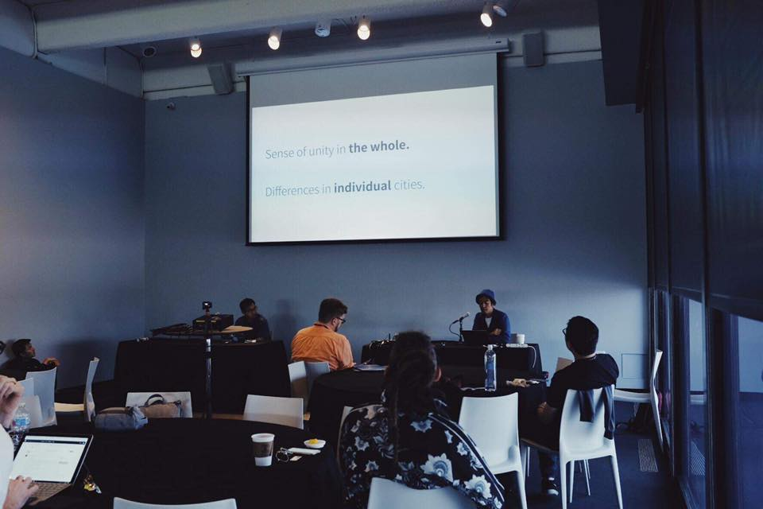

+++
author = "Yuichi Yazaki"
title = "Lightning Talk at Eyeo Festival 2019"
slug = "talk-eyeo"
date = "2019-06-06"
categories = ["talk"]
tags = ["International"]
image = "images/cover_eyeo2019.png"
+++

In 2019, I spoke at Eyeo Festival — Converge to Inspire, an international conference for creative coding and data visualization held in Minneapolis.

<!--more-->

In the Lightning Talk session, I presented “Open Data Day Logo Generator.” The talk introduced the development of an automatic logo-generation tool for Open Data Day and explored a creative approach combining data and design.

The presentation is available below.



## Related Links

- [Eyeo Festival | Converge to Inspire](https://eyeofestival.com/)
- [Eyeo Festival 2019 | CreativeApplications.Net](https://www.creativeapplications.net/event/eyeo-festival-2019-converge-to-inspire/)
