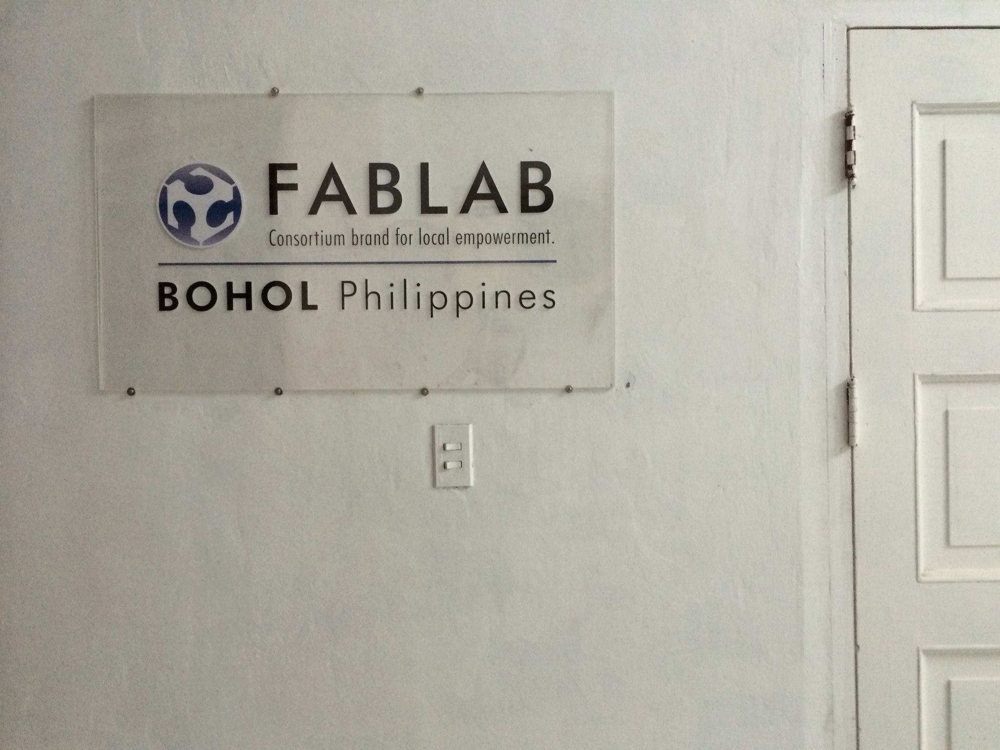
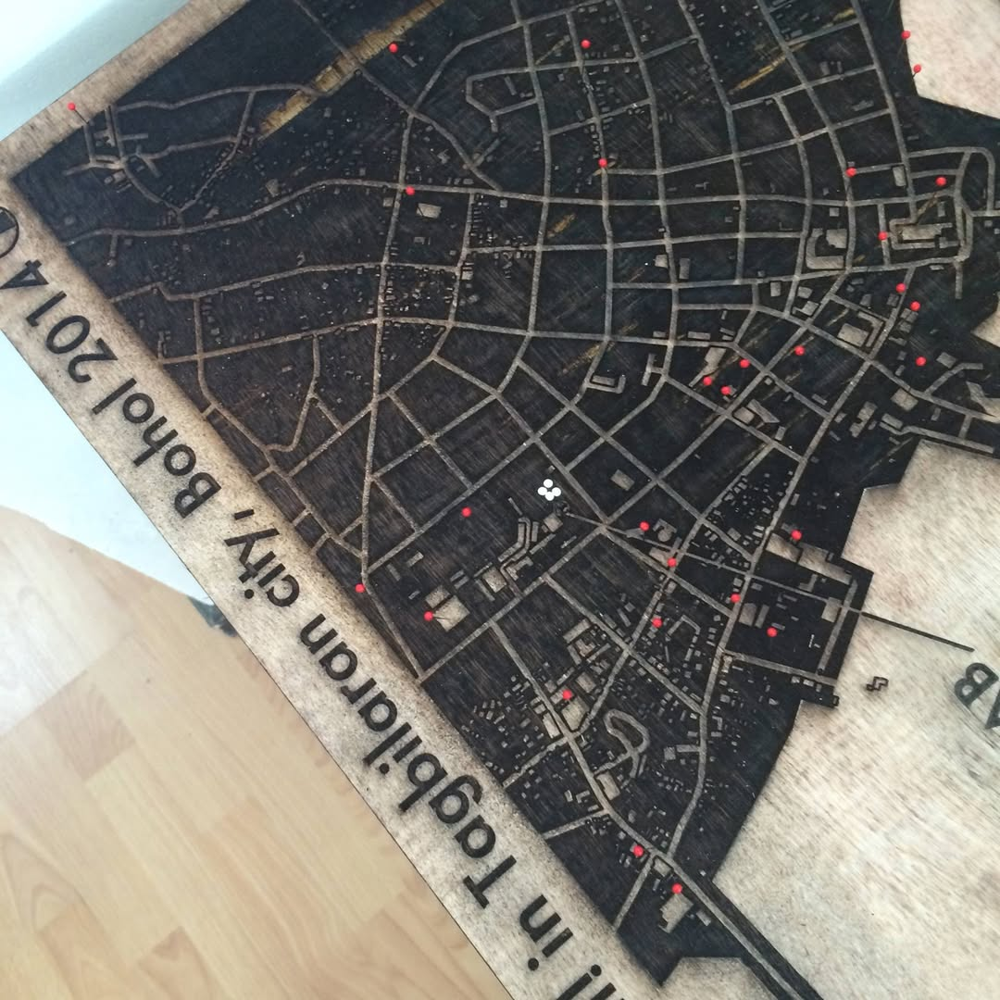
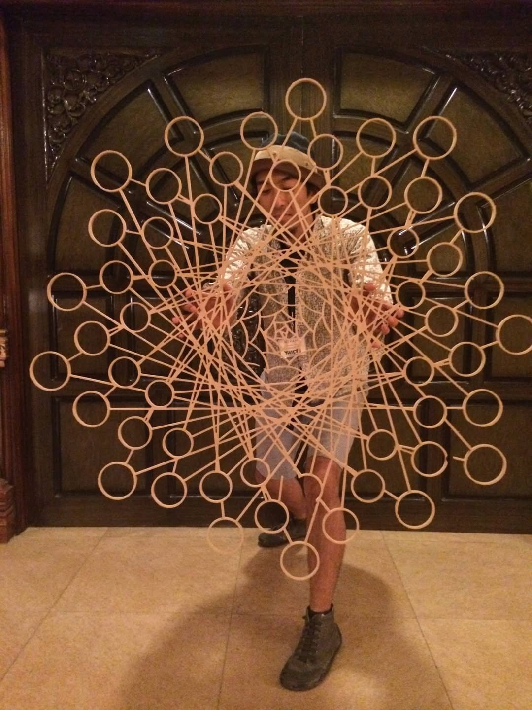
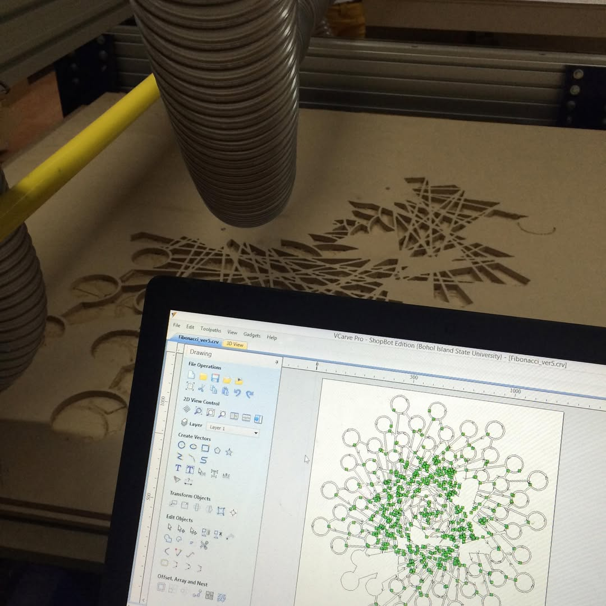
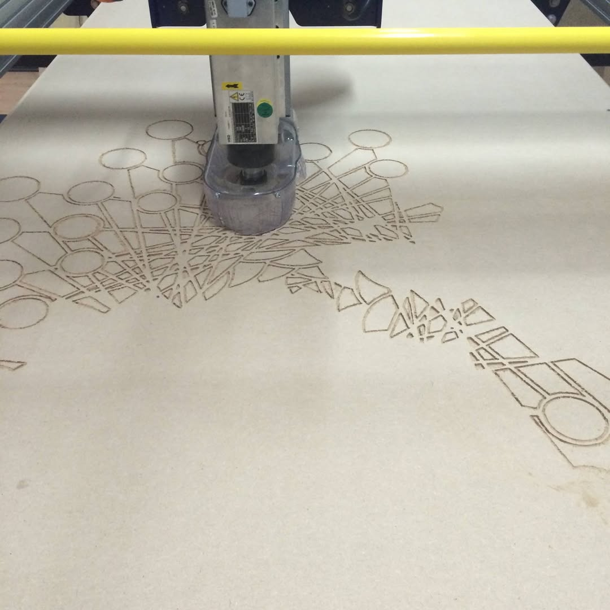
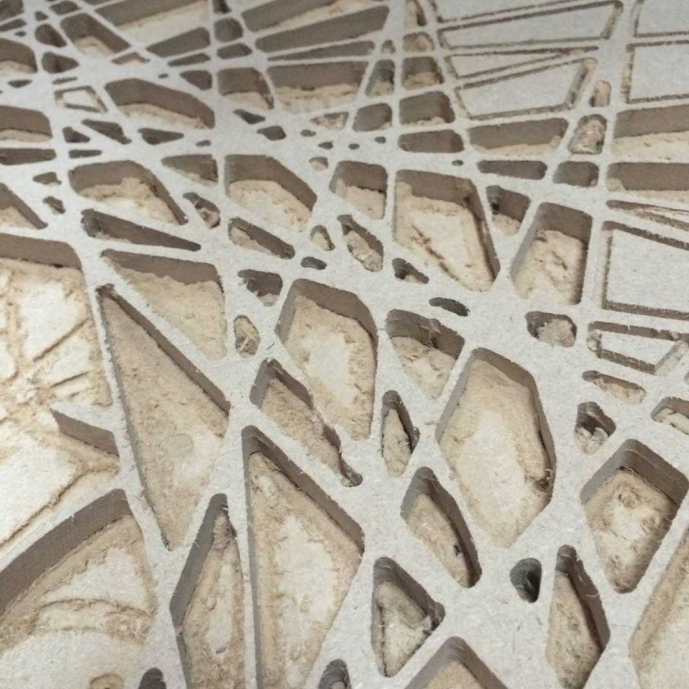

+++
author = "Yuichi Yazaki"
title = "Participating and Speaking at FAN1, Asia's First FabLab Conference"
slug = "talk-fan1"
date = "2014-05-07"
categories = ["talk"]
tags = ["International"]
image = "images/cover_fan1.png"
+++

In May 2014, I participated in FAN1 — FabLab Asia Network 1st Conference, Asia's first FabLab network conference, held on Bohol in the Philippines, and spoke in a Lightning Talk session.

<!--more-->

The conference brought FabLab communities from across Asia together to discuss the spread of digital fabrication and the potential to address local challenges through making.

## Main Activities

At a local FabLab, I used digital fabrication to prototype a giant bubble-making device. I presented the process and results in a Lightning Talk and exchanged technical knowledge with other participants.

The event contributed to forming a stronger FabLab network in Asia and encouraging international collaboration through making.

- **Event:** FAN1 — FabLab Asia Network 1st Conference
- **Location:** Bohol, Philippines
- **Date:** May 2014
- **Activities:** Prototyping a giant bubble-making device and presenting a Lightning Talk

## Prototype

## Presentation



## Related Links

- [FAN1 — FabLab Asia Network 1st Conference](http://fablabasia.net/)
