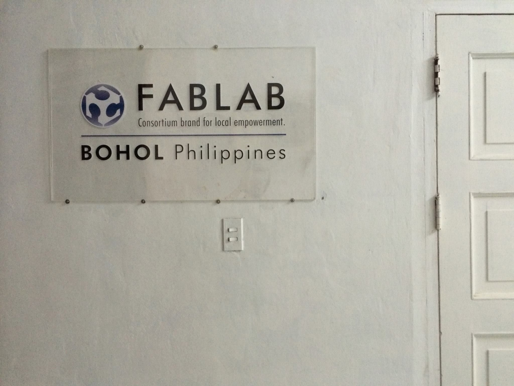
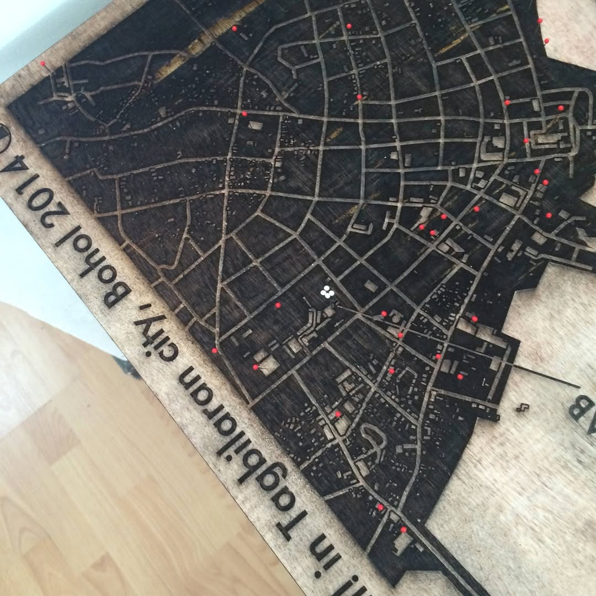
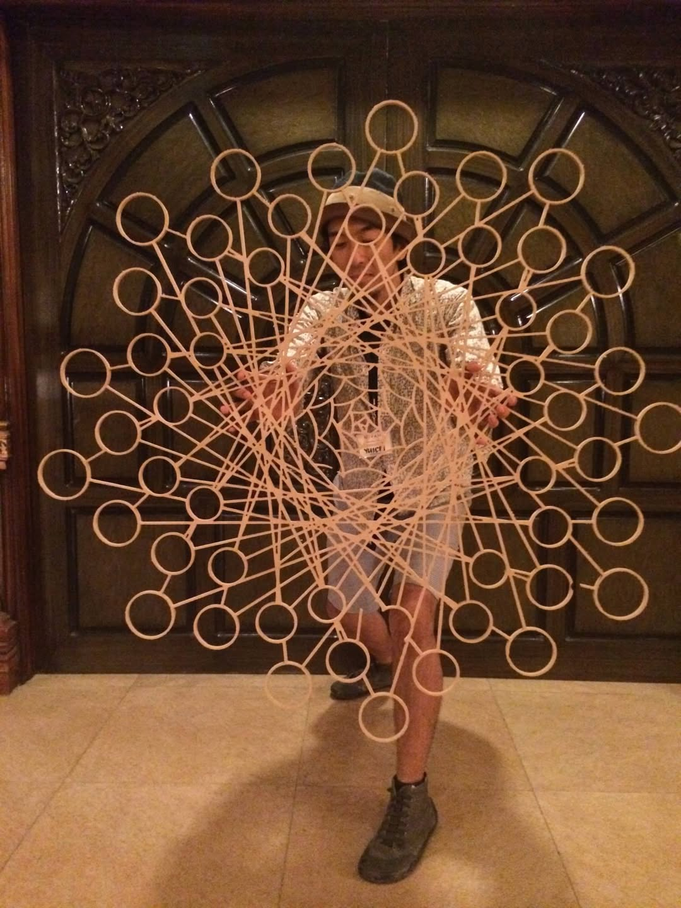
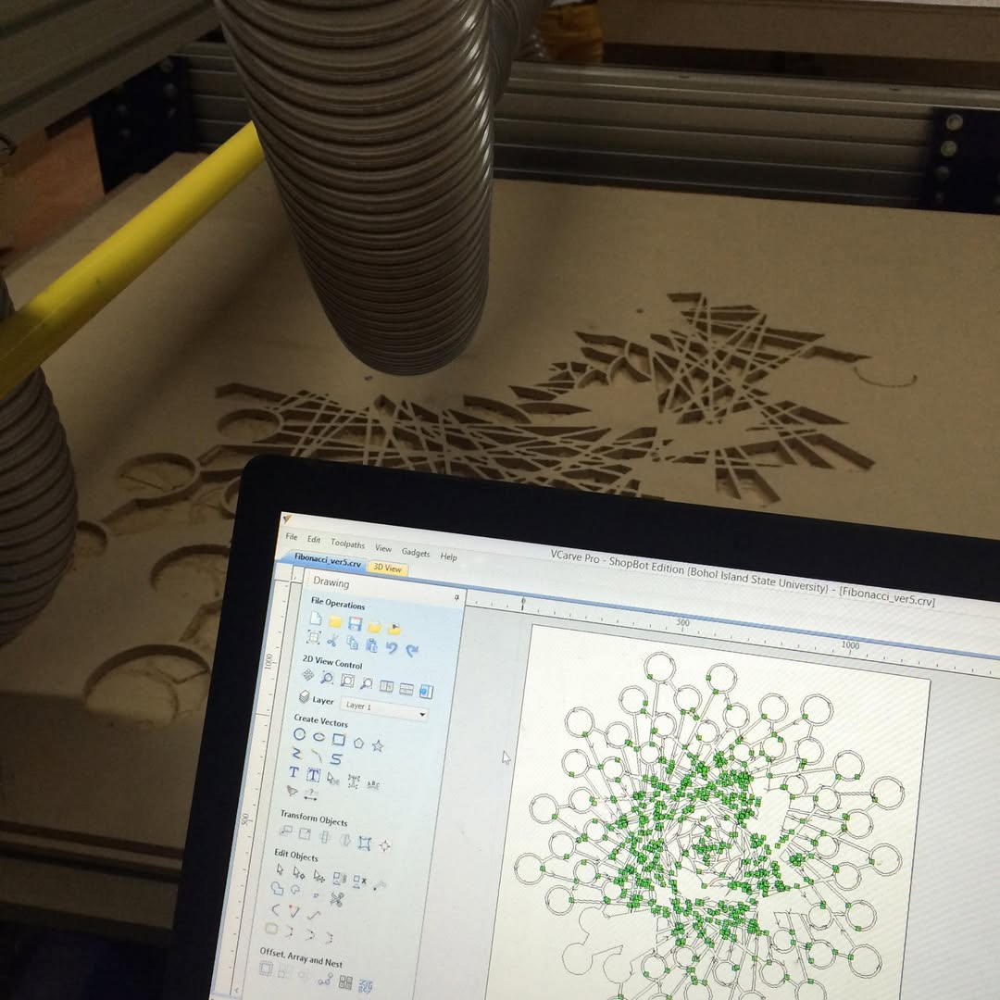
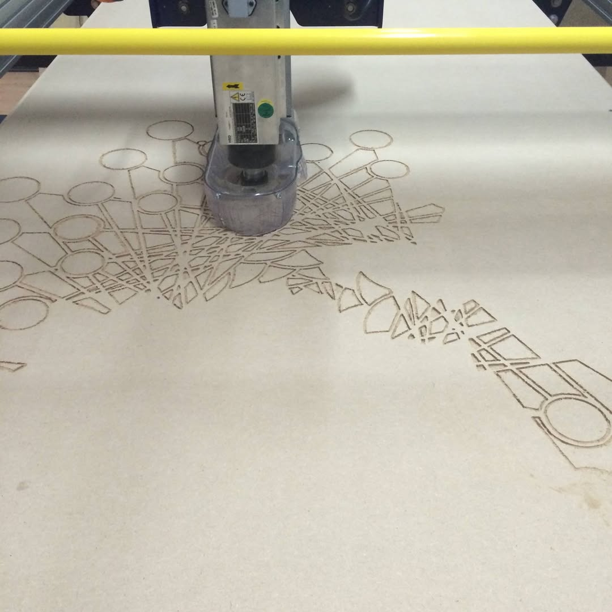
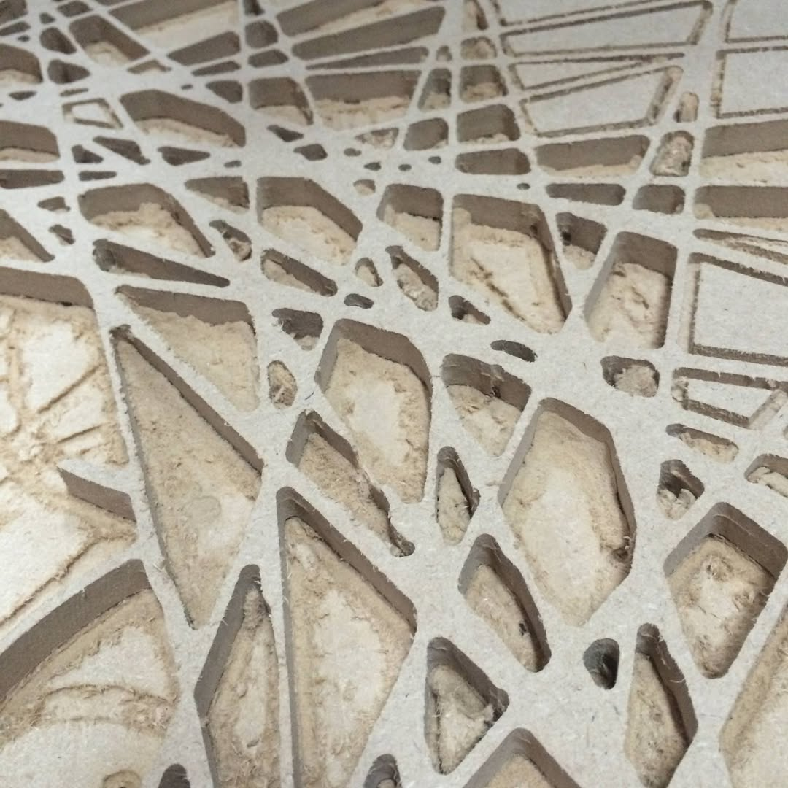

+++
author = "Yuichi Yazaki"
title = "アジア初のFabLabカンファレンス「FAN1 – FabLab Asia Network 1st Conference」に参加・LT登壇"
slug = "talk-fan1"
date = "2014-05-07"
categories = [
    "talk"
]
tags = [
    "海外"
]
image = "images/cover_fan1.png"
+++

2014年5月、フィリピンのボホール島で開催されたアジア初のFabLabネットワークカンファレンス「**FAN1 – FabLab Asia Network 1st Conference**」に参加し、Lightning Talkセッションに登壇いたしました。

<!--more-->

本カンファレンスは、アジア各国のFabLab(ファブラボ)コミュニティが一堂に会し、デジタルファブリケーション技術の普及と、ものづくりを通じた地域課題解決の可能性を議論する場として開催されました。

## 主な活動内容

カンファレンス期間中、現地のFabLabにて**巨大なシャボン玉飛ばし器**を制作し、デジタルファブリケーション技術を活用した実践的なプロトタイピングを実演しました。この制作プロセスと成果をLightning Talkセッションにて発表し、参加者との技術交流を深めました。

本参加を通じて、アジア地域におけるFabLabネットワークの形成と、ものづくりを通じた国際的なコラボレーションの促進に貢献しました。

- **イベント名**: FAN1 – FabLab Asia Network 1st Conference
- **開催地**: フィリピンのボホール島
- **開催年**: 2014年5月
- **活動内容**: 巨大シャボン玉飛ばし器の制作、Lightning Talk登壇

## 制作物

## 登壇内容



## 関連リンク

- [FAN1 – FabLab Asia Network 1st Conference](http://fablabasia.net/)

