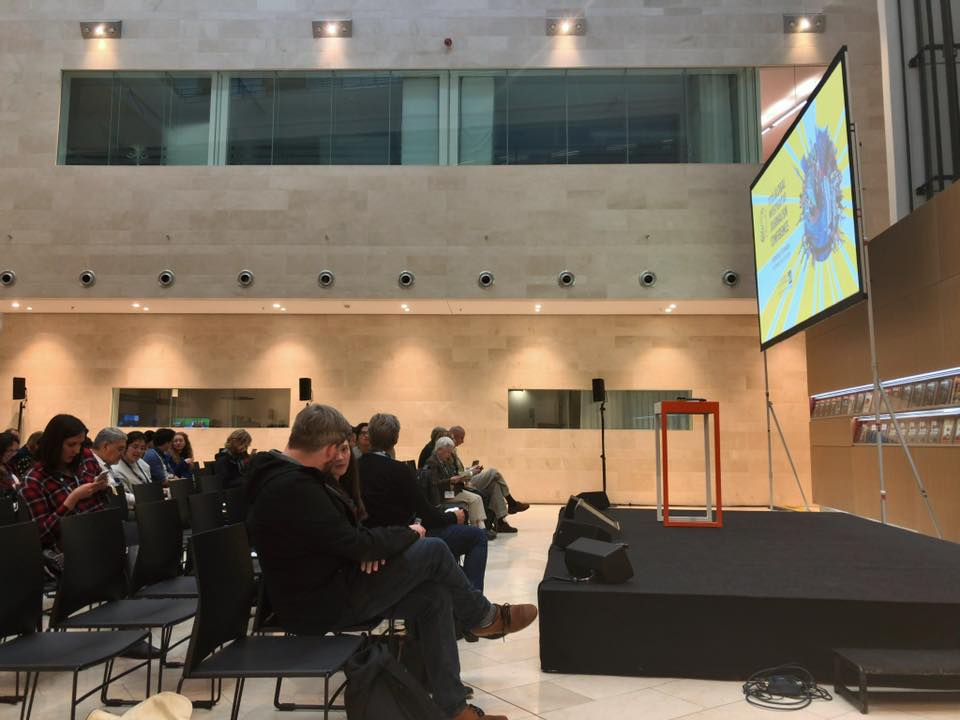

+++
author = "Yuichi Yazaki"
title = "Speaking at the Global Investigative Journalism Conference 2019"
slug = "talk-gijc"
date = "2019-09-28"
categories = ["talk"]
tags = ["International"]
image = "images/cover_gijc.png"
+++

Yuichi Yazaki of Notation LLC spoke at the Global Investigative Journalism Conference 2019 in Hamburg.

<!--more-->

- **Event:** Global Investigative Journalism Conference 2019
- **Date:** September 28, 2019
- **Session:** Lightning Round: New Digital Tools
- **Venue:** Atrium, Der Spiegel headquarters
- **Co-presenter:** Yuko Ryu, then of Waseda Chronicle
- **Presentation:**
  - **Project:** JUDGIT!
  - **Overview:** A presentation of [JUDGIT!](https://judgit.net/), a website for searching and visualizing Japanese government program budgets, as an example of a new digital tool

## Related Links

- [Global Investigative Journalism Conference 2019](https://gijc2019.org/)
