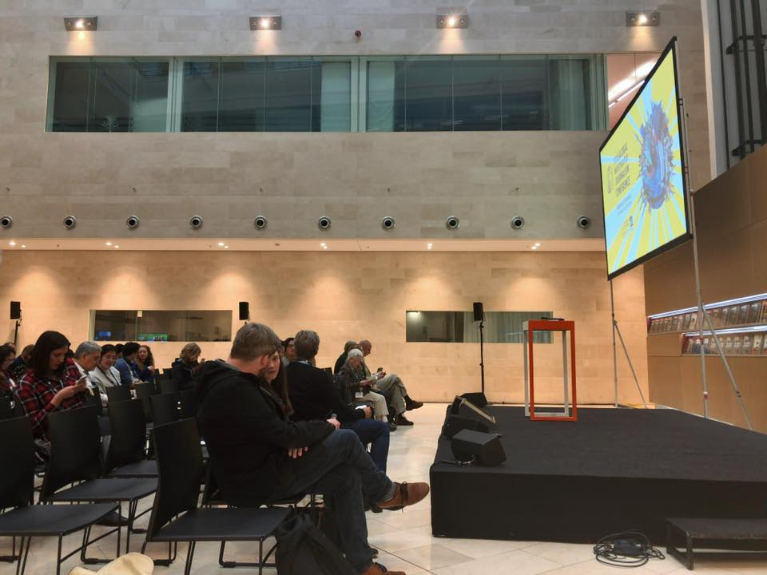

+++
author = "Yuichi Yazaki"
title = "【Global Investigative Journalism Conference 2019 への登壇"
slug = "talk-gijc"
date = "2019-09-28"
categories = [
    "talk"
]
tags = [
    "海外"
]
image = "images/cover_gijc.png"
+++

当社の矢崎裕一が、ハンブルクで開催された世界的なジャーナリズム会議「Global Investigative Journalism Conference 2019」に登壇いたしました。

<!--more-->

- **イベント名:** Global Investigative Journalism Conference 2019
- **開催日:** 2019年9月28日
- **セクション:** Lightning Round: New Digital Tools
- **場所:** Atrium, Der Spiegel（スピーゲル本社・一階スペース）
- **共同登壇者:** Yuko Ryu 氏（早稲田クロニクル ・当時）
- **登壇内容:**
    - **プロジェクト名:** JUDGIT1!（ジャジット）
    - **概要:** 政府の事業予算を検索・可視化できるサイト「JUDGIT!（<https://judgit.net/>）」について発表し、新しいデジタルツールとしての活用事例を紹介いたしました。

## 関連リンク

- [Global Investigative Journalism Conference 2019](https://gijc2019.org/)