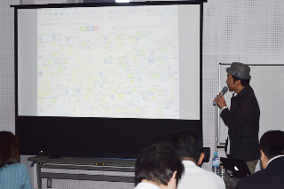

+++
author = "Yuichi Yazaki"
title = "Nagareyama, Chiba: Open-Data Course for Residents"
slug = "talk-gurutto-nagareyama"
date = "2017-01-28"
categories = ["civictech"]
tags = []
image = "images/cover_gurutto-nagareyama.png"
+++

On Saturday, January 28, 2017, I was invited to teach the “Open-Data Use Course” at Nagareyama Lifelong Learning Center as the representative of Code for Tokyo.

<!--more-->

The course aimed to help Nagareyama residents understand how to use open data and deepen their interest in the community.

### Main Topics

- **Theme:** Discovering Local Conditions through Open Data
- **Content:** Concrete examples demonstrated a central idea of data visualization: visualization allows people to see the same data from multiple perspectives rather than merely collecting it.
- **Examples:** Engaging visual examples included a chart counting appearances of Kumamon on other prefectural and municipal websites using National Diet Library data.
- **Tools:** I introduced analytical tools such as the Regional Economy and Society Analyzing System (RESAS), along with Code for Tokyo's activities.

The course helped communicate the value and enjoyment of using data to the general public, not only to technical specialists, as part of a municipal open-data initiative.

- **Event:** Nagareyama Open-Data Use Course
- **Date:** Saturday, January 28, 2017
- **Organizer:** Nagareyama City

## Related Links

- [Nagareyama Open-Data Use Course | Nagareyama City](https://www.city.nagareyama.chiba.jp/contents/23140/30074/33050/032963.html)
