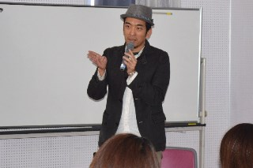
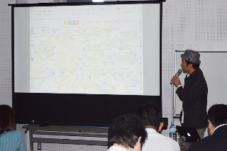

+++
author = "Yuichi Yazaki"
title = "【千葉県流山市】市民向けオープンデータ活用講座に登壇"
slug = "talk-gurutto-nagareyama"
date = "2017-01-28"
categories = [
    "civictech"
]
tags = [
]
image = "images/cover_gurutto-nagareyama.png"
+++

2017年1月28日（土）に流山市生涯学習センター（流山エルズ）にて開催された「**ぐるっと流山 オープンデータ利用講座**」に、Code for Tokyo代表として講師として招かれ、登壇いたしました。

<!--more-->

この講座は、流山市の市民の方々にもっとオープンデータの利用方法を知ってもらい、地域への関心を深めてもらうことを目的に実施されました。

**主な講演内容**

- **テーマ**: 「**オープンデータから地域の現状を発見しよう**」
- **内容**: データをただ集めるだけでなく、「**データを見える化することによって、多様なモノの見方ができる**」という、データビジュアライゼーションの本質について、具体的な事例を用いて解説しました。
- **事例紹介**: 国立国会図書館のデータを使った「くまモンの他県自治体サイトへの登場回数」グラフなど、視覚的な面白さも交えた事例を紹介し、データ活用に対する市民の興味を引き出しました。
- **ツール紹介**: 地域経済分析システム「RESAS」など、データの「見える化」を実践するための分析ツールや、Code for Tokyoとしての活動も紹介しました。

本登壇は、自治体が推進するオープンデータ政策の普及において、技術者だけでなく一般市民を対象に、データ活用の意義と楽しさを伝えることに貢献した事例です。

- **イベント名**: ぐるっと流山 オープンデータ利用講座
- **開催日**: 平成29年1月28日（土）
- **主催**: 流山市

## 関連リンク

- [ぐるっと流山　オープンデータ利用講座｜流山市](https://www.city.nagareyama.chiba.jp/contents/23140/30074/33050/032963.html)

