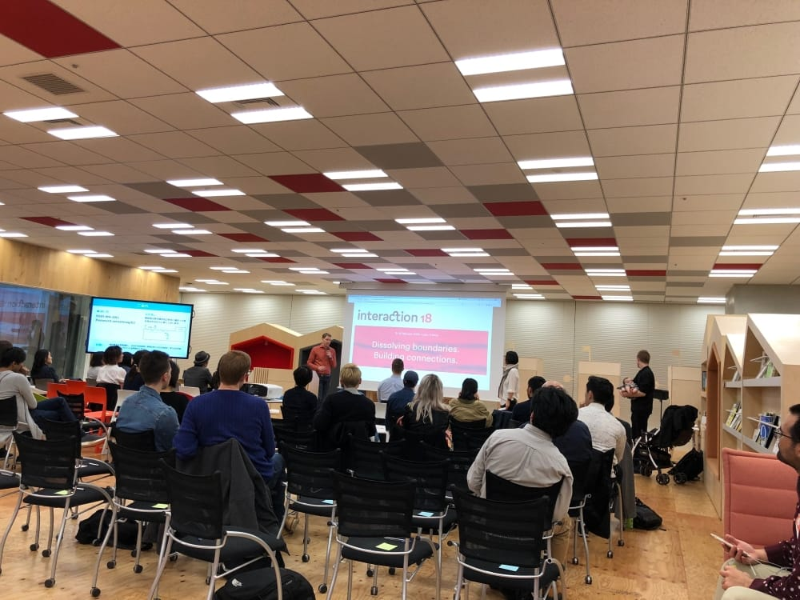

+++
author = "Yuichi Yazaki"
title = "Speaking at IxDA Tokyo #3 Community Talk"
slug = "talk-ixda-tokyo"
date = "2018-03-15"
categories = ["talk"]
tags = []
image = "images/cover_ixda-tokyo.png"
+++

Yuichi Yazaki of Notation LLC spoke at IxDA Tokyo #3 Community Talk, organized by the Tokyo chapter of the nonprofit Interaction Design Association.

<!--more-->

- **Event:** IxDA Tokyo #3 Community Talk
- **Date:** May 2018 (publication date of the event report)
- **Venue:** Yahoo! JAPAN LODGE
- **Theme:** Dissolving Boundaries, Building Connections
- **Overview:** Beginning with the fundamental question “What is data visualization?”, I introduced selected work and discussed the importance of understanding a work's role in society and consciously approaching people with different attributes and perspectives.
- **Participants:** Designers from consultancies and operating companies, as well as independent designers

## Related Links

- [IxDA Tokyo #3 Community Talk event report | Yahoo! JAPAN Tech Blog](https://techblog.yahoo.co.jp/event/ixda_3/)
