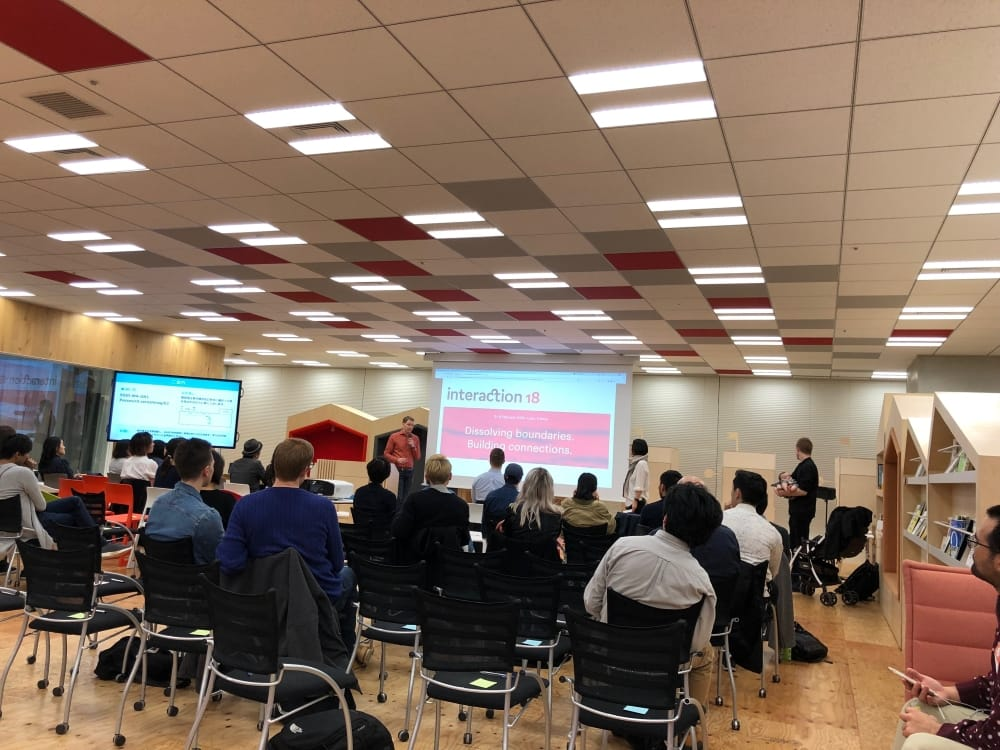

+++
author = "Yuichi Yazaki"
title = "IxDA Tokyo #3 Community Talk への登壇"
slug = "talk-ixda-tokyo"
date = "2018-03-15"
categories = [
    "talk"
]
tags = [
]
image = "images/cover_ixda-tokyo.png"
+++

当社の矢崎裕一が、インタラクションデザインの普及と推進を目的とした非営利団体 IxDA（Interaction Design Association）の東京支部による「IxDA Tokyo #3 Community Talk」にスピーカーとして登壇いたしました。

<!--more-->

- **イベント名:** IxDA Tokyo #3 Community Talk
- **開催日:** 2018年5月（開催されたコミュニティートークのレポート日付）
- **場所:** Yahoo! JAPAN LODGE
- **講演テーマ:** Dissolving boundaries, building connections.
- **概要:** 「データビジュアライゼーションとは何か」という基本的な問いから、制作された作品の紹介、そしてデータビジュアライゼーションが社会的な役割を果たす上で重要となる「その作品の持つ役割を意識すること」「異なる属性、異なる視点に意識的にアプローチしていくこと」などについてお話ししました。
- **参加者:** デザインコンサルファームや事業会社、フリーランスなど、多様なデザイナーが集まりました。

## 関連リンク

- [IxDA Tokyo #3 Community Talk: イベントレポート - Yahoo! JAPAN Tech Blog](https://techblog.yahoo.co.jp/event/ixda_3/)