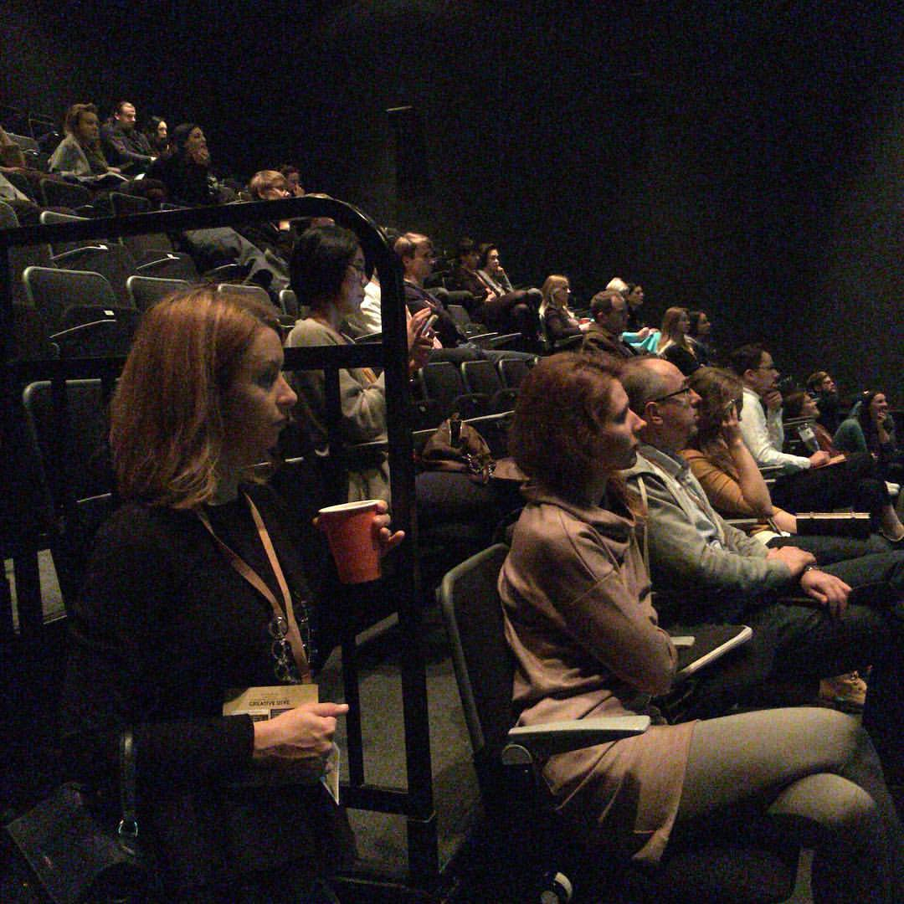
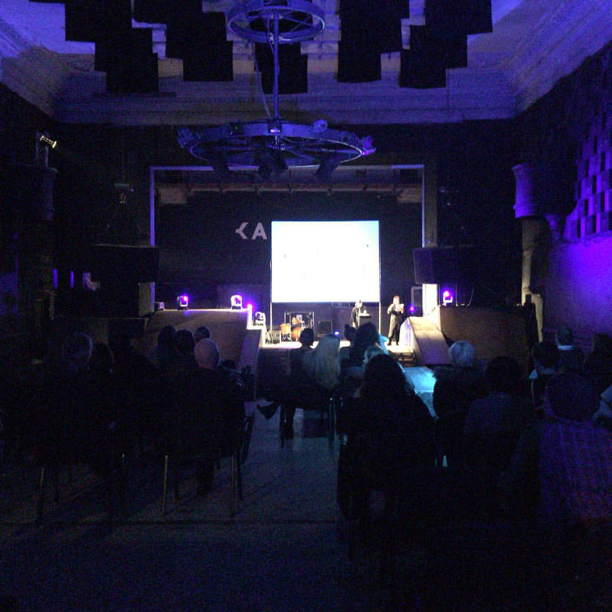
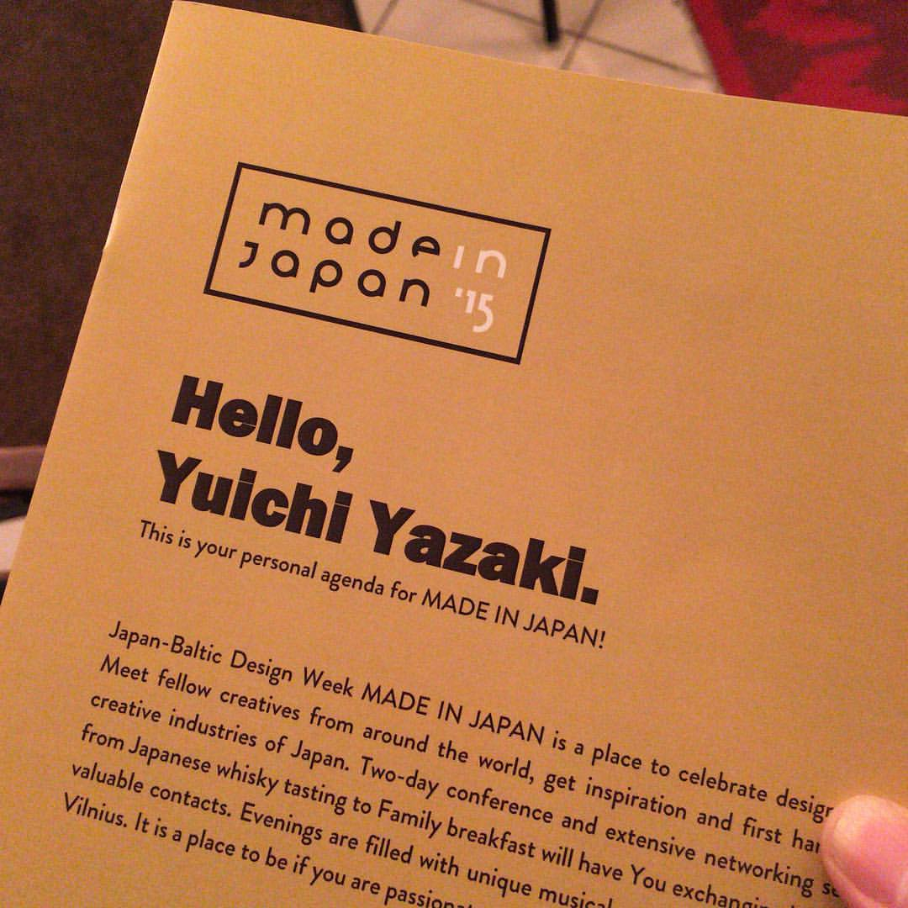
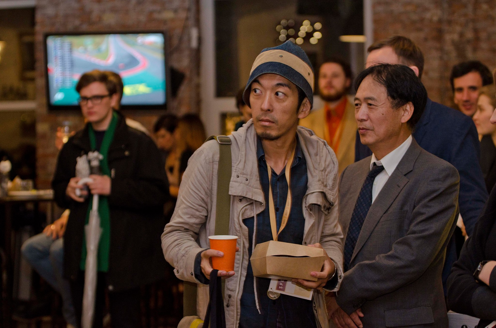
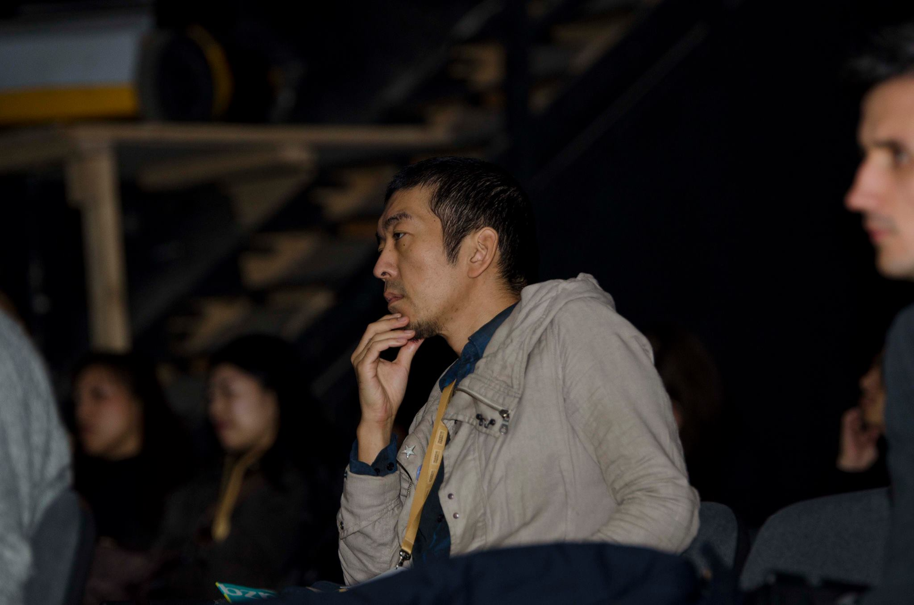
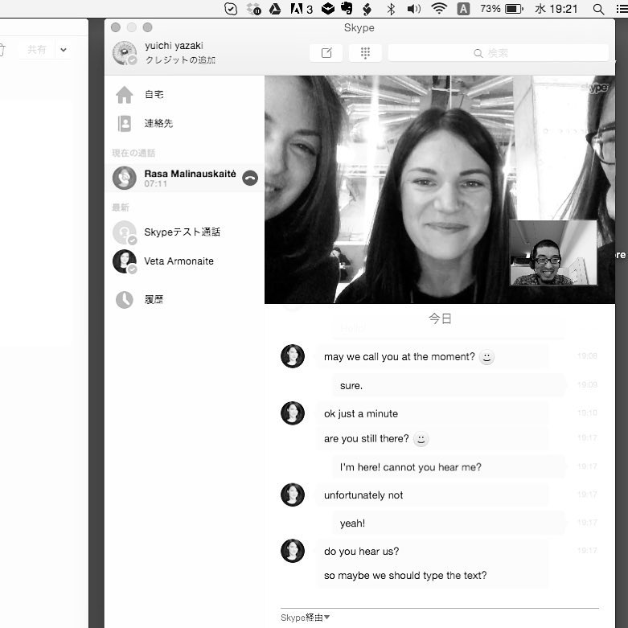

+++
author = "Yuichi Yazaki"
title = "Speaking at the International JAPAN–BALTIC DESIGN WEEK Conference"
slug = "talk-lithuania"
date = "2015-10-24"
categories = ["talk"]
tags = ["International"]
image = "images/cover_lithuania.png"
+++

In 2016, I spoke at JAPAN–BALTIC DESIGN WEEK, an international design event focused on the cultures and design of Lithuania, Latvia, and Estonia.

<!--more-->

In a session introducing Japanese design and creative initiatives, I presented “Creative City Yokohama: Yokohama-Born Design Recognized by the World.” Examples from Yokohama illustrated Japan's creative ecosystem and its international recognition.

The presentation contributed to cultural exchange through design between Japan and the Baltic states.

## Related Links

- [JAPAN–BALTIC DESIGN WEEK archive](https://web.archive.org/web/20161008152429/http://www.madeinjapan.lt/en/about/)
