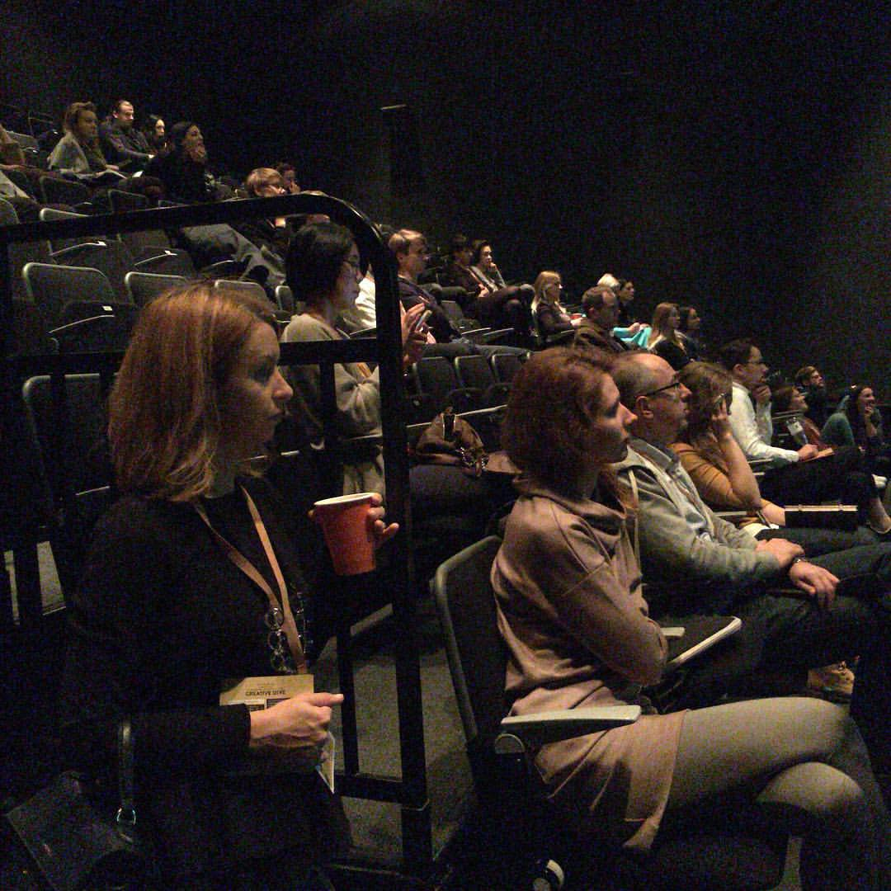
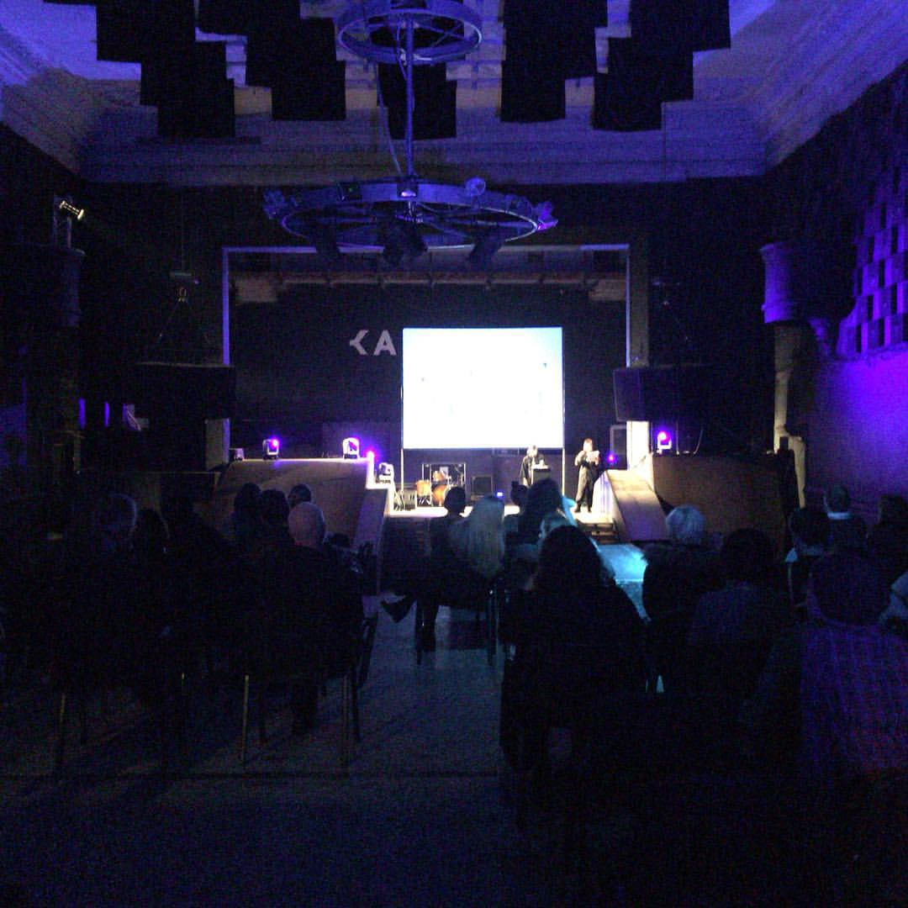
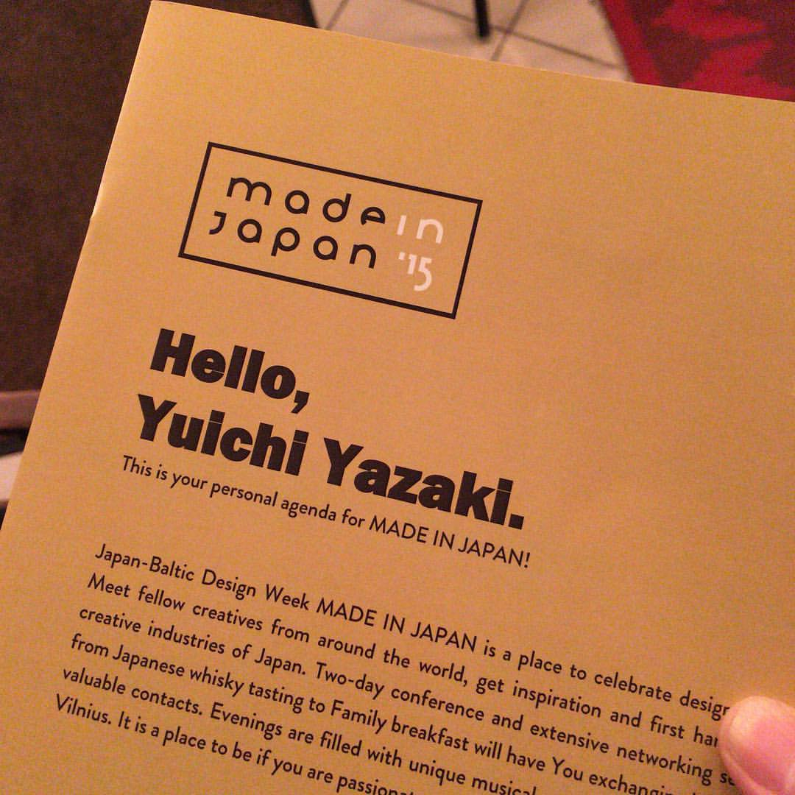
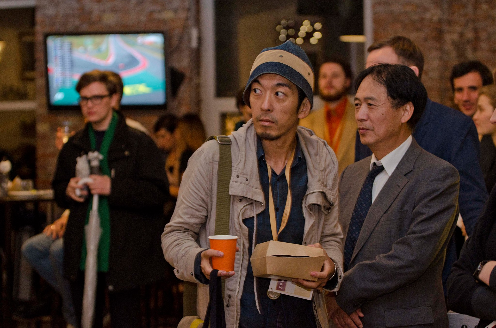
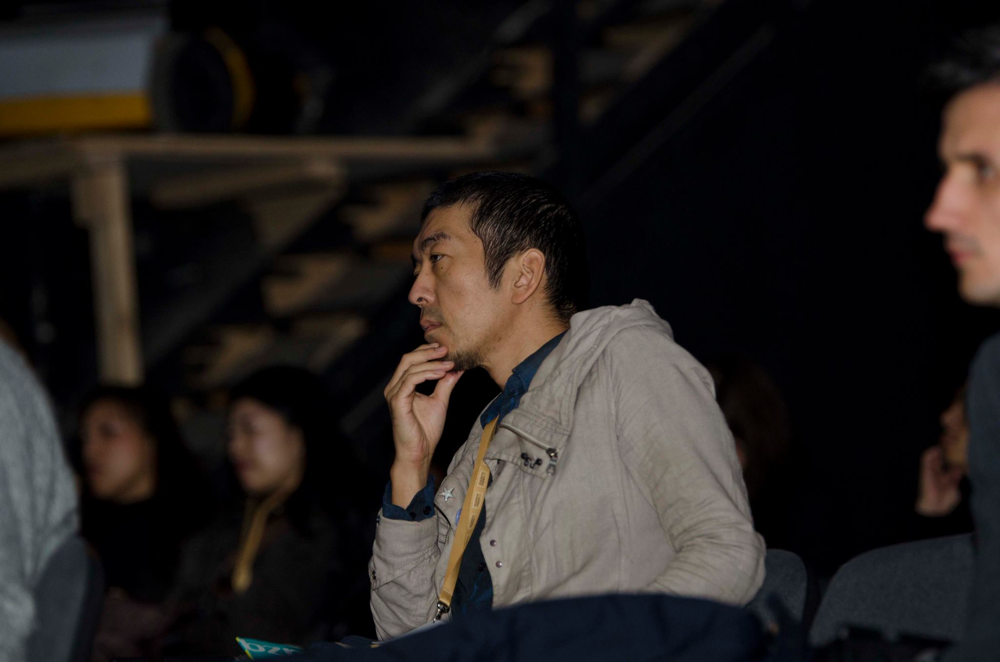
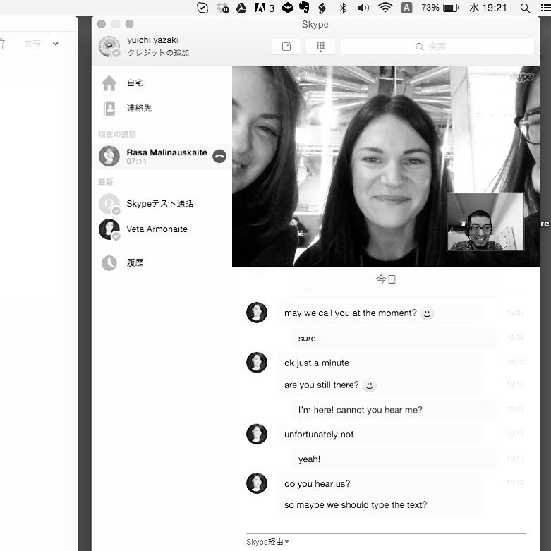

+++
author = "Yuichi Yazaki"
title = "国際デザインカンファレンス「JAPAN-BALTIC DESIGN WEEK」に登壇"
slug = "talk-lithuania"
date = "2015-10-24"
categories = [
    "talk"
]
tags = [
    "海外"
]
image = "images/cover_lithuania.png"
+++

2016年、バルト三国（リトアニア、ラトビア、エストニア）の文化とデザインに焦点を当てた国際的なデザインイベント「**JAPAN-BALTIC DESIGN WEEK**」に登壇いたしました。

<!--more-->

本イベントでは、日本のデザインやクリエイティブな取り組みを紹介するセッションにおいて、「**創造都市横浜：世界が認めた横浜生まれのデザイン**」と題したプレゼンテーションを行いました。横浜発のデザイン事例を通じて、日本のクリエイティブ・エコシステムと国際的な評価についてご紹介しました。

この登壇は、日本とバルト三国間のデザインを通じた文化交流の一助となりました。

## 関連リンク

- [JAPAN-BALTIC DESIGN WEEK (当時のアーカイブ)](https://web.archive.org/web/20161008152429/http://www.madeinjapan.lt/en/about/)