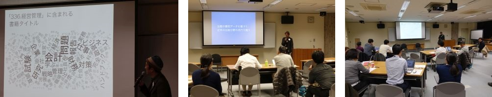
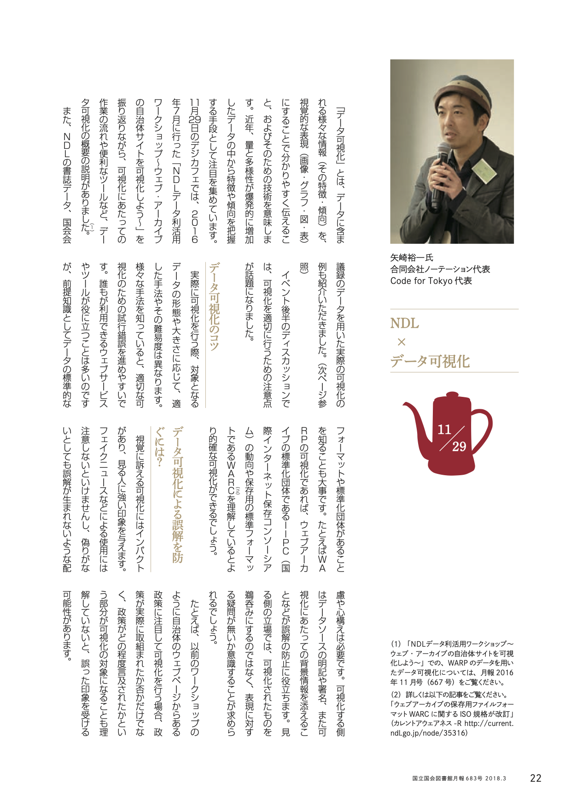
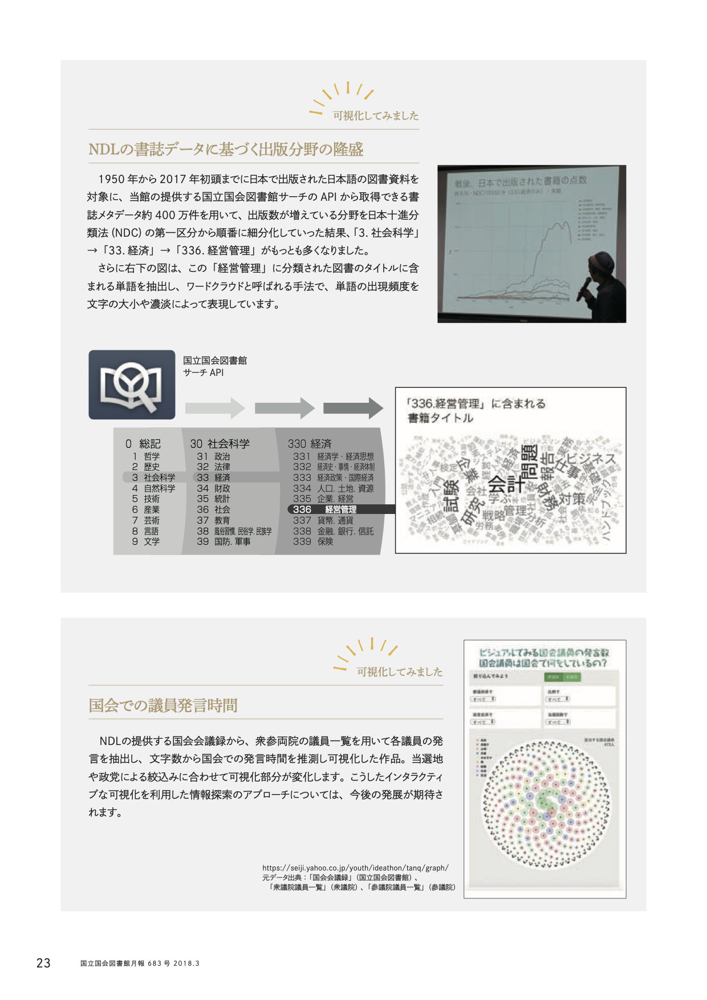

+++
author = "Yuichi Yazaki"
title = "National Diet Library Digital Library Café: Visualizing Bibliographic Data"
slug = "talk-ndl"
date = "2017-11-29"
categories = ["civictech"]
tags = []
image = "images/cover_ndl.png"
+++

On November 29, 2017, I taught a session at the NDL Digital Library Café, organized by Japan's National Diet Library.

<!--more-->

The event provided a forum for discussing and practicing ways to use the library's diverse datasets. My presentation focused on data visualization.

### Main Topics

I introduced practical examples of analysis and visualization using National Diet Library data.

- **Theme:** Building on a visualization of the previous year's Web Archiving Project (WARP), I explained the creation and analysis of a work visualizing recent trends and changes in publishing using National Diet Library bibliographic data such as subject areas and publication years.
- **Hands-on contribution:** Participants explored a prototype that allowed multidimensional browsing of bibliographic data by NDC classification, price, publication location, and other facets.
- **Role:** From the planning stage, I advised on data-extraction requirements and technical implementation and helped share knowledge through visualization.

## Related Links

- [NDL Digital Library Café | National Diet Library](https://lab.ndl.go.jp/cms/digicafe2017)
