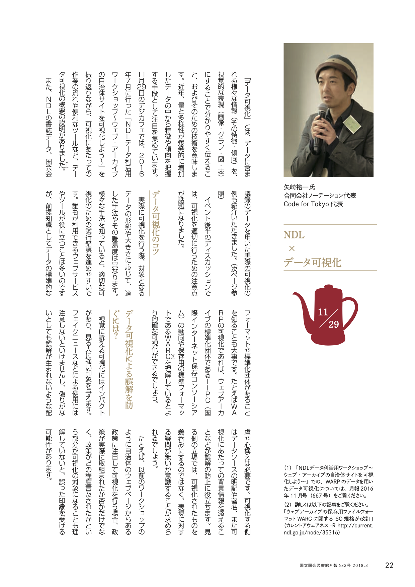
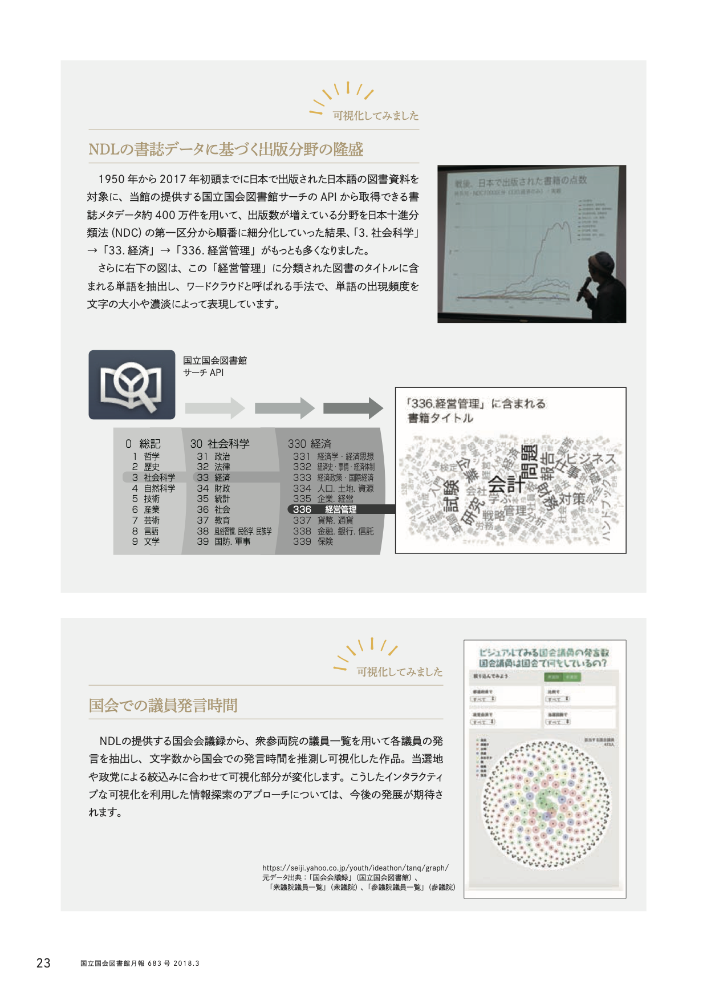

+++
author = "Yuichi Yazaki"
title = "国立国会図書館の「NDLデジタルライブラリーカフェ」に登壇：書誌データ可視化の事例紹介"
slug = "talk-ndl"
date = "2017-11-29"
categories = [
    "civictech"
]
tags = [
]
image = "images/cover_ndl.png"
+++

2017年11月29日、国立国会図書館（NDL）が主催するイベント「**NDLデジタルライブラリーカフェ**」に講師として登壇いたしました。

<!--more-->

本イベントは、図書館が持つ多様なデータを活用するための議論・実践の場として開催され、データビジュアライゼーションをテーマに講演を行いました。

**主な発表内容**

講演では、国立国会図書館が提供するデータを活用した分析・可視化の実践例を紹介しました。

* **テーマ**: 昨年度のウェブアーカイブ（WARP）の可視化作品の紹介を踏まえ、**国立国会図書館の書誌データ**（出版分野、出版年など）に基づき、**近年の出版分野の傾向や流行り廃り**を可視化する作品の作成と分析について解説しました。
* **実践的な貢献**: 参加者が、書誌データを様々な切り口（NDC分類、価格、出版地など）で多次元的に閲覧できる**プロトタイプ**を操作する機会を設け、データ活用の可能性を体験していただきました。
* **役割**: イベントの実施内容の策定段階から、データ抽出の要件定義や技術的な助言を行い、**データの可視化を通じた知見の共有**に貢献しました。

## 関連リンク

- [国立国会図書館／NDLデジタルライブラリーカフェ](https://lab.ndl.go.jp/cms/digicafe2017)
