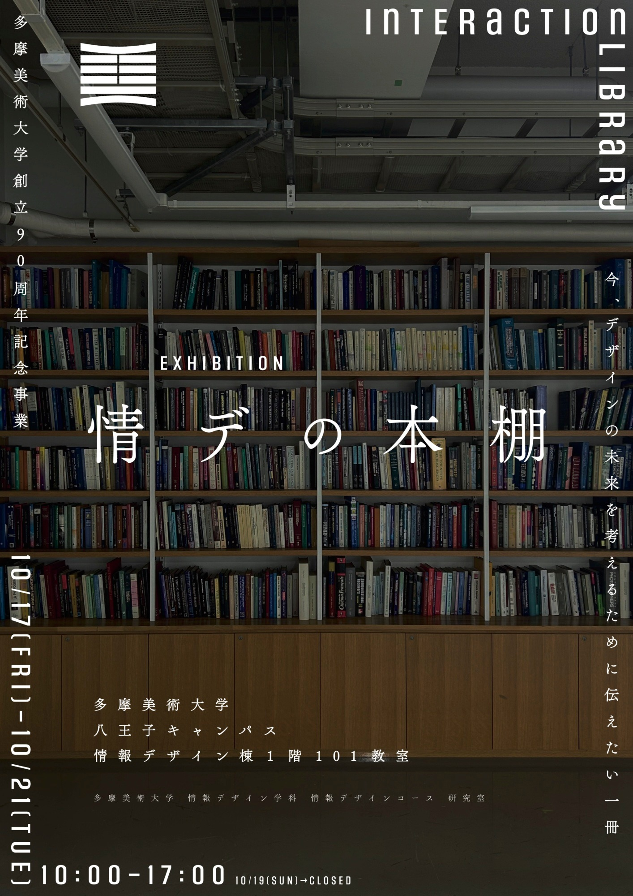
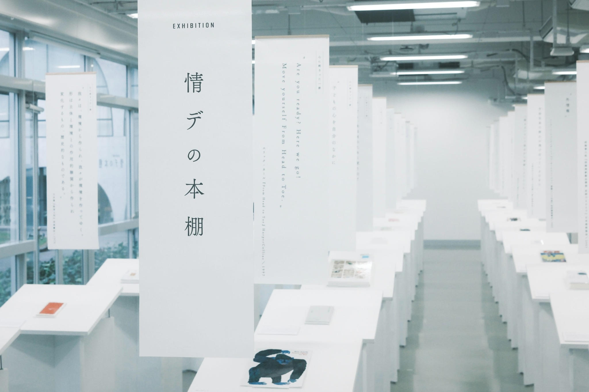
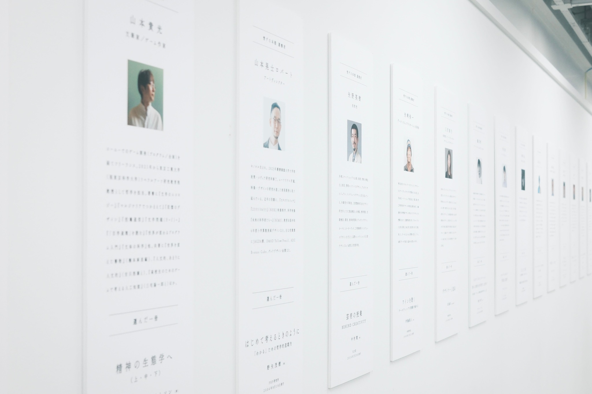
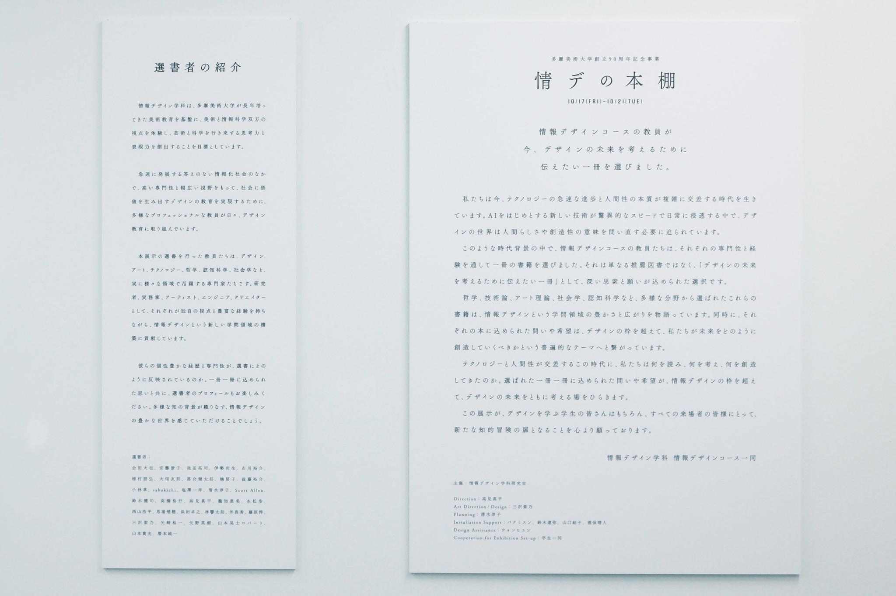
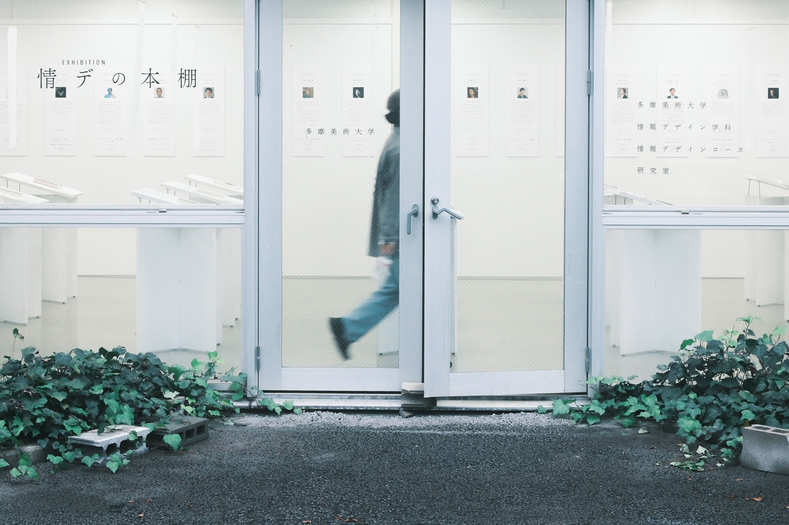

+++
author = "Yuichi Yazaki"
title = "Tama Art University 90th Anniversary — Exhibition: The Information Design Bookshelf"
slug = "tamabi-exhibition-bookshelf"
date = "2025-10-18"
categories = ["education"]
tags = []
image = "images/561123796_24658883343733043_5553422252304067183_n.jpg"
+++

Faculty members from Tama Art University's Information Design Course each selected and exhibited one book they wanted to share as a way to consider the future of design. I participated as one of the selectors.

<!--more-->

## Event Announcement

To celebrate Tama Art University's 90th anniversary, faculty members from the Information Design Course presented books chosen from their individual perspectives as works they wanted to share when thinking about the future of design.

At a time when technology and humanity intersect, the exhibition asked what we have read, considered, and created. The questions and hopes embodied in each selection were intended to create a place for thinking together about the future of design beyond the boundaries of information design.

The university's 90th-anniversary ceremony was also held on Saturday, October 18, 2025, with full-time faculty present on the Hachioji campus.

- **Dates:** October 17–21, 2025, 10:00 a.m.–5:00 p.m.
- **Closed:** Sunday, October 19
- **Venue:** Room 101, Information Design Building, Tama Art University Hachioji Campus
- **Address:** 2-1723 Yarimizu, Hachioji, Tokyo
- **Organizer:** Information Design Course Laboratory

The selectors included Daiya Aida, Ryoko Ando, Takuji Ikeda, Hisao Ise, Yusuke Ichikawa, Tomohiro Uemura, Tomonori Ohata, Kentaro Ochiai, Fusako Kusunoki, Yusuke Goto, Akira Kobayashi, sabakichi, Kazuhiro Shiozawa, Junko Shimizu, Scott Allen, Kenji Suzuki, Hiroyuki Takahashi, Shinpei Takami, Chiemi Taki, Ayumu Nagamatsu, Kohei Nishiyama, Masuho Baba, Takayuki Hamada, Kyotaro Hayashi, Masahide Ban, Jun Fujiwara, Shino Misawa, Yuichi Yazaki, Hideki Yano, Robert Akishi Yamamoto, Takamitsu Yamamoto, and Junichi Rekimoto.

- Direction: Shinpei Takami
- Art direction and design: Shino Misawa
- Planning: Junko Shimizu
- Installation support: Bak Misun, Ryoya Suzuki, Yuko Yamaguchi, and Haruto Tokuho
- Design assistance: Won Heeyoon
- Exhibition setup: Volunteer Information Design students

### Scenes from the Exhibition

## Related Links

- [Information Design Course: Exhibition — The Information Design Bookshelf](https://www.tamabi.ac.jp/news/96049/)
