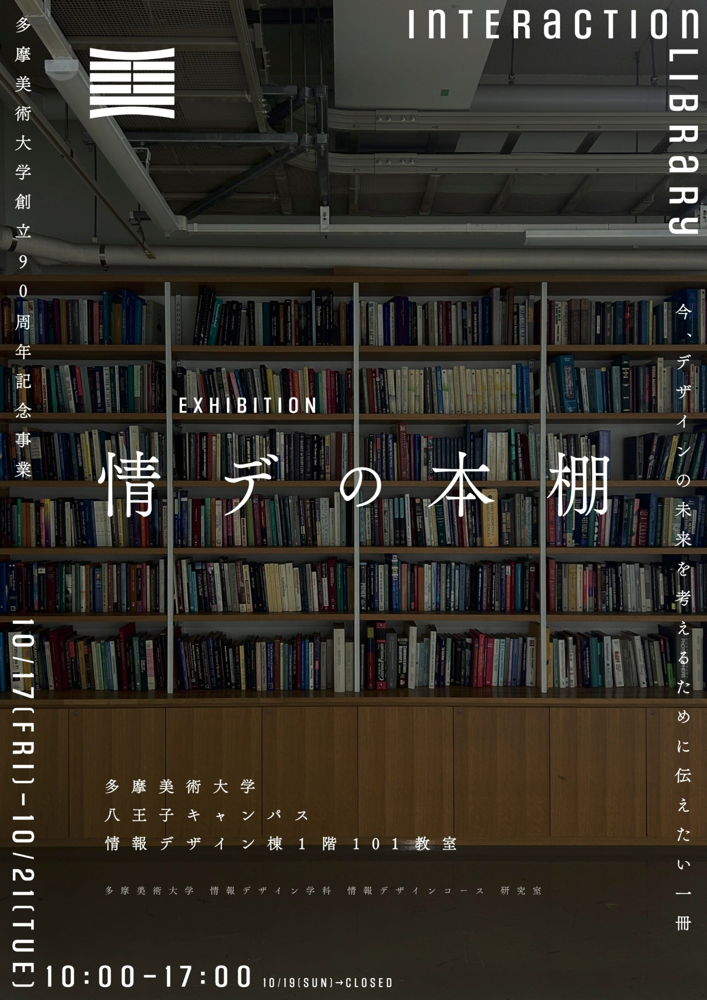
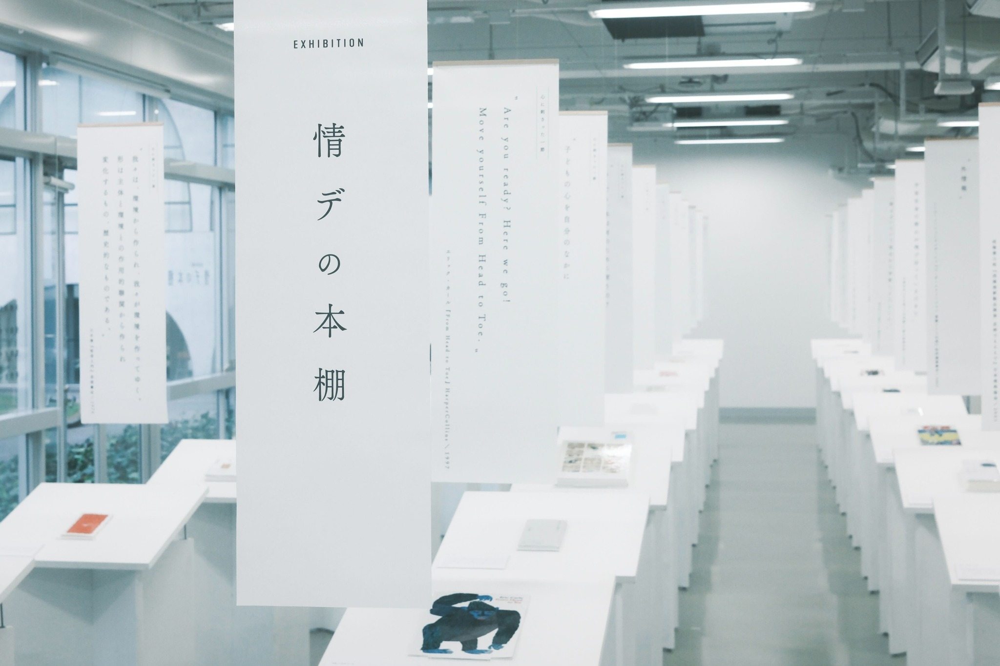
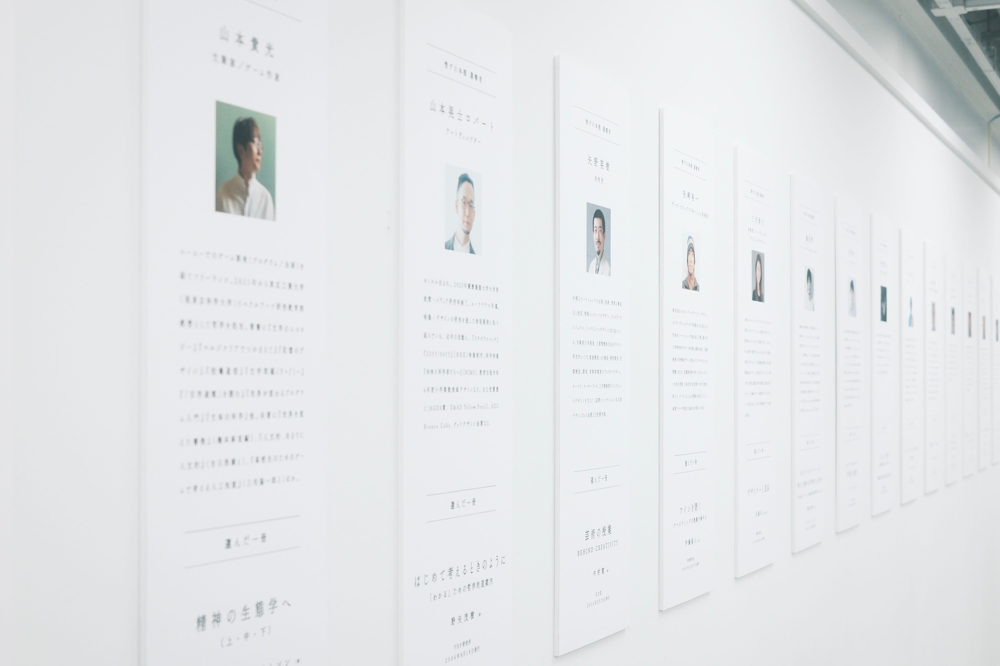
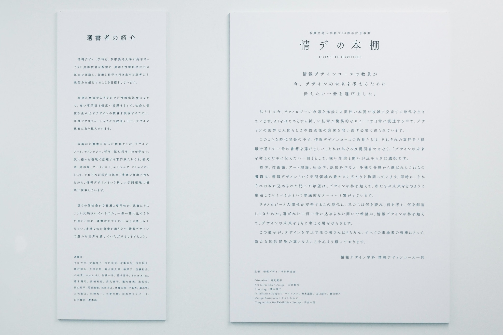
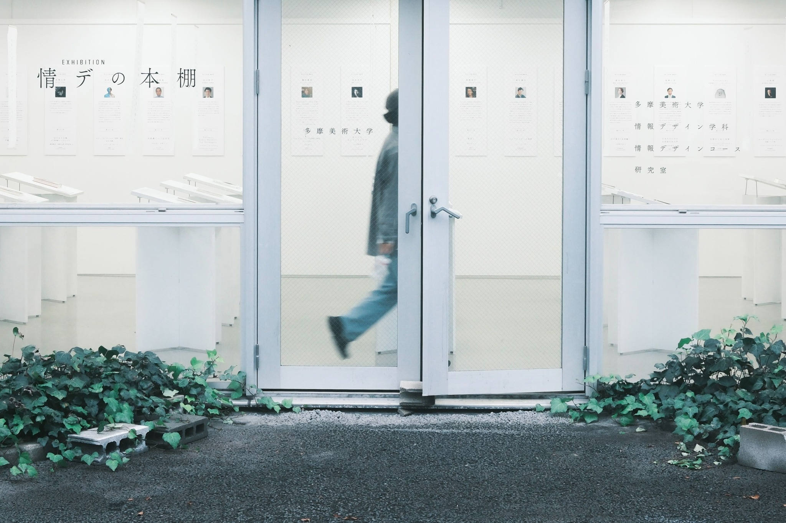

+++
author = "Yuichi Yazaki"
title = "【多摩美90周年記念】「EXHIBITION:情デの本棚」"
slug = "tamabi-exhibition-bookshelf"
date = "2025-10-18"
categories = [
    "education"
]
tags = [
    ""
]
image = "images/561123796_24658883343733043_5553422252304067183_n.jpg"
+++

多摩美術大学 情報デザインコースの教員たちが、それぞれ独自の視点で「デザインの未来を考えるために伝えたい一冊」を展示。矢崎も参加しました。

<!--more-->

## 告知文

【多摩美90周年記念】「EXHIBITION:情デの本棚」のご案内

情報デザインコースの教員たちが、それぞれ独自の視点で「デザインの未来を考えるために伝えたい一冊」を展示いたします。テクノロジーと人間性が交差するこの時代に、私たちは何を読み、何を考え、何を創造してきたのか。選ばれた一冊一冊に込められた問いや希望が、情報デザインの枠を超えて、ともにデザインの未来を考える場となれば幸いです。

また、2025年10月18日(土)は、多摩美90周年式典も開催されるため、専任教員一同が出校予定です。秋の爽やかな季節、八王子キャンパスの風景も美しい頃合いですので、散策がてら、ぜひお立ち寄りください。

- ■会期：2025年10月17日(金) - 10月21日(火)　10:00～17:00
- ■休廊：10月19日(日)
- ■会場：多摩美術大学八王子キャンパス 情報デザイン棟101教室
- ■住所：東京都八王子市鑓水2-1723

[ 主催 ] 情報デザインコース研究室

[ 選書者 ] 会田大也、安藤僚子、池田拓司、伊勢尚生、市川裕介、植村朋弘、大畑友則、落合健太郎、楠房子、後藤裕介、小林章、sabakichi、塩澤一洋、清水淳子、Scott Allen、鈴木健司、高橋裕行、高見真平、瀧知惠美、永松歩、西山浩平、馬場殖穂、浜田卓之、林響太朗、伴真秀、藤原惇、三沢紫乃、矢崎裕一、矢野英樹、山本晃士ロバート、山本貴光、暦本純一（50音順）

- Direction：高見真平
- Art Direction, Design：三沢紫乃
- Planning：清水淳子
- Installation Support：バクミスン、鈴木遼弥、山口結子、德保晴人
- Design Assistance：ウォンヒユン
- Cooperation for Exhibition Set-up・情デ有志学生一同

### 開催中の様子

## 関連リンク

- [情報デザイン学科（情報デザインコース）「EXHIBITION：情デの本棚」](https://www.tamabi.ac.jp/news/96049/)

