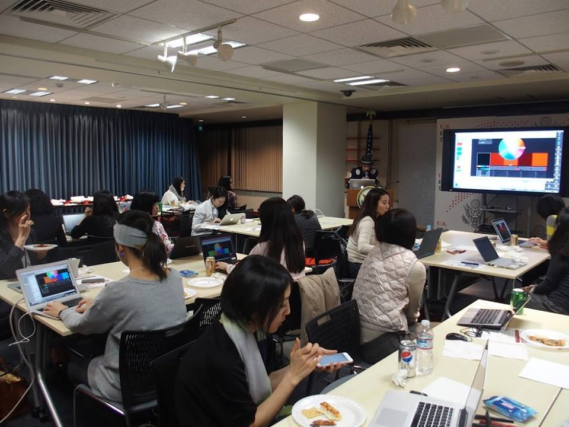

+++
author = "Yuichi Yazaki"
title = "U.S. Embassy and Women Who Code Tokyo: Make Your Favorite Music Move with Data Visualization and p5.js"
slug = "woman-who-code-tokyo_america-embassy-p5"
date = "2015-12-17"
categories = ["civictech"]
tags = []
image = "images/cover.png"
+++

I helped plan and teach a women-only data visualization workshop co-hosted by the U.S. Embassy in Tokyo.

<!--more-->

## Event Overview

- **Date and time:** Thursday, December 17, 2015, 6:30–9:00 p.m.; doors opened at 6:00 p.m.
- **Venue:** American Center Japan, 8F NOF Tameike Building, 1-1-14 Akasaka, Minato-ku, Tokyo
- **Capacity:** 45
- **Fee:** Free
- **Instructor:** Yuichi Yazaki
- **Audience:** Women interested in learning data visualization. Beginners were welcome, though experience using a text editor and installing a computer application was recommended.
- **Registration:** Through Meetup, with all required details completed for building entry
- **Technology:** [p5.js](http://p5js.org/)
- **What to bring:** A laptop computer—the exercises did not run on tablets—and a willingness to have fun
- **Organizer:** Women Who Code Tokyo
- **Co-host:** U.S. Embassy Tokyo
- **Support:** Data Visualization Japan and LinkData Association

## Related Links

- [Women-only data visualization event co-hosted by the U.S. Embassy | Knowledge Connector](https://idea.linkdata.org/idea/idea1s1380i)
- [Event report from U.S. Embassy Tokyo | Facebook](https://www.facebook.com/usembassytokyo/posts/pfbid02gbpjRa7UYcZPh6cgUDBa98Y3QDHJb8yDrfF4eMpSu7h6VpdSAmeStfEDLkt9wM3Gl)
