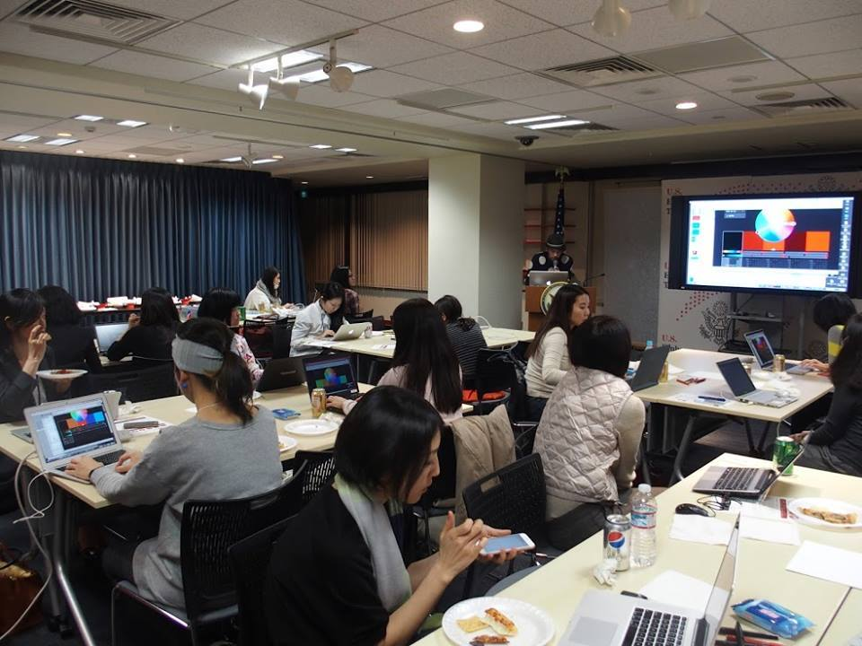

+++
author = "Yuichi Yazaki"
title = "アメリカ大使館・Woman Who Code Tokyo「♡大好きな音­楽­が動き出す♡データビジュアライズの­キラ­キラおまじないをかけてみよう！」"
slug = "woman-who-code-tokyo_america-embassy-p5"
date = "2015-12-17"
categories = [
    "civictech"
]
tags = [
    "ワークショップ","シビック・テック"
]
image = "images/cover.png"
+++

【女性限定】米国大使館共催データビジュアライズイベントの企画協力とワークショップ実施しました。

<!--more-->

## イベント概要

- 日時：12/17（木）18:30-21:00（開場18:00）
- 会場：アメリカンセンターJAPAN
    - 〒107-0052 東京都港区赤坂 1-1-14 ＮＯＦ溜池ビル8階 http://americancenterjapan.com/access/
- 定員：45名
- 参加費：無料
- 講師：矢崎 裕一（Yuichi Yazaki）氏
- 対象者：データビジュアライゼーションを学びたい女性 ー 初心者も大歓迎ですが、下記2点の経験があった方が望ましいです。
    - テキストエディタを使ったことがある(何でも結構です)
    - パソコンでアプリをインストールしたことがある
- 応募方法：meetupに必要事項を記入の上申込み(入室の際必要になりますので、必ず全ての項目を記入して下さい)
- 使用技術：p5.js (http://p5js.org/)
- 持ち物：ご自身のノートPC (タブレットでは動きませんのでご注意下さい)、楽しむ気持ち♡
- 主催：Women Who Code Tokyo
- 共催：アメリカ大使館
- 協力：Data Visualization Japan, 一般社団法人リンクデータ

## 関連リンク

- 【女性限定】米国大使館共催データビジュアライズイベント | ナレッジコネクター https://idea.linkdata.org/idea/idea1s1380i
- アメリカ大使館 U.S. Embassy Tokyoさんの投稿 - データビジュアライゼーションのイベントレポート https://www.facebook.com/usembassytokyo/posts/pfbid02gbpjRa7UYcZPh6cgUDBa98Y3QDHJb8yDrfF4eMpSu7h6VpdSAmeStfEDLkt9wM3Gl